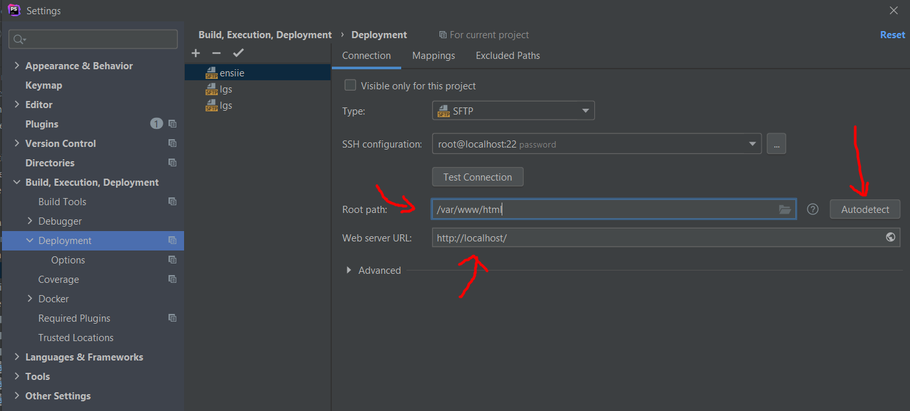

# Launch website

[Go back](../index.md#phpstorm)

Open an `HTML` or `PHP` file. Then you should see those (since 2021, we can now open a page inside an embed window in PHPStorm)

But they may not open the URL you wanted.

If that is the case, simply open the `Deployment` menu (shift+shift > Deployment > configuration on 2021+), and change the webserver URL. You may also change the root path or go into `mappings` and make some changes here.

