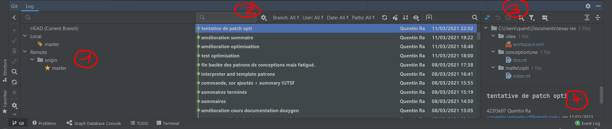
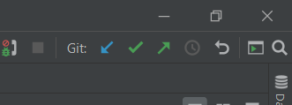
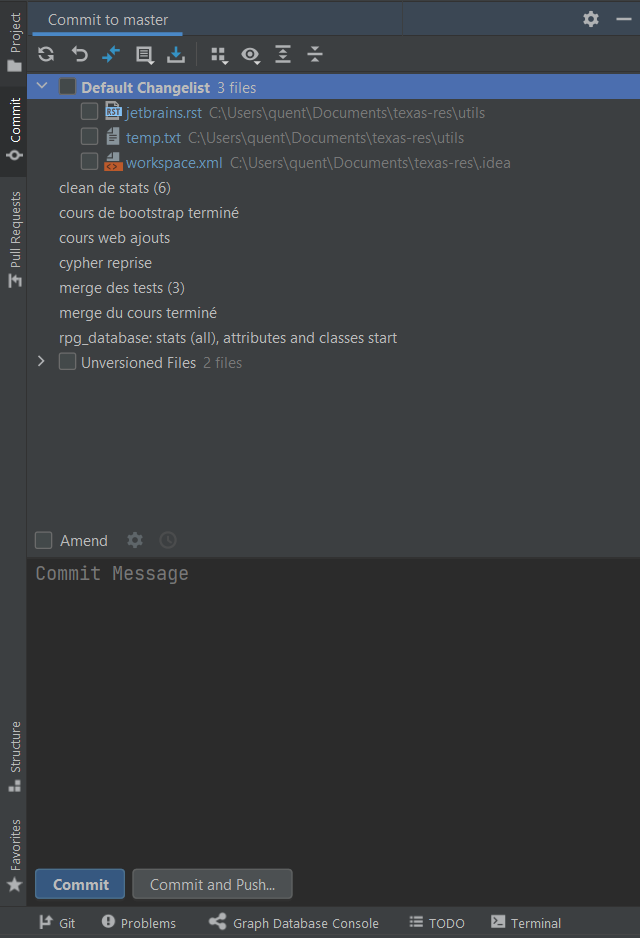

# Git

[Go back](../menus.md)

If you are in a git repository, check at the bottom left of your screen, you should have a `GIT` menu.

* `1`: your branches
* `2`: your commits
* `3`: your changes
* `4`: current commit description

## Pull-push or commit

You might use the `blue` arrow to pull and the `green` to push. JetBrains will provide you a great tool to merge if needed.

## Local changes

You can commit or view local changes using the left menu.