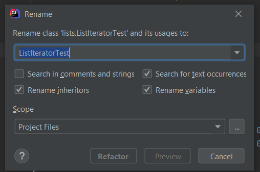
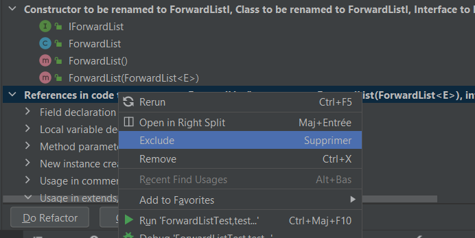

# Refactor

[Go back](../menus.md)

A powerful tool to rename a class/method/file/... and all their usages.

Right-click on something and rename/copy something may trigger refactor if there is at least one usage of what you tried to rename/copy.

**Note**: Be sure to check the preview to have this menu and check what you are refactoring.

Be sure to exclude/remove what you don't want to refactor.

