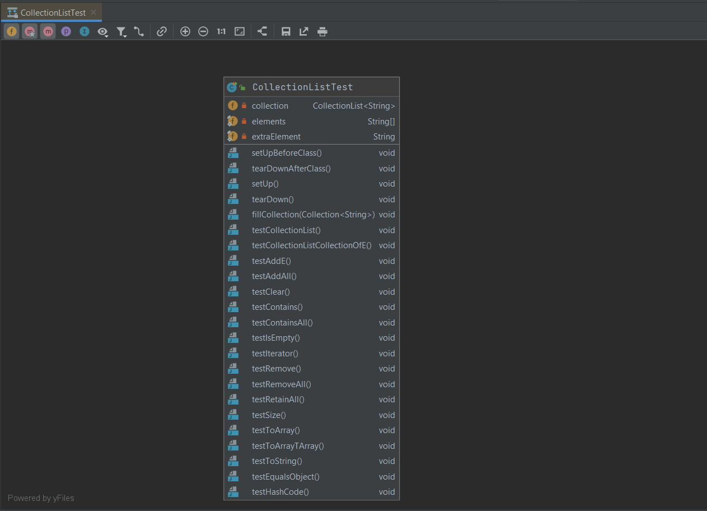

# UML

[Go back](../menus.md)

You can generate a UML diagram from the selected classes, using the following shortcuts

* `CTRL+ALT+MAJ+U`
* `CTRL+ALT+U`

They work at least in `JAVA`, `PHP` and `JS`.

You will have something like this in Java. Be sure to select all files that you want in the diagram. You can add or remove part of it later, such as attributes, classes, or methods...

