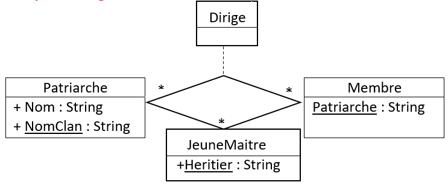

# Multi-classes associations

[Go back](../index.md)

This is a complex relationship called the ``association n-aires`` in French, with ``n`` the number of classes. Here is an example in ``French`` with $n=3$, so we call it ``association ternaire``

