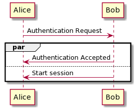

# par, seq, and critical fragments

[Go back](../index.md)

You can use the fragments par, seq, and critical to indicate blocks of code that are working differently than usual.

* <kbd>par</kbd> (parallel) executes all blocs at the same time,
* <kbd>seq</kbd> execute one block at a time,
* and <kbd>critical</kbd> (sequence) is used to wrap blocs of code that must be run without errors, otherwise the program can't continue running.

Here is an example

