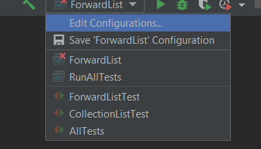

# Run

[Go back](../index.md#intellij-idea)

To run a class, go to the `main` function, then you should see a `green` arrow. Click on it and that's it.

If you don't see such a thing or may want to tune a bit the launch of your main, then open the `edit configurations` menu.

then you can set your JDK, your program argument, and even set VM options.

## I don't have an arrow

Check if your JDK is set. If that's okay, then is the directory of your files in `blue`?

If not, press `CTRL+ALT+MAJ+S`, go to `modules`, and set your source folder as `source`.

