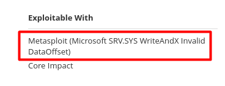

# Nessus vulnerability scanner

[](https://tryhackme.com/room/rpnessusredux)

<div class="row row-cols-md-2"><div>

**Nessus vulnerability scanner** is a tool to find, and report vulnerabilities.

* [Download Nessus](https://www.tenable.com/downloads/nessus)

```bash
$ sudo dpkg -i  Nessus-10.3.0-ubuntu1404_amd64.deb
$ sudo systemctl start nessusd.service
```

* Open `https://localhost:8834/`
* [You will need an activation code](https://www.tenable.com/products/nessus/nessus-essentials)
</div><div>

Once you are logged in to the website, you can create new scans.

* **Host Discovery**: find alive hosts
* **Basic network scan**: sort of nmap
* **Web application test**: see vulnerabilities in your web app

Most scans have the following options

* Set a target
* In Discovery, you can select a range of ports
* In Assessment, you can select the kind of scan
* In Advanced, you may go for a "low bandwidth scan"
* In the credential tabs, you can log in to an account.
* **Launch**: explore vulnerabilities to see results

It's important to note that Nessus is generating a lot of traffic, and may not find every vulnerability, so you shouldn't grow dependent on it, and do things "manually" when you can.

</div></div>

> **Note**: if you have a scope/knowledge of specific ports/... to scan, you can define a policy in the Policy tab.<br>

<hr class="sep-both">

## 🥳 Metasploit and nessus ⚡

[See Metasploit framework - Database / Workspaces](/_cybersecurity/exploitation/general/metasploit/msfconsole.md#-the-metasploit-database-)

<div class="row row-cols-md-2"><div>

First, in the Nessus web interface, when exploring each vulnerability one by one, you may find a section **Exploitable With** indicating tools that Nessus knows you can exploit this vulnerability with these.



* First, start msf database
* Second, create a workspace (optional)
* Third, import your scan inside the database
* Four, work on it
</div><div>

Everything below is coming from [this tutorial](https://scubarda.com/2015/11/16/launching-nessus-scans-inside-metasploit/), but Metasploit unleashed has also [some tips](https://www.offensive-security.com/metasploit-unleashed/working-with-nessus/).

```bash
msf6 > load nessus
# Connect
msf6 > nessus_connect user:pass@localhost:8834
# List the scans that you did
msf6 > nessus_scan_list
# Import the result of a scan
msf6 > nessus_db_import id_you_found_in_the_list
```
</div></div>