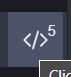

# Methodology to exploit webservers

<p>

📜 If you haven't already done so during the investigation, you should check if previous versions of the website were saved on the [wayback machine](https://archive.org/web/), and dig for information about frameworks/... using OSINT.
</p>

<div class="row row-cols-md-2 mt-4"><div>

🌟  **Website mapping**

A penetration tester will have to list every feature of the website along their route. For instance,

* "list all products": `/products,`
* "list a product": `/products?id=x`

This is done as you explore by BurpSuite if you are redirecting requests through the proxy, even if you don't intercept them.

<br>

🌟  **Look at the source of the website** (<kbd>CTRL+U</kbd>)

[](https://tryhackme.com/room/picklerick)

* is there hidden elements?

<details class="details-e">
<summary>Example of code</summary>

```javascript
Array.from(document.querySelectorAll('*')).filter(x => {
    // There were not displayed to the user in the first place
    if (x.nodeName === "HEAD" || x.nodeName === "META"
        || x.nodeName === "LINK" || x.nodeName === "STYLE"
        || x.nodeName === "SCRIPT" || x.nodeName === "TITLE") return false
    // hidden hidden="" hidden="hidden"
    if (x.hidden === true) return true
    // style (visibility/display/font-size)
    const style = window.getComputedStyle(x)
    if (style.visibility === 'hidden') return true
    if (style.display === 'none') return true
    if (style.fontSize === "0px") return true
    return false
}).map(x => x.outerHTML)
```
</details>

```javascript
// list every element with a href
document.querySelectorAll('*[href]') 
```

* is there information in HTML comments?

```javascript
// my own version V1.2
document.querySelector('html').innerHTML.replaceAll('\n', ' ').match(/<!--.*?-->/g)
// alternate version to keep \n
document.querySelector('html').innerHTML.replaceAll('\n', '/n').match(/<!--.*?-->/g).map(x => x.replaceAll('/n', '\n'))
// if you want to remove empty comments
[...].filter(r => r !== "<!---->")
// there are also more complicated regexes if you don't
// want to use my trick (deleting \n to in-inline comments) 
// example: https://www.regextester.com/96517
```
<br>

🌟  **Look for logic flaws**

A logic flaw is when a programmer is thinking that a user will do something, such as browsing pages in a specific order, or submitting an email in an "email input field", and does not check, or not properly check, for those that take a path different from intended.

Another logic flaw could be related to websites using a username to check if a user is allowed to see the "admin" side of the website. Maybe some tricks like a username " admin" may bypass the check.

<br>

🌟  **Look for frameworks** [See frameworks](frameworks/index.md)

Most developers are using a framework, which is a sort of box of utilities to make a website more easily.

➡️ Try the framework default credentials (if any).

<br>

🌟  **Analyze the javascript**

You may use the dev console debugger, after adding a breakpoint in the JavaScript, to analyze the javascript code, if needed.

</div><div>

🌟  **Analyze the network**

You may use the dev console network tab to analyze requests, and responses sent to the server. Once you click on a request, there are multiple tabs, for requests, responses...

Some misconfigured servers are, for instance, sending the web service name <small>(Nginx, Apache, IIS, Node.js)</small>, and sometimes even the version. [See HTTP headers](others/headers.md).

<br>

🌟  **/robots.txt and /sitemap.xml**

[](https://tryhackme.com/room/picklerick)

Robots.txt is listing pages that crawlers (search engine robots) shouldn't crawl. There may be some routes that even clients were not aware of inside.

There is also a link to the website "sitemap", which is generated by the developer to help search engine index the website. If the sitemap wasn't updated, you may find routes not available for visitors, but were available before, were not removed, and may be vulnerable.

🌟  **Forced Browsing** [See Forced Browsing](fuzz/forced_browsing.md)

This is a technique of not using the website links to navigate to another page, but rather trying manually/using a tool with a list of routes that may exist, and trying them all while hoping to find some gold.

<br>

🌟  **Insecure Direct Object References (IDOR)** [See fuzzing](fuzz/index.md)

[](https://tryhackme.com/room/idor)
[](https://tryhackme.com/room/neighbour)

A failure in which we can guess given a URL how to access other elements,
and if we change the URL <small>(id=10$\to$id=11)</small>. It could be a get form with predictable values, or a folder with predictable filenames... It could also be unpredictable values, and in such case, the best test would be to create two accounts, and see if you can swap the potential IDOR. They can be found in forms, in the JavaScript, in cookies...

<br>

🌟  **Find usernames/emails** [See Brute force forms](forms/index.md)

You could achieve this using the website API if there is one, and/or its interface, such as register forms: "this username is already taken", or the same process for emails with the password forgot page...
</div></div>

<hr class="sep-both">

## 🎣 Tools🎣

<div class="row row-cols-md-2"><div>

* [nikto](https://github.com/sullo/nikto) (6.2k ⭐). Scan web server for known vulnerabilities.

```bash
$ nikto -h URL
# Server
# SSL certificate
# Headers
```

* Spoof User-Agent

You can install an extension to make the target website believe that you are using another browser. Look for **User-Agent Switcher** extensions on Google. You can try them on [whatismybrowser](https://www.whatismybrowser.com/).

* Use a proxy

You may use a proxy as an intermediary for your requests. If you do, then you can use the **FoxyProxy extension** of your browser to easily swap between no proxy, and your proxies configurations.
</div><div>

* Disable scripts

You may do that to bypass JavaScript verifications. You can use plugins such as [noscript](https://noscript.net/), or ublock by clicking on the following icon



* [wappalyzer](https://github.com/wappalyzer/wappalyzer) (7.8k ⭐) to find frameworks, their versions... It can also be installed as a browser extension or used via their [website](https://www.wappalyzer.com/). If you are using the extension, you might want to uncheck the option to send anonymous data to their website.

* [Beef](https://github.com/beefproject/beef) (7.8k ⭐): The Browser Exploitation Framework Project
</div></div>

<hr class="sep-both">

## Mitigations

<div class="row row-cols-md-2 mt-4"><div>

* 🔒 Display generic error messages, disable errors messages, and do not give much information <small>(ex: on invalid login, display the message 'credentials invalid', instead of 'username invalid' or 'password invalid')</small>

* 🚧 Test your endpoints with invalid values: 0, -1, characters, symbols... Test your pages with/without excepted parameters, especially if a hacker tries to access pages in an unexpected order.
</div><div>

* 🔫 Do not trust anything coming from the user, its browser, or even your database. Basically, Zero Trust.
</div></div>