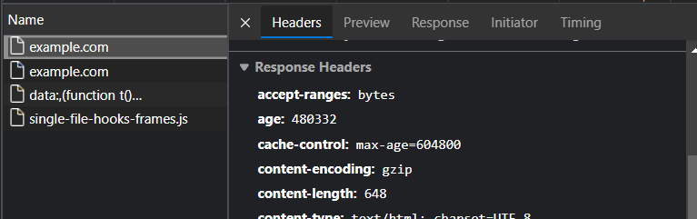

# ⚡ HTTP Headers ⚡

[](https://tryhackme.com/room/agentsudoctf)

<div class="row row-cols-md-2"><div>
</div><div>

You can test your headers

* [Venom](https://github.com/ovh/venom) (test internal website, read [this gist](https://gist.github.com/righettod/f63548ebd96bed82269dcc3dfea27056#gistcomment-3630811))
* [Postman](https://www.postman.com/) (software)
* `curl -I https://memorize.be/` (😎, but no advice like others have 😶)

What values should I give to my headers?

* either check [the headers of the top websites](https://owasp.org/www-project-secure-headers/#div-top) (enter the command on your PC, the result changed)
* or read [OWASP proposal](https://owasp.org/www-project-secure-headers/#div-bestpractices) (the page seems a bit old)

**And**, you can read [OWASP guide](https://owasp.org/www-project-secure-headers/) about secure headers, as I did to make this page <small>(through, I discovered their guide after doing my headers 😭)</small>. You got a [quick reference here too](https://web.dev/security-headers/) by **Google**.

You can use websites to check your webserver configuration 🚀

The OWASP foundation has a [Secure Headers Project](https://owasp.org/www-project-secure-headers/) with [their recommended top practices](https://owasp.org/www-project-secure-headers/#div-bestpractices).

These issues may have to be fixed on the server level too. If a website does not use automatic routing, then if a hacker uses an invalid URL, they will still receive headers in the response, and these might disclose the server version...
</div></div>

<hr class="sep-both">

## 💪 Grab HTTP headers 💪

<div class="row row-cols-md-2"><div>

* [whatweb](https://github.com/urbanadventurer/WhatWeb) (4.2k ⭐). Web scanner.

```bash
$ whatweb URL
# Server
# Libraries used (ex: JQuery...)
# Uncommon Headers
```
</div><div>

`curl` is also a nice way of fetching headers

```bash
$ curl -I IP:port
# all headers
```
</div></div>

There is also [httpstatus](https://httpstatus.io/) for a batch or URLs, or to support automatic redirection.

<hr class="sep-both">

## 🍾 Other tools for fancy folks 🍾

<div class="row row-cols-md-2"><div>

You can use [nmap](/_cybersecurity/discovery/nmap/index.md)

```bash
$ nmap --script=http-server-header.nse IP -p80,443
$ nmap -sC IP -p80,443 # may provide less information
```

You can use [Metasploit](/_cybersecurity/exploitation/general/metasploit/msfconsole.md)

```bash
msf6 > use auxiliary/scanner/http/http_version
```
</div><div>

You can use your browser, see the network tab of the dev console.



<br>

You could use [telnet](/_it/networking/protocols/index.md#-telnet---23-tcp) too, but I doubt you would want to write requests manually... And, it will only work with HTTP, not HTTPS.
</div></div>