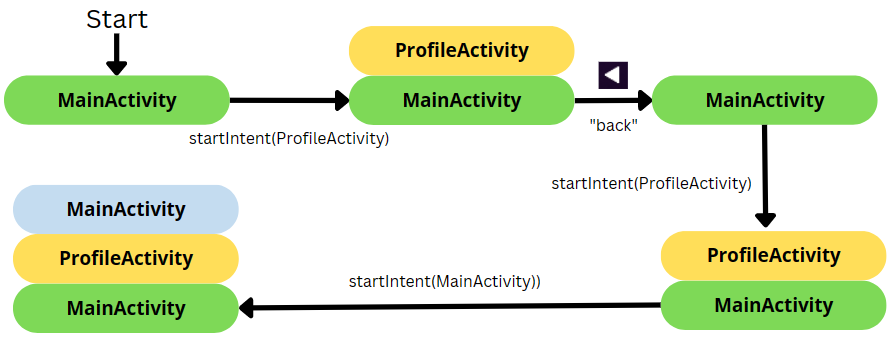

# Android Activities

<div class="row row-cols-md-2"><div class="align-self-center">

From a user perspective, an activity is a view of your application.

* 👉 Activities must be declared in AndroidManifest.xml
* 👉 The first screen is usually called "MainActivity"
* 👉 Activities are associated with a [View](../views/index.md) <small>(ex: R.layout.activity_main)</small>

Using **Fragments**, a developer can use multiple views in one activity. Fragments are reusable views that can be loaded from any Activity.

```kotlin
class MainActivity : AppCompatActivity(R.layout.activity_main) {
}
```

</div><div>

Extended (and usual) version

```kotlin
import androidx.appcompat.app.AppCompatActivity
import android.os.Bundle

class MainActivity : AppCompatActivity() {
    override fun onCreate(savedInstanceState: Bundle?) {
        super.onCreate(savedInstanceState)
        // Load the associated View
        // See View to configure the view (listeners...)
        setContentView(R.layout.activity_main)
    }
}
```
</div></div>

<hr class="sep-both">

## Android Application

<div class="row row-cols-md-2"><div>

When an Android application is started, the class `Application` is started, and loads the main activity.

The implementation by default is enough, so you won't need to write this class. But here are some use case

* 👉 running code only once in `onCreate` <small>(in an Activity, the code will be run when we navigate between application, when we rotate the screen...)</small>

For instance, to run the code to create notification channels, if you want to send notifications.

* 👉 listening for changes on the Application level 

<details class="details-e">
<summary>Ex: app foreground/background</summary>

```diff
-class MainApplication : Application() {
+class MainApplication : Application(), DefaultLifecycleObserver {

    override fun onCreate() {
        super<Application>.onCreate()
+        ProcessLifecycleOwner.get().lifecycle.addObserver(this)
    }

+    override fun onStart(owner: LifecycleOwner) {
+        // App in the foreground
+    }

+    override fun onStop(owner: LifecycleOwner) {
+        //App in the background
+    }
}
```
</details>

</div><div>

```kotlin
class MainApplication : Application() {
    override fun onCreate() {
        super.onCreate()
    }
}
```

In your AndroidManifest.xml, look for the tag "application", and add an attribute "android:name" pointing to your newly created file.

```
<application
        ...
        android:name=".MainApplication"
        />
```
</div></div>

<hr class="sep-both">

## Activity life-cycle

<div class="row row-cols-md-2 mt-4"><div class="align-self-center">

Android activities' lifecycle is a bit complex. To summarize, 

* 👉 **onCreate** is where you will configure the view
* 👉 Before presenting the activity, **onStart** is called. If the user press "home"/the activity isn't visible anymore, **onStop** is called.
* 👉 Before the user can interact with the activity, **onResume** is called. If the user isn't able to interact with the activity anymore, **onPause** is called.

**onDestroy** is called

* when the user closes the app
* when the system terminates the app <small>(free up memory...)</small>
* when it's easier to kill and recreate the app
  * the language changed
  * **the rotation changed** <small>(on emulated devices, after enabling screen-rotation, you can use the buttons in the toolbar to rotate the screen)</small>
</div><div>


**Note**: **onPause** must be lightweight, otherwise it will delay the other application from showing up in the front screen <small>(ex: a call)</small>.

**Note** (2): A bundle is a **small, in-memory**, dictionary. It's passed to onCreate, if the app was recreated. See [onRestoreInstanceState](https://developer.android.com/reference/android/app/Activity#onRestoreInstanceState(android.os.Bundle)) and [onSaveInstanceState](https://developer.android.com/reference/android/app/Activity#onSaveInstanceState(android.os.Bundle)) too, if you want to use it to store/load data.
</div></div>

<hr class="sep-both">

## Random notes about activities

<div class="row row-cols-md-2"><div>

* Set the Activity's title from the code. The title is shown is the task list, and in the default menu bar.

```kotlin
class MainActivity : AppCompatActivity() {
    override fun onCreate(savedInstanceState: Bundle?) {
        ...
        title = "Some title"
    }
}
```
</div><div>

...
</div></div>

<hr class="sep-both">

## Navigate/open another activity

<div class="row row-cols-md-2"><div>

An [**intent**](https://developer.android.com/guide/components/intents-filters) is an object representing some action to be performed, such as navigating to another activity. There are two kinds of intent


* **Explicit**: ask specifically for something <small>(ex: start the Activity XXX)</small>
* **Implicit**: request another application/the system <small>(ex: open link)</small>

```kotlin
// create an intent
val intent = Intent(SOME_PARAMETERS)
// optional, you can pass parameters
intent.putExtra("param", "a value")
// start
startActivity(intent)
```

If you passed parameters, in the new Activity, use

```kotlin
val param = intent?.extras?.getString("param")
```
</div><div>

#### Explicit intent

Ex: to navigate to "MainActivity"

```kotlin
// this = a context
val intent = Intent(this, MainActivity::class.java)
```

#### Implicit intent

[There are a lot of them here](https://developer.android.com/reference/android/content/Intent).

<details class="details-e">
<summary>Open a link/mail/phone</summary>

Open a URL (`https:`), a mail (`mailto:`), or a telephone (`tel:`). For instance, given a URL, it will try to open it in a browser...

```kotlin
val intent = Intent(Intent.ACTION_VIEW, Uri.parse("???"))
```
</details>

<details class="details-e">
<summary>Share something</summary>

```kotlin
val intent = ShareCompat.IntentBuilder.from(this)
        .setText("...")
        .setType("text/plain")
        .intent
```
</details>

<details class="details-e">
<summary>Send an email</summary>

```kotlin
val intent = Intent(Intent.ACTION_SEND)
    .setType("text/plain")
    .putExtra(Intent.EXTRA_SUBJECT, "xxx")
    .putExtra(Intent.EXTRA_TEXT, "yyy")
    .putExtra(Intent.EXTRA_EMAIL, "a@b.c")
```
</details>

<details class="details-e">
<summary>⚠️ How to properly run an implicit intent ⚠️</summary>

What if you try to open a link in a browser, but the user uninstalled every browser? It will fail. You have to handle errors!

* Option 1: check if the startActivity fails

```kotlin
try {
    startActivity(intent)
} catch (ex: ActivityNotFoundException) {
    // use a toast / ...
}
```

* Option 2: check before starting the intent

```kotlin
if (packageManager.resolveActivity(intent, 0) != null) {
    startActivity(intent)
}
```
</details>
</div></div>

<hr class="sep-both">

## Application back stack

<div class="row row-cols-md-2"><div>

Android activities are pilled up in something called the "back stack". In older devices, users can use the "back arrow" to go back to a previous activity. The current intent is popped out, and the previous activity is started again. If there are none, then the app is terminated.


</div><div>

It's always the activity at the top that is shown to the user.

At the end of the example, we got two instances of "MainActivity". It's important to consider if this behavior is acceptable or not. If not, you should pass flags to your Intent using [Intent#addFlags](https://developer.android.com/reference/android/content/Intent.html#flags).

👉 For instance, if the user logs out, he should not be able to press "back", and go back to the "connected area".

* Manual "back" <small>(pop out current)</small>

```javascript
intent.addFlags(Intent.FLAG_ACTIVITY_CLEAR_TOP)
```
</div></div>

<hr class="sep-both">

## Fragments

<div class="row row-cols-md-2"><div>

Fragments are in many ways similar to activities. They are loaded by an activity, but they have their own lifecycle.

* 👉 `Activity#onCreated` was split into 3 methods
* 👉 The navigation is done with a [Navigation Component](../views/index.md#-navigation-component-)
* 👉 Some code need to be updated <small>(most "`this`" won't work...)</small>
  * Use `requireActivity()` to get an Activity
  * Use `activity` to get an Activity <small>(@Nullable)</small>

```diff
- val param = intent?.extras?.getString("param")
+ val param = requireActivity().intent?.extras?.getString("param")
+ val param = activity?.intent?.extras?.getString("param")
```

  * Use `requireContext()` to get a Context
  * Use `context` to get a Context <small>(@Nullable)</small>

```diff
- val intent = Intent(this, MainActivity::class.java)
+ val intent = Intent(requireContext(), MainActivity::class.java)
+ val intent = Intent(context!!, MainActivity::class.java)
```

* Use `view`/`requireView()` to get a View

```diff
- val myButton = findViewById<Button>(R.id.myButton)
+ val myButton = view.findViewById<Button>(R.id.myButton)
+ val myButton = requireView().findViewById<Button>(R.id.myButton)
```

* Use `viewLifecycleOwner` to get a LifecycleOwner

```diff
- myLiveData.observe(this) {}
+ myLiveData.observe(viewLifecycleOwner) {}
```
</div><div>

#### Create a fragment

* File > New > fragment > [select a template]

```kotlin
class BlankFragment : Fragment() {

    override fun onCreateView(
        inflater: LayoutInflater, container: ViewGroup?,
        savedInstanceState: Bundle?
    ): View? {
        // Load the associated View
        return inflater.inflate(R.layout.fragment_blank, container, false)
    }

    override fun onViewCreated(view: View, savedInstanceState: Bundle?) {
        super.onViewCreated(view, savedInstanceState)
        // See View to configure the view (listeners...)
        // use "view.xxx()" instead of "xxx()".
    }
}
```

The Fragment lifecycle is as follows.


</div></div>