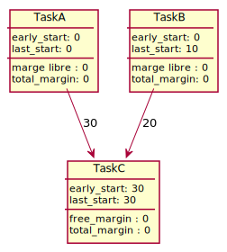

# Terminology

[Go back](..#scheduling-problem)

Learn about the terminology for scheduling problems (optimal cost, early/last start time, and total/free/certain margin).

<table class="table table-bordered table-striped border-dark">
<tr><th>optimal cost/duration</th></tr>
<tr><td>

Also called `durée optimale`/`coût optimal`, this is the least number of days the project will last. This is the last task (usually called END) early start time.
</td></tr></table>

Note: we are using the notation $A(10)$, for the task $A$ having a duration/cost of $10$.

<table class="table table-bordered table-striped border-dark">
<tr><td style="min-width: 150px;">early start time</td><td>

In French, it's called `date au plus tôt`. It's the number of days/... you will have to wait before doing this task.

* for the first one, it's 0
* for the next ones, it's the maximum result of the sum of
  * the previous early start time
  * and the task duration/cost

Ex: If a task $C$ need the task $A(10)$ and $B(20)$, and they are both starting after 30 days, then the task C while start after at least $\max(30+20, 30+10)=50$. The early start time for $C$ is $50$.
</td></tr>
<tr><td>last start time</td><td>

In French, it's called `date au plus tard`. This is the last date for a task and if we pass this date then the optimal duration of the project will increase.

You will start from the end.

* for the last one, it's "early start time" value
* for the previous ones, it's the minimum result of the subtraction of
  * the predecessor last start time
  * their duration

Ex: If a task $C(last=???)$ got two predecessors $D(cost=4, last=45)$ and $E(cost=7, last=45)$ then the $\min(45-4,45-7)=38$, so we have $C(last=38)$.
</td></tr>
</table>

<table class="table table-bordered table-striped border-dark">
<tr><th colspan="2">margin</th></tr>
<tr><td>total</td><td>

Also called `marge totale`. This is the maximum delay that we can take for a task without affecting the optimal cost.

**Operation**: early - last

Ex: If $D(early=42, last=45)$ then the total margin is $45-42=3$.
</td></tr>
<tr><td>free</td><td>

Also called `marge libre`. Same as the total margin, but without changing the next task starting date.

**Operation**: solve $x$
@
x + \text{early_start} + \text{cost} \le \forall_{successor}\hspace{0.3cm} \text{early_start_successor}
@

Ex: the free margin for $I(cost=7, early=30)$ having one successor $J(early=69)$ is $x + 30 + 7 \le 69 \Leftrightarrow x = 69-37=32$
</td></tr>
<tr><td>certain</td><td>

Also called `marge certaine`. Same as the free margin, but considering that every task started with the maximum delay.

**Operation**: $a$ is the certain margin value of the task $A$ if for all predecessors $p$ of $A$, $\text{last_start}\_p - (\text{last_start}\_A + cost(A \to p)) \ge a \ge 0$.

Ex: If a task $C(last=38)$ got two predecessors $D(cost=4, last=45)$ and $E(cost=7, last=45)$ then we have

* $45-38+4=3$
* $45-38+7=0$
* certain margin=0
</td></tr>
</table>

Instead of margin, you can use

* "optimistic time estimate" instead of total margin
* "normal time estimate" instead of free margin
* "pessimistic time estimate" instead of certain margin

but I will use a French-friendly kind of name.

## Alternative example

The **early start time** for C is

\[
\text{early start for C} 
= \max \sum_\text{i predecessor of C} \text{early_start}_i + cost(i \to C)
\]

If you got a task C that can only be done after the task "A" and the task "B", then simply check what's the task that you will have to wait for (=maximum), and the "wait" value is the "cost=duration + the start".

The **last start time** for C, it's the same as the early start time because C seems to be the last task.

The **last start time** for A, it's 

\[
\text{last start for A} 
= \min \sum_\text{i successor of A}
\text{last_start}_i - cost(A \to i)
= min( 30 - 30 ) = 0 
\]

The **last start time** for B, it's

\[
\text{last start for B} 
= \min \sum_\text{i successor of B}
\text{last_start}_i - cost(B \to i)
= min( 30 - 20 ) = 10 
\]

The **optimal cost/duration** is simply the last task early start + cost. Since we don't have a cost for C, we can assume that the optimal duration is $30$. C task's name should have been END.