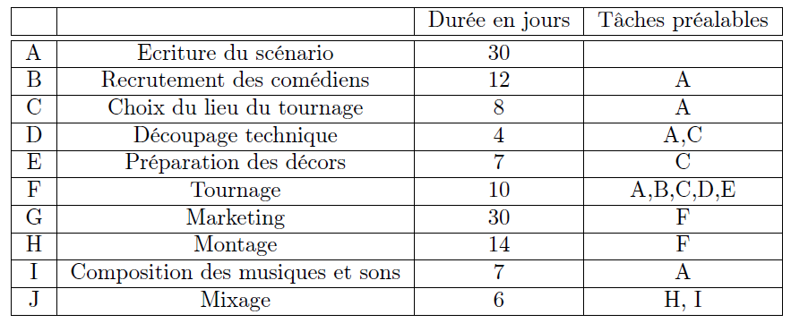
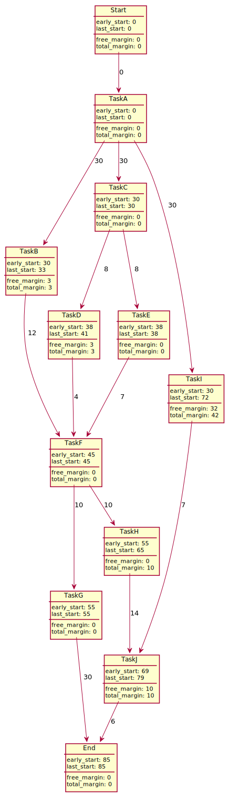

# Metra potential method

[Go back](..#scheduling-problem)

The Metra potential method (`méthode potentiel-tâche`) is what I think is the English name of the `méthode potentiel-tâche`.

* first, create a graph of all of your tasks
* the tasks are linked with edges having a weight which is the duration of the task
* We are usually starting at a node called START, and ending at a node called END

The task (nodes) will have properties

* early start time
* last start time
* free margin (optional)
* total margin (optional)

**Note**: You may have some cases of **redundancy** like C is dependent on A, and D is dependent on C and A. You must remove $A \to D$ because we got by transitivity since we have $A \to C \to D$.

## Example

This is a specifications' table, but the words are in French. Nothing complicated, you got the task id (A, B, ...), the task full name, the duration (=cost), and the dependencies.

And the resulting Metra potential diagram is

 

**Explanations (dependencies)**

* this is straightforward
* C need A so $A \to C$ and A duration is 30 so the weight is 30
* D need C and A, but C needs A, so D only needs C (**redundancy**)
* F need A, B, C, D, and E, but B needs A, so F only needs B, C, D, E (**redundancy**)
* F need A, B, C, D, and E, but E needs C, so F only needs B, D, E (**redundancy**)
* ...

**Explanations (early/last start)**

* C early start is A early start + A cost: $0+30=30$
* D early start is C early start + C cost: $30+8=38$
* ...

As for the last start, once we did all the early_start value, starting from the End

* End's last_start is early_start value (always)
* J's last_start is $85-6=79$ (End's last_start minus J cost)
* C's last_start is $min(41-8, 38-8)=30$ (D's and resp. E's last_start minus C cost)
* ...

**Explanations (free/total margin)**

* The total margin is $\text{last_start-early_start}$
* J's total margin is simply $79-69=10$
* I's total margin is simply $72-30=42$
* ...

As for the free margin

* we are trying to get a total margin without changing the next early_date
* J's free margin is $x + 69 + 6 \le 85 \Leftrightarrow x=10$
* H's free margin is $x + 55 + 14 \le 69 \Leftrightarrow x=0$
* I's free margin is $x + 30 + 7 \le 69 \Leftrightarrow x=32$
* D's free margin is $x + 38 + 4 \le 45 \Leftrightarrow x=3$
* ...

**Explanations (note)**

The critical path is $(Start, A, C, E, F, G, End)$.