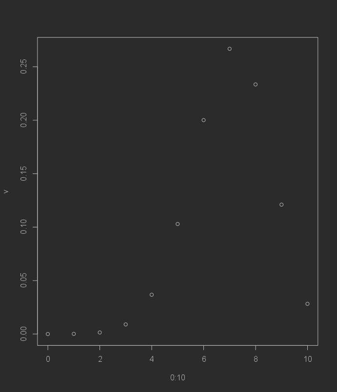

# Bilateral test (basic example)

[Go back](../index.md#tests)

This is a basic example of a Test, because we are evaluating W instead of looking for T. Let's say we generated a sample, following a Bernoulli distribution $B(0.7)$.

```r
n <- 10
m <- rbinom(n = n, size = 1, prob = 0.7)
m
# [1] 1 0 1 1 1 0 1 1 0 1
```

<hr class="sl">

## Hypothesis

We are making the bilateral test under the two hypothesis

* $H_0: \mu = 0.7$
* $H_1: \mu \neq 0.7$

<hr class="sl">

## Looking after $W$

We are looking for the theoretical distribution if the mean was $0.7$. Another way to put it would be that we will look for

@
\forall_{k \in [0,n]} \quad P(X = k)
@

We are computing the theoretical values

```r
v <- NULL
for(k in 0:n)
  # we are adding to the vector v (with the c() function)
  # the result of P(X = k)
  v <- c(v, choose(n, k) *  0.7^k * 0.3^(n-k))
# plot
plot(0:10, v)
```



We are picking $\alpha = 0.05$, so we must remove here the $k$ for which the probability is $\lt 0.05$. Remember that $W$ is the region of rejection, not the region of non-rejection.

```r
v
# [1] 0.0000059049 0.0001377810 0.0014467005 0.0090016920 0.0367569090
# [6] 0.1029193452 0.2001209490 0.2668279320 0.2334744405 0.1210608210
# [11] 0.0282475249

# which x are lesser than 0.05?
# we started from 0 in 0:n so we remove 1
# because R indexes starts from 1 :)
which(v < 0.05) - 1
# [1] 0  1  2  3  4 10
```

The range the $W$ is $[0,4] \cup [10]$. We didn't look after $T$ here.

<hr class="sl">

## Result

If the number of successes is within $[0,4] \cup [10]$ then at a significance level of $\alpha=0.05$, we are rejecting $H_0$.

```r
# this is a trick to count the number of successes
# since we have a vector of 0/1
# - 1 (success)
# - 0 (failure)
# so we are simply doing 1+0+1+...
sum(m)
# [1] 7
```

Since $7 \notin W$ then **we can't reject** $H_0$ at a significance level of $\alpha=0.05$ (do not use "accept", we are picking a hypothesis between two, not confirming that something is always true).