# Unity Script++

This course is a gathering of notes and tips to make your scripts cleaner, and more user-friendly.

<hr class="sl">

## Coding conventions

### Methods

<details class="details-s">
<summary>The name of a method should start with an uppercase</summary>

```diff
- private void myMethod() {}
+ private void MyMethod() {}
```
</details>

<details class="details-s">
<summary>You should explicitly add the qualifier</summary>

```diff
- void MyMethod() {}
+ private void MyMethod() {}
```
</details>

### Attributes

<details class="details-s">
<summary>Private attributes should start with an underscore (<code>_</code>), or ends with an underscore (up to you). You can use either snake case, or camel case.</summary>

```diff
- private int myAttribute;
+ private int _myAttribute;
```
</details>
<details class="details-s">
<summary>Attributes should be private or protected</summary>

```diff
- int myAttribute; // not private (implicit)
- public int myAttribute; // not public
+ protected int _myAttribute; // either explicit protected
+ private int _myAttribute; // or explicit private
```
</details>
<details class="details-s">
<summary>Serialized variables (explained later) or public variables (bad 🙄) should start with a lower case</summary>

```diff
- public int _myAttribute;
- [SerializeField] private int _myAttribute;
+ public int myAttribute;
+ [SerializeField] private int myAttribute;
```
</details>

<hr class="sr">

## Performances

<details class="details-s">
<summary>"If" must not be the last instruction</summary>

```diff
- private void MyMethod()
- {
- 	// some code here (optionnal)
- 	if (something) {
- 		// some code here
- 	}
- }
+ private void MyMethod()
+ {
+ 	// some code here (optionnal)
+ 	if (!something) return;
+ 	// some code here
+ }
```
</details>

<hr class="sl">

## Serialize Field

When creating a Script, it's shown) in the inspector. You can add <small>(we are saying "expose" too)</small> fields inside the inspector too, to allow someone (or yourself) to easily change some values/parameters.

The **bad way** to do this, is to set an **attribute public**. Indeed, as a "side effect", it will be shown inside the editor, but it also means that any other class knows this attribute, and this may lead to problems later.

The **right way** to do this, is to declare a serialized field.

```cs
[SerializeField] private int number = 0;
// or on two lines 😶
[SerializeField]
private int number = 0;
// or 🙄 (bad 👎)
public int number = 0;
```

Resulting in


> **Pro tip**: Unity will show the right field, according to the type of the attribute. You can request a game object, or a component, and in both cases, you will be able to drag and drop a game object from the hierarchy, to the field. You can also use the small circle with a dot, to browse values for this field (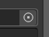).

<hr class="sr">

## Serialize Field : basic

<details class="details-e">
<summary>Rename a Serialize Field 👍</summary>

```cs
[SerializeField]
[FormerlySerializedAs("oldName")] private int number = 0;
```
</details>

<details class="details-e">
<summary>Tooltips 😎</summary>

Maybe, the name of your attribute isn't providing enough information for the user to know what should be in this field. You should always add a **Tooltip**, shown when the user is hovering (=mouse stay over) the field.

```cs
[Tooltip("Some description blah blah blah")]
[SerializeField] private int number = 0;
```

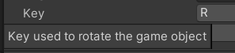 (mouse hovering "key")

> **Pro tip**: this is not an excuse to give bad names to your fields (as I did with "number" or "key").
</details>

<details class="details-e">
<summary>Headers ✨</summary>

You can make categories with Headers. This is a great way of sorting your serialized fields, if you got a lot of them.

```cs
[Header("Some header")]
[SerializeField] private int a;
[SerializeField] private float b;
[SerializeField] private bool c;
```

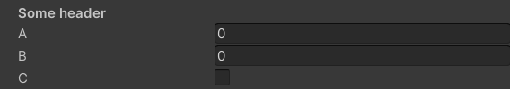
</details>

<details class="details-e">
<summary>Spaces ✨✨</summary>

If headers aren't enough, you can add some spacing too.

```cs
[Header("Some header")]
[SerializeField] private int a;
[Space(2)]
[Header("Some header")]
[SerializeField] private int b;
```

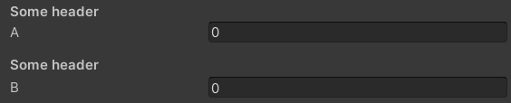
</details>

<details class="details-e">
<summary>New Menu 🚀</summary>

When clicking on "adding component", you got a list of menus such as "Audio", ... You can add a new menu here 🚀!

```cs
// this is a path, you can subfolders (=nested menus) with /
[AddComponentMenu("CubeMaster/Movement")]
public class MovementManager : MonoBehaviour {}
```


</details>

> **Pro tip**: `[Space(2)][Header("name")]` is the same as `[Space(2), Header("name")]`

<hr class="sl">

## Serialize Field: more

<details class="details-e">
<summary>General 🛠</summary>
<br>
<table class="table table-striped table-bordered border-dark">
<tr><th>Code</th><th>Editor/Description</th></tr>

<tr><td>

```cs
[HideInInspector] public float hide;
```
</td><td><br>

No field "hide".
</td></tr>

<tr><td>

```cs
[RequireComponent(typeof(Collider))]
// [RequireComponent(typeof(Collider), typeof(Rigidbody))]
public class SomeClass : MonoBehaviour {}
```
</td><td><br>

You can't add this class as a component of a game object, if this class does not have a collider.
</td></tr>

<tr><td>

```cs
[DisallowMultipleComponent]
public class SomeClass : MonoBehaviour {}
```
</td><td><br>

You can't have more than one instance of this component per game object.
</td></tr>

<tr><td>

```cs
[HelpURL("https://memorize.be/games")]
public class SomeClass : MonoBehaviour {}
```
</td><td><br>

You can set the link opened when clicking on the "?" mark, next to the 3 dots, to remove a component.
</td></tr>

<tr><td>

```cs
[ContextMenuItem("reset", "ResetIntWithMenuItem")] 
public int intWithMenuItem;
private void ResetIntWithMenuItem()
{
	intWithMenuItem = 12;
}
```
</td><td><br>

When using your left-click on a field, you can add fields in the context menu. If you want to add something for the class, check [ContextMenu](https://docs.unity3d.com/ScriptReference/ContextMenu.html).

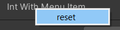
</td></tr>

<tr><td>

```cs
// using System; // for Serializable
[Serializable]
public class NestedClass // <=> struct
{
	public int nestedAttribute; 
}
[SerializeField] private NestedClass nestedClass;
```
</td><td><br>

You can make a dropdown nested inside your component, as other native components do. The class must be Serializable, then simply give the Serializable class as the type of the field.

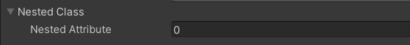
</td></tr>

<tr><td>

```cs
private enum Axis
{
	[InspectorName("X-axis")] X, 
	[InspectorName("Y-axis")] Y
}
[SerializeField] private Axis axis = Axis.X;
```
</td><td><br>

You can use this to rename the values of your enum in the inspector. It does not work for attributes 😭.

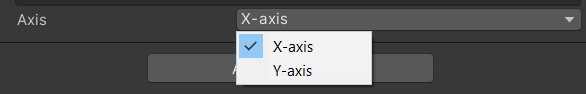

</td></tr>
</table>
</details>

<details class="details-e">
<summary>Numbers 🔢</summary>
<br>
<table class="table table-striped table-bordered border-dark">
<tr><th>Code</th><th>Editor/Description</th></tr>

<tr><td>

```cs
[Min(10)] public int speed = 15;
```
</td><td>

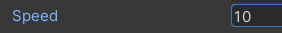

If the value is lower than min, then value = min.
</td></tr>

<tr><td>

```cs
[Range(0, 1)] public float volume;
```
</td><td><br>

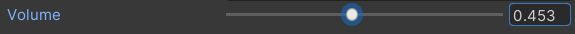
</td></tr>

</table>
</details>

<details class="details-e">
<summary>Strings 📚</summary>
<br>
<table class="table table-striped table-bordered border-dark">
<tr><th>Code</th><th>Editor/Description</th></tr>

<tr><td>

```cs
[Multiline(2)] public string text = "";
```
</td><td><br>

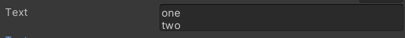
</td></tr>

<tr><td>

```cs
// or [TextArea( minLines, maxLines )]
[TextArea] public string textarea = "";
```
</td><td><br>

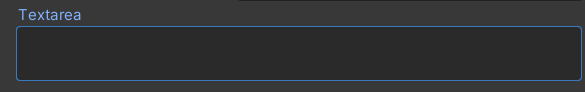
</td></tr>

</table>
</details>

You got way more attributes, you can

* use [SelectionBase](https://docs.unity3d.com/ScriptReference/SelectionBaseAttribute.html) to a class (even if you are not showing it in the editor), to pick whether this class should be selected (no attribute, default), or the base (this attribute)
* add an **entry** in the **preferences** with [SettingsProvider](https://docs.unity3d.com/ScriptReference/SettingsProvider.html) (new version of [PreferenceItem](https://docs.unity3d.com/ScriptReference/PreferenceItem.html))
* add an **entry** in the **toolbar** with [MenuItem](https://docs.unity3d.com/ScriptReference/MenuItem.html)
* add an **entry** in the **assets list** with [CreateAssetMenu](https://docs.unity3d.com/ScriptReference/CreateAssetMenuAttribute.html) (attached to a class extending ScriptableObject)
* make this component show up when **selecting multiples game objects** with [CanEditMultipleObjects](https://docs.unity3d.com/ScriptReference/CanEditMultipleObjects.html)

More?

* This [extension adding new attributes](https://github.com/dbrizov/NaughtyAttributes) may be helpful 🚀
* This [extension is adding new attributes too](https://github.com/gasgiant/Markup-Attributes) ✨
* This [repository is providing examples for every attribute](https://github.com/LastAssertor/Unity-Attributes-Example) 🤓
* [Odin](https://assetstore.unity.com/packages/tools/utilities/odin-inspector-and-serializer-89041) (paid unity plugin)