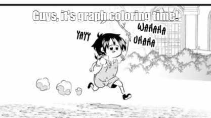
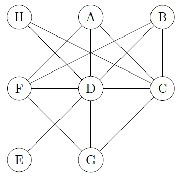
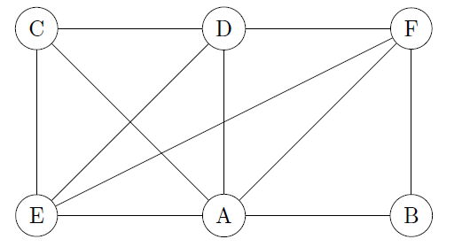
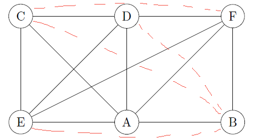
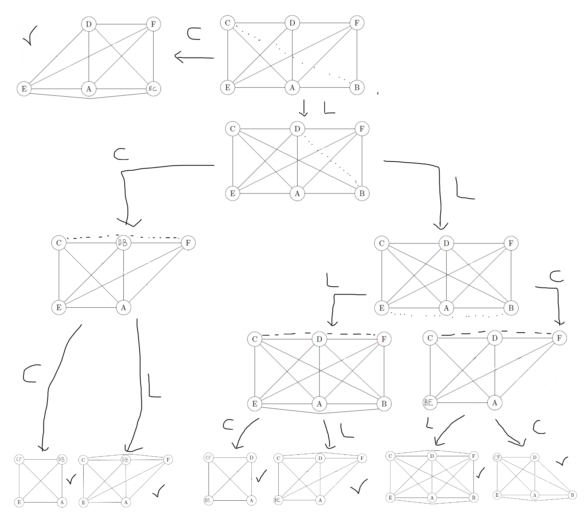
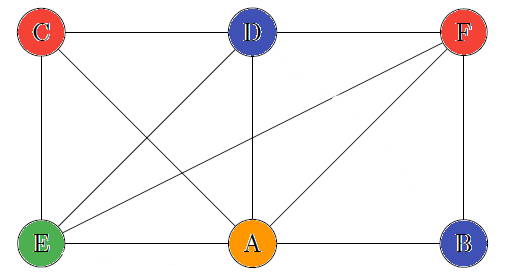

# Vertex coloring

[Go back](..#graph-coloring-problems)

You must use the **least colors**, taking into account that **neighbors can't have the same color**, while coloring the Graph.

We are calling chromatic number (`nombre chromatique`) $\gamma(G)$ (gamma) or $\chi(G)$ (chi) of $G$ the minimum number of colors that we will have to use to color the graph. This is a value hard to found but we know

* $1 \le \gamma(G) \le n$
* if a graph is not planar: $\gamma(G)=|V|$
* if a graph is planar: $\gamma(G) \le 4$
* if a graph is stable: $\gamma(G)=1$
* if a graph is bipartite: $\gamma(G)=2$
* if a graph is complete: $\gamma(G)=|V|$
* minoring: $\gamma(G) \ge |\text{longest_clique_of_G}|$
* majoring: $\gamma(G) \le d_{max}(G)+1$ <small>(max degree+1)</small>

The solution is said to be optimal when we can't find a better one.

## Welsh-Powell greedy algorithm

* order the vertices by decreasing degree
* while all vertices are not colored
    * pick the first not colored vertex
    * pick an unused color
    * while conserving the order above, color every uncolored vertex, not adjacent to the ones we are coloring with this color

To check if the solution is the best one, check if the solution is

* greater than the minoring: not the best one
* equals than the minoring: good

## Contraction

In French, it's called `Algorithme Reliement-contraction`. We are either

* contracting two vertices
* linking two vertices with an edge

Your goal is to get a clique. This algorithm is evaluated as $2^z$ graph to make, with $z$ the number of edges missing for the graph to be complete.

Algorithm

* until every subgraph is complete
* create 2 subgraphs
    * one contracting two vertices
    * one linking two vertices

Once you are done, the degree of the smallest clique is the chromatic number. Note that the vertex in the smallest clique that are contracted together will have the same color.

Source: Tensei Shitara dai Nana Ouji dattanode, Kimamani Majutsu o Kiwamemasu <small>(alias: the Trap)</small>.

## Exercise 1 - Greedy algorithm

Use Welsh-Powell greedy algorithm and find the coloration for the following graph. Is it the optimal solution?

<blockquote class="spoiler">

* $d(D)=7$
* $d(F)=6$
* $d(A)=d(C)=5$
* $d(B)=d(G)=d(H)=4$
* $d(E)=3$

Giving us the following table

* o=colored
* x=not colored since neighbor to a colored
* "nothing"=already colored

| Colors\Vertex | D | F | A | C | B | G | H | E |
|---------------|---|---|---|---|---|---|---|---|
| Red           | o | x | x | x | x | x | x | x |
| Yellow        |   | o | x | o | x | x | x | x |
| Green         |   |   | o |   | x | x | o | x |
| Blue          |   |   |   |   | o | o |   | o |

We are checking: the longest clique is $D-C-A-H$ (size=4) and we colored the graph in $4$ colors, this is the optimal solution. We had the clique $F-D-G-E$ too.
</blockquote>

## Exercise 2 - Contraction

Use the contraction algorithm and find the coloration for the following graph.

<blockquote class="spoiler">

We got 4 missing edges so up to $2^4=16$ graphs we will have to make for $[c,b], [d,b], [e,b], [c,f]$.

And the result is

With L=Link and C=Contraction. The smallest clique (we are among the graphs with the symbol ✔️) is 

* $CF-DB-E-A$: 4 colors
* $CF-D-BE-A$: 4 colors

So we can color our graph like this

</blockquote>