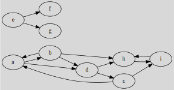

# Terminology - exercises

[Go back](index.md#terminology)

These are easy questions, to make sure that you understood and remembered the vocabulary. We will use this graph $G(V, E)$ for the following questions

* give $V$ (the set of vertices)

<blockquote class="spoiler">

$V=\text{
\{a,b,c,d,e,f,g,h,i\}
}$
</blockquote>

* give $E$ (the set of edges)

<blockquote class="spoiler">

$E=\text{
\{(a,b),(a,d),(b,a),(b,d),(b,h),(c,a),(d,h),(d,c),
(h,i),(i,h),(e,f),(e,g),(c,i)\}
}$
</blockquote>

* give $\Gamma(a)$, $\Gamma(b)$, $\Gamma(c)$

<blockquote class="spoiler">

The number of neighbors of

* a is $\Gamma(a) = \Gamma(a)^+ + \Gamma(a)^- = 2 + 2 = 4$	
* b is $\Gamma(b) = \Gamma(b)^+ + \Gamma(b)^- = 1 + 3 = 4$
* c is $\Gamma(c) = \Gamma(c)^+ + \Gamma(c)^- = 2 + 1 = 3$
</blockquote>

* give a path, a cycle, a chain, and a circuit

<blockquote class="spoiler">

* path: a,b
* cycle: a,b
* chain: a,b,h,i
* circuit: a,d,c
</blockquote>
