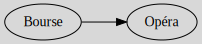

# Introduction

A graph $G$, is a set of **vertices** (=nodes=`sommets/nœuds`) $V$ linked by **edges** (=links=`arêtes`) $E$ giving us the notation $G(V, E)$. Vertices can have a direction or not.

You will use graphs in databases in GraphDatabase, check the NoSQL course if that was what you are looking for. You may also use it to solve scheduling problems using P.E.R.T. in the project management course.

## Kinds of graphs

A graph can be simple/multiple and directed or not.

* **simple graph** (`graphe simple`): up to one edge between two vertex (2 if "directed graph") and no loop/self-edges.
* **multiple graph** (`graphe complexes`): graphs that are not simple
* **undirected graph** (`Graphe non orientés (GNO)`): edges do not have a direction,
  they are written $(a,b)$
* **directed graph** (`Graphe orientés (GO)`): edges, called arcs, have a direction, they are written $[a,b]$

<table class="table table-bordered border-dark table-striped">
    <thead>
        <tr>
            <th>undirected graph</th>
            <th>directed graph</th>
            <th>description</th>
        </tr>
    </thead>
    <tbody>
        <tr>
            <td>
                edge  
                <code>arête</code>
            </td>
            <td>
                arc  
                <code>arc</code>
            </td>
            <td>
                The keyword for edges in changing if the graph is directed or not.
            </td>
        </tr>
        <tr>
            <td>
                chain/walk $P_n$  
                <code>Chaine</code>
            </td>
            <td>
                path/trail $P_n$  
                <code>chemin</code>
            </td>
            <td>
                Each vertex degree is 2 aside from the extremities (degree=1). If the graph is directed, we must be able to go from one extremity to the other.
            </td>
        </tr>
        <tr>
            <td>
                cycle/tour $C_n$  
                <code>cycle</code>
            </td>
            <td>
                circuit $C_n$  
                <code>circuit</code>
            </td>
            <td>
                Each vertex degree is 2. This is also called "closed walk/path/...". If a graph does not have cycles, then the graph is <u>acyclic</u>.
            </td>
        </tr>
        <tr>
            <td>
                star $S_n$  
                <code>étoile</code>
            </td>
            <td>
                star $S_n$  
                <code>étoile</code>
            </td>
            <td>
                One vertex degree is $|V|-1$ and the others are of degree $1$. We got a vertex linked to every other vertex.
            </td>
        </tr>
        <tr>
            <td>
                wheel $W_n$  
                <code>roue</code>
            </td>
            <td>
                wheel $W_n$  
                <code>roue</code>
            </td>
            <td>
                One vertex degree is $|V|-1$ and the others are of degree $3$. It's a vertex linked to all other vertices and each vertex is linked to two aside from the center of the wheel.
            </td>
        </tr>
        <tr>
            <td>
                butterfly/hourglass  
                <code>papillon</code>
            </td>
            <td>
                butterfly/hourglass  
                <code>papillon</code>
            </td>
            <td>
                One vertex degree is $|V|-1=4$ and the others are of degree $2$. The graph is make of $6$ edges and $5$ vertices.
            </td>
        </tr>
    </tbody>
</table>

Note: the degree is the number of neighbors, see next part.

## Terminology

I marked with a little star `*`, the keywords that we are not using often (and that you may learn later).

<table class="table table-bordered border-dark table-striped">
    <thead>
        <tr>
            <th>name</th>
            <th>description</th>
        </tr>
    </thead>
    <tbody>
        <tr>
            <td>
                adjacent/neighbor  
                <code>Adjacent/Voisins</code>
            </td>
            <td>
                Two nodes are adjacent if they are linked by an edge.     The notation is $N(X)$ or $\Gamma(X)$ (gamma) for the adjacent nodes of X. With arcs, we use$N^{+}(X)$ (arc entering/arriving, in-degree) and $N^{-}(X)$ (arc exiting, out-degree).
            </td>
        </tr>
        <tr>
            <td>
                degree  
                <code>Degré</code>
            </td>
            <td>
                The number of neighbors.   
                The notation is $d(X) = |\Gamma(X)|$. In a directed graph, this is $|\Gamma^{+}(X)| + |\Gamma^{-}(X)| = d^+(X) + d^-(X)$. (called <code>demi degré extérieur/prédécesseur (entrants)</code> and <code>demi degré intérieur/successeur (sortants)</code>).
            </td>
        </tr>
        <tr>
            <td>
                incidence  
                <code>incidence</code>
            </td>
            <td>
                A vertex is incident to an edge if they are linked.
            </td>
        </tr>
        <tr>
            <td>
                order  
                <code>ordre</code>
            </td>
            <td>
                The number of vertices, $|V|$, $|V(G)|$ while the cardinal $|V|$ (=the number of elements of a set V) can also be noted, $\#V$ or $Card(V)$.
            </td>
        </tr>
        <tr>
            <td>
                density* 
                <code>Densité</code>
            </td>
            <td>
                This is the number of edges of our graph divided by the number of edge of the complete graph (see below).
            </td>
        </tr>
    </tbody>
</table>

You may also note that, if we have an arc $A \to B$, then

* $A$ is the predecessor of $B$ (`prédécesseur`)
* $B$ is the successor of $A$ (`successeur`)

There are names for graphs having some properties

<table class="table table-bordered border-dark table-striped">
    <thead>
        <tr>
            <th>name</th>
            <th>description</th>
        </tr>
    </thead>
    <tbody>
        <tr>
            <td>
                closed path*  
                <code>cycle/chaine élémentaire</code>
            </td>
            <td>
                A cycle/circuit in which each traversed vertex is only traversed once. <small>If the use of path is disturbing for you, then read the RandomFolkNote at the end of the course.</small>
            </td>
        </tr>
        <tr>
            <td>
                d-regular graph  
                <code>Graphe k-régulier</code>
            </td>
            <td>
A regular graph or d-regular graph is a graph where all degrees have the same value (d, for instance, 3-regular graph).
            </td>
        </tr>
        <tr>
            <td>
                complete graph $K_n$  
                <code>Graphe complet</code>
            </td>
            <td>
Each and every vertex is adjacent to all other vertices aside itself, giving us $|V| = \frac{n(n-1)}{2}$.
            </td>
        </tr>
        <tr>
            <td>
                bipartite graph $K_{a,b}$  
                <code>Graphe bi-parti</code>
            </td>
            <td>
We can split the vertices into 2 groups: the group having a degree a and the group having a degree b with $b > a \ge 1$. Each vertex in the first group must be adjacent to $a$ vertex in the second (resp. second group and $b$).
            </td>
        </tr>
        <tr>
            <td>
                subgraph $G'$  
                <code>Sous-graphe/Graphe induit</code>
            </td>
            <td>
$G'$ is a subgraph of $G$ if we only removed $G$ vertices and their incident edges (like you can't remove an edge alone). 
            </td>
        </tr>
        <tr>
            <td>
                clique 
                <code>Clique</code>
            </td>
            <td>
                A clique is a complete subgraph.
            </td>
        </tr>
        <tr>
            <td>
                Complement/inverse* 
                <code>Complémentaire</code>
            </td>
            <td>
The complement of a graph is a graph in which we are creating all the edges that didn't exist while removing the existing ones. Like if we have $A-B-C$ then the complementary graph would be $A-C\hspace{.5cm}B$.
            </td>
        </tr>
        <tr>
            <td>
                isomorphism* 
                <code>Isomorphe</code>
            </td>
            <td>
Let two graphs $G$ and $H$. If we can move some nodes and get the same graph, then there is an isomorphism. More formally, if there is a bijection between them, then there is an isomorphism.
            </td>
        </tr>
    </tbody>
</table>

**You may do these exercises**: [exercises](exercises.md).

## Advanced Terminology

* Matrix
  * [Adjacency matrix](terms/adj.md)
  * [Incidence matrix](terms/inc.md)
  * [Degree matrix](terms/degree.md)
* [Transitive closure](terms/tc.md)
* [Spanning graph](terms/partial.md)
* [Connected graphs](terms/connected.md)
* [Planar graph](terms/planar.md)
* [Graph matching](terms/matching.md)
* [Independent set](terms/independence.md)
* [Cycle basis](terms/cycle_basis.md)

## Sorting and search

You can sort a graph using

* [Topological sorting](manip/ts.md)

You can search a graph using

* [Depth-first search](manip/dfs.md)
* [Breadth-first search](manip/bfs.md)

And you can solve the problems of passing once by an edge/a vertex with

* [Eulerian graph](manip/euler.md)
* [Hamiltonian graph](manip/hamilton.md)

## Graph coloring problems

You will try to color a graph (vertex/edges) will the least colors.

* [Vertex coloring](coloring/vertex.md)
* [Edge coloring](coloring/edges.md)

What you learned here is very similar to the notion of an independent set. In fact, you can use Grundy to find a coloration. I do not know why we learned those separately. Look for [Grundy number or Grundy chromatic number](https://en.wikipedia.org/wiki/Grundy_number).

A graph coloring problem could be something like "A, B, C, D, E" must pass some tests, but they can't be in the same room for the same test. We are giving you a table of which tests they are passing, and your goal is to find the minimum of rooms needed. You can also have a similar problem like "A, B, C, D, E" can't be in the same room (you got a table of which one can't be with which one) and you have to find at least how many rooms are needed (make a graph of which can't be with which and solve it).

## Trees

A tree is a graph having one of these properties (they are equivalent)

* connected and acyclic (=no cycles)
* one path between two nodes
* connected but would be disconnected if we are removing a vertex
* acyclic but would be cyclic if we are adding one vertex
* connected and $|E| = |V| - 1$
* acyclic and $|E| = |V| - 1$

And here are new notions for trees

* [Spanning tree](trees/def.md) (`Arbre couvrant`)
* [Minimum weight spanning tree (MST)](trees/opti.md) (`Arbre couvrant de poids minimum (ACM)`)

## The shortest path problem

You have 4 algorithms explained here (out of 6)

* [Dijkstra's algorithm](sp/dijkstra.md)
* [Bellman–Ford algorithm](sp/bellman-ford.md)
* [Floyd–Warshall algorithm](sp/floyd-warshall.md)
* [Johnson's algorithm](sp/johnson.md)
* [Distance and Diameter](sp/distance.md)

## Scheduling problem

In French, it's called `Ordonnancement`. You are given

* a list of tasks and their dependencies (like a task need another one to be done first)
* the duration of each task

And your job is to create the best schedule, meaning that you must find the best way to organize the tasks making the project the shorter possible (it's not only used in projects).

Here, we are considering that we can execute an unlimited number of tasks in parallel, and we do not take delays into account, so it's a simplified version of scheduling's problems.

* [Terminology](scheduling/index.md)
* [Critical path analysis](scheduling/cpa.md)
* [Metra potential method](scheduling/pt.md)
* [P.E.R.T. method](scheduling/pert.md)

You should have noticed, but our two methods are giving the same result (same critical path, same optimal duration, ...). This is a way of checking that you did things right. Note that there will be some differences with the early_start/last_start values.

## The random folk note

I don't know how should I interpret this, but French and English do not seem to agree on the terminology. I'm a bit confused, but I'm not changing the course content.

They are using walk for `chaine/chemin`, but

* "A trail is a walk in which all edges are distinct" [wiki](https://en.wikipedia.org/wiki/Path_(graph_theory)#Walk,_trail,_path)
* "A path (`Chemin`) is a trail in which all vertices are distinct" [wiki](https://en.wikipedia.org/wiki/Path_(graph_theory)#Walk,_trail,_path)
* you add directed if needed like "directed path" [wiki](https://en.wikipedia.org/wiki/Path_(graph_theory)#Directed_walk,_trail,_path)
* Chain (`chaine`) is a synonym for a walk [wiki](https://en.wikipedia.org/wiki/Glossary_of_graph_theory#chain)

They are using closed walk for `cycle/circuit`, but

* "A cycle (`cycle`) may either refer to a closed walk (also called a tour)" [wiki](https://en.wikipedia.org/wiki/Glossary_of_graph_theory#cycle)
* "A tour may either refer to "a closed trail (also called a walk)" [wiki](https://en.wikipedia.org/wiki/Glossary_of_graph_theory#tour)
* "A circuit (`circuit`) may refer to a closed trail" [wiki](https://en.wikipedia.org/wiki/Glossary_of_graph_theory#circuit)

## Sources

This is a list of all Wikipedia pages that you may want to check

* <https://en.wikipedia.org/wiki/Graph_theory>
* <https://en.wikipedia.org/wiki/Glossary_of_graph_theory>
* <https://en.wikipedia.org/wiki/Multiple_edges>
* <https://fr.wikipedia.org/wiki/Graphe_simple>
* <https://en.wikipedia.org/wiki/Adjacency_matrix>
* <https://en.wikipedia.org/wiki/Degree_matrix>
* <https://en.wikipedia.org/wiki/Incidence_matrix>
* <https://en.wikipedia.org/wiki/Sprague%E2%80%93Grundy_theorem>
* <https://en.wikipedia.org/wiki/Bridge_(graph_theory)>
* <https://en.wikipedia.org/wiki/Independent_set_(graph_theory)>
* <https://en.wikipedia.org/wiki/Graph_partition>
* <https://en.wikipedia.org/wiki/Transitive_closure>
* <https://en.wikipedia.org/wiki/Connectivity_(graph_theory)>
* <https://en.wikipedia.org/wiki/Planar_graph>
* <https://en.wikipedia.org/wiki/Matching_(graph_theory)>
* <https://en.wikipedia.org/wiki/Cycle_space>
* <https://en.wikipedia.org/wiki/Cycle_basis>

Search, Scheduling methods, ...

* <https://en.wikipedia.org/wiki/Depth-first_search>
* <https://en.wikipedia.org/wiki/Breadth-first_search>
* <https://en.wikipedia.org/wiki/Graph_traversal>
* <https://en.wikipedia.org/wiki/Topological_sorting>
* <https://en.wikipedia.org/wiki/Eulerian_path>
* <https://en.wikipedia.org/wiki/Hamiltonian_path>
* <https://fr.wikipedia.org/wiki/M%C3%A9thode_potentiel-t%C3%A2che>
* <https://en.wikipedia.org/wiki/Program_evaluation_and_review_technique>
* <https://en.wikipedia.org/wiki/Critical_path_method>
* <https://en.wikipedia.org/wiki/Graph_coloring>
* <https://en.wikipedia.org/wiki/Edge_coloring>

Trees

* <https://en.wikipedia.org/wiki/Tree_(graph_theory)>
* <https://en.wikipedia.org/wiki/Spanning_tree>
* <https://en.wikipedia.org/wiki/Minimum_spanning_tree>
* <https://en.wikipedia.org/wiki/Kruskal%27s_algorithm>
* <https://en.wikipedia.org/wiki/Prim%27s_algorithm>

Shortest path problem

* <https://en.wikipedia.org/wiki/Shortest_path_problem>
* <https://en.wikipedia.org/wiki/Dijkstra%27s_algorithm>
* <https://en.wikipedia.org/wiki/Bellman%E2%80%93Ford_algorithm>
* <https://en.wikipedia.org/wiki/Floyd%E2%80%93Warshall_algorithm>
* <https://en.wikipedia.org/wiki/Johnson%27s_algorithm>
* <https://fr.wikipedia.org/wiki/Diam%C3%A8tre_(th%C3%A9orie_des_graphes)>
* <https://en.wikipedia.org/wiki/Distance_(graph_theory)>

[other references](refs.md)