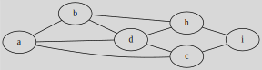

# Adjacency matrix

[Go back](..#advanced-terminology)

This may also be called the boolean matrix (rarely) or `Matrice d’adjacence/Matrice booléenne`. This is a matrix vertex by vertex, and the values are either 0 or 1. If we are at row=A, col=B 

* **1**: $A \to B$ exists 
* **0**: $A \to B$ do not exist 

Notes

* in an undirected graph, the matrix is symmetric.
* if the vertex is looping, we are adding a 2 on the diagonal (and that's can't be called boolean matrix anymore)

This matrix is quite convenient because if $A$ is the adjacency matrix, then $A^p$ is the adjacent matrix after $p$ transition. You can use that to know, after $p$ steps, where you can go.

## Example 1

The adjacency matrix for

is

\[
\displaylines{
\hspace{0.7cm}\begin{array}{} a&b&c&d&h&i \end{array} \ \ \
\\
\begin{array}{} a\\b\\c\\d\\h\\i \end{array}
\begin{pmatrix}
0 & 1 & 0 & 1 & 0 & 0  \\
1 & 0 & 0 & 1 & 1 & 0  \\
1 & 0 & 0 & 0 & 0 & 1  \\
0 & 0 & 1 & 0 & 1 & 0  \\
0 & 0 & 0 & 0 & 0 & 1  \\
0 & 0 & 0 & 0 & 1 & 0  \\
\end{pmatrix}
}
\]

## Example 2

The adjacency matrix for

is

\[
\displaylines{
\hspace{0.7cm}\begin{array}{} a&b&c&d&h&i \end{array} \ \ \
\\
\begin{array}{} a\\b\\c\\d\\h\\i \end{array}
\begin{pmatrix}
0 & 1 & 1 & 1 & 0 & 0  \\
1 & 0 & 0 & 1 & 1 & 0  \\
1 & 0 & 0 & 1 & 0 & 1  \\
1 & 1 & 1 & 0 & 1 & 0  \\
0 & 1 & 0 & 1 & 0 & 1  \\
0 & 0 & 1 & 0 & 1 & 0  \\
\end{pmatrix}
}
\]

You may have noticed, but if we add the edge (d,i), we got a Wheel ($W_{6}$).