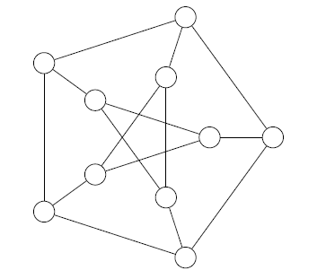
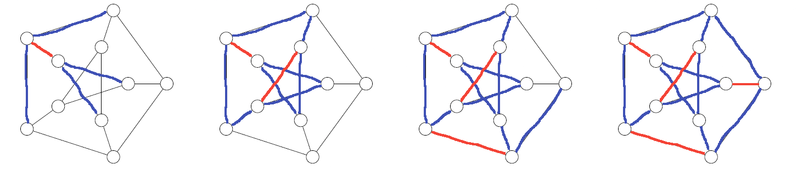
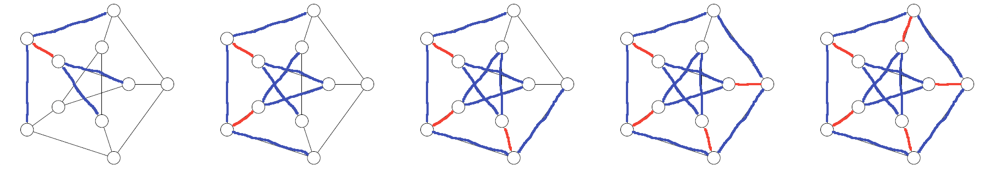

# Graph matching

[Go back](..#advanced-terminology)

A matching graph (`couplage d'un graphe`) is a graph $G'$ having a subset of $G$ edges without common vertices (two vertices are not adjacent). To summarize, you simply have to pick paths of 2 vertices, while making sure that you didn't use a vertex in another path you picked. The edges you used in your paths are forming the matching graph.

* **Maximal**: if we add one more edge of $G$, then this isn't a matching graph anymore
* **Maximum**: we can't make a matching graph with more edges
* **Perfect/Complete**: every vertex of $G$ is used in $G'$ in a path.

A perfect matching is both maximum and maximal. A maximum matching is also maximal.

Algorithm

* pick an edge
* delete all edges incident to your two incident vertex (aside from the one you picked)
* mark the edge as "picked"
* again, until all the edges are either "picked" or "removed"

## Example

Give a maximal matching, maximum matching, and perfect matching of the graph $G$.

Note: this graph is called the Petersen graph.

<blockquote class="spoiler">
Note

* red: picked
* blue: removed

Using the algorithm, I could get the following maximal matching

I found this perfect matching, which means that I also found a maximal and a maximum matching

</blockquote>