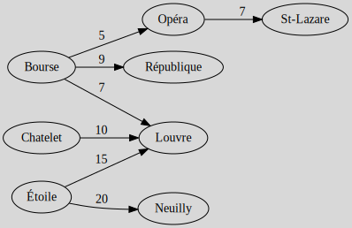
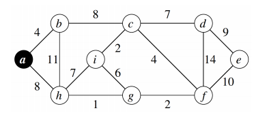
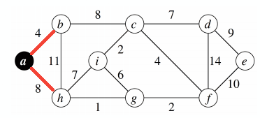
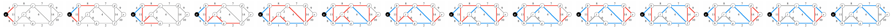

# Minimum weight spanning tree (MST)

[Go back](..)

You are usually given a non-oriented graph (if the graph is oriented, consider it as non-oriented) with a weight on your edges. Your job is to create a Minimum weight spanning tree (`Arbre couvrant de poids minimum (ACM)`) by minimizing the total weight.

**Kruskal's algorithm**

1. Draw all of your vertices
2. While we can add new edges (not a tree yet)
   1. take the edges with the least weight
   2. try adding it (if you are not making a cycle)

**Prim's algorithm**

1. Draw a starting vertex and add it links in $S$
2. While $S$ isn't empty
    1. pick the edge in $S$ having the least weight
    2. if you can add it without creating a cycle, then add it
    3. else destroy/remove the link
    4. add the new vertex edges in $S$

## Exercise 1 (Kruskal)

Create a tree from this table. The value at the line "Chatelet" and the column "N" is the cost for constructing a road from "N" (Neuilly) to "Chatelet".

<blockquote class="spoiler">

We are creating 8 vertices for our 8 destinations. Then we are looking at the least cost in the whole table. It's 5. If adding B (Bourse) - Opera is creating a cycle

* then we do not add it
* otherwise, we add it

And we are doing that until all the nodes are linked.

</blockquote>

## Exercise 2 (Prim)

Apply Prim's algorithm on this graph, **starting from a**.

<blockquote class="spoiler">

I colored in red the edges we may pick. Then, among the ones in red, simply try to add the one with the least weight. If you can, then add the added vertex's edges in red. If I couldn't add an edge, then I colored it in grey.

 

Some may pick b-c instead of a-h, since both weights are $8$. I picked a-h, but this doesn't matter, the rest of the graph would be the same aside from this one edge.
</blockquote>