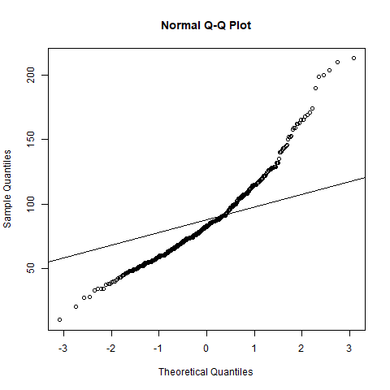

# Descriptive statistics

[Go back](..)

You need to come up with a model for your distribution. Use plots, functions, etc., and try to find as many properties as you can. This is the easiest part of the statistics (at least for non-mathematicians).

You will use normal plots, histograms, and box plots a lot. The first thing to do when having data in your hand would be to check the variables you are interested in with a histogram or a box plot. If you notice outliers with the boxplot (see next part), deal with it. You may notice something, and by cross-checking other diagrams, you may come up with ideas.

* look at the moments of your distribution
* check if your distribution is following a normal distribution (useful in tests)
* try to generate another distribution and compare it with your sample
* check if your variables are independent/dependant
* ...

<hr class="sl">

## Outliers

An outlier (`valeurs anormales/aberrantes/extrêmes`) is a value that looks out of place when observing your distribution. They are impacting your work a lot because they are impacting the mean.

Let's say you got some grades like ``10,10,12`` and your teacher made a mistake and submitted ``10,10,120``.

* ``mean(c(10,10,120)) = 46.66/20`` (impacted a lot)
* ``median(c(10,10,120)) = 10/20`` (not really impacted)

You can notice outliers easily with a boxplot, and you should remove/ignore/fix them. The median is not affected by outliers, so it's more robust.

<hr class="sr">

## QQ-plot

The Quantile-Quantile plot (QQ-plot) is a plot in which we are comparing the quantiles of our distribution with the quantile of another one. It is used to check if it's likely that our data is following a distribution.

```r
qqnorm(ech$var)
# qqnorm(ech$var, datax = TRUE)

# test with poisson distribution
qqline(rpois(100, mean(ech$var)))
```

We can see on this graph that it does not seem, that our sample is following a Poisson distribution.



<hr class="sl">

## Side note

This is a hint, try to remember distribution properties because that might help.

* we know that for a Poisson distribution, mean=variance=parameter
* if we are observing a $mean=3$, $var \simeq 3$, then we could check a Poisson distribution with $\lambda=3$
* this is not an accurate hint, just a hint as to how you could try to think (if you are lost, that is).