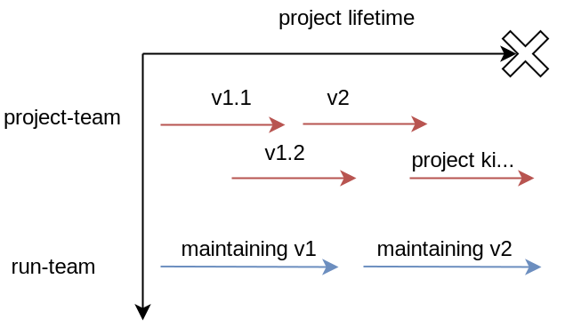
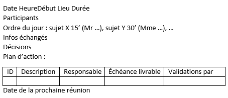

# Make a project

If you're wondering what's the vocabulary used when doing a project, how you could write your specifications or organize your project, then you're in the right place. If you're making an IT project, then we have some [additional knowledge here](../../../it/dev/git-project/todo/index.md).

Honestly, this is a boring yet interesting theoretical course. You will learn a lot of things, but there is a lot of vocabulary. I will try to present it to you in a useful way so that you will enjoy the course. You will learn

* Projects' vocabulary and structure
* How you can write specifications (``CDC``)
* How reporting works
* How you can deal with bugs/issues

## Vocabulary

* **Nature of the project**/**Need** (``Besoin``): what the client wants
* **Deliverables** (``Livrables``): what you will give to the client
* **Milestones** (``Jalons``): important dates of your project
* **Scope** (``Périmètre``): tasks, deliverables, budget, ... everything related to the project.
* **Man-days** (`Homme-Jour HJ`): an indicator of how many resources a task will require
* **Engineer**/**Architect** (``Maitre d’ouvrage``): interactions with the client, planned the project
* **General contractor** (``Maitre d’oeuvre``): interactions with programmers/technical staff, work on the project

## Project Structure

Usually,

* a **build-team**/**project-team** is formed to create a version (ex: 1.0)
* then a **run-team**/**exploitation-team** will keep the project running, make updates, fix bugs ...

It's usually looking like this.

Personally, I barely ever saw the use of run/exploitation-team, but I'm seeing quite a lot "maintainer", at least in IT projects.

## Specifications

You will need to write a document called specifications (``Cahier des charges CDC``), summarizing everything that you have to do.

* **present the company**  : name, logo?, background
* **present the project** : client, what we want, ...
* **present the public** : who will use the product(language, age, IT knowledge, ...)
* **the team** : organization, roles, ...
* **graphic chard** : if you have one

Then, start digging into the real stuff

* [Functional specifications](cdc/fs.md)
* [Technical specifications](cdc/ts.md)
* [Risks](cdc/risks.md)

## Organize your project

You would usually write a Gantt project to organize your tasks, even in an Agile-project (though it may have less content).

You need to create a Gantt with your tasks, their time, their cost, who will do it, ... So we need to do some diagrams beforehand.

* [Work breakdown structure](tools/wbs.md) (WBS)
* [P.E.R.T.](tools/pert.md)
* [GanTT](tools/gantt.md)

Then work on the project and don't forget

* to update your Gantt
* to communicate with your team
* to (properly) organize some meetings
* to do some **tests**
* to write some **documentation**

And please take note that

> **YOU MUST ALWAYS HAVE A WORKING VERSION OF YOUR SOFTWARE**. At any time of the development, the software can be run and, the client or whoever can test it. That's the key to the success so don't forget that 🧐.

## Meetings and reporting

There are usually two kinds of meetings

* **periodic meetings**: with the rest of the team, to summarize what's done and what's need to be done
* **steering meeting** (``réunion de pilotage``): with the client, usually, each month to check what you are doing.
  
For a meeting, you will usually have to write (or read) the minutes of meeting (``Compte Rendu``) which may look like this in French

The daily order/schedule (``ordre du jour/agenda``) is listing who will talk in the meeting, along with how much time and the subject. We have a time set for each participant.

## Bugs

If you are on a small project, you can use a file to store information about your bugs. You can make an Excel table with 1 line per bug.

* give each bug an ID
* a description of how we can reproduce the bug
* a description of what was expected
* a description of what you got
* notes like the software version/tool version/...
* a priority
* an assignee/some reviewers
* a boolean with true/false if solved

But, a lot of tools/websites exist, so you might as well use them. Enter "issues tacker" on a search engine, and you might find what you want. 

* ex: GitHub issues (for IT projects with version control)
* ex: [YouTrack](https://www.jetbrains.com/youtrack/) (an issues' tracker made by JetBrains)
* ex: Jira (Atlassian)

## Sources

* <https://www.codeur.com/blog/gestion-de-projet-diagramme-pert/>
* <https://en.wikipedia.org/wiki/Project_management>