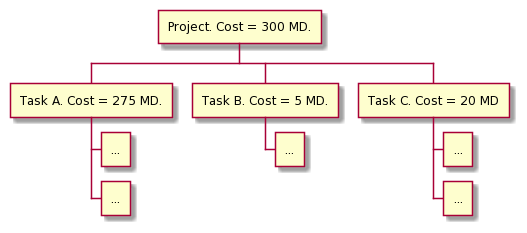

# Work breakdown structure

[Go back](../index.md#organize-your-project)

The Work breakdown structure (`organigramme des taches`) is a tree made of your tasks.

* the project is the root
* then the branches are the direct task needed to do the node above
* for each node, we will have
    * a duration
    * a cost (Man-days/money $)
    * the result expected (optional)
    * the resources needed (optional)

A basic version may look like this

<pre class="d-none" style="display: none;">
@startwbs
* Project. Cost = 300 MD.
** Task A. Cost = 275 MD.
*** ...
*** ...
** Task B. Cost = 5 MD.
*** ...
** Task C. Cost = 20 MD
*** ...
*** ...
@endwbs
</pre>

