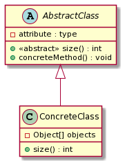

# Abstract classes

[Go back](../index.md)

An abstract class is like a normal class, aside from the fact that we are allowed to have ``<<abstract>>`` methods. An abstract method is a method without code, we are delegating the implementation to the classes generalizing our abstract class.

* the name of the class is in italic and/or with ``<<abstract>>`` before
* you can't call a constructor=instantiate the class, since the class is incomplete, but you can add constructors
* you can have 0 or more ``<<abstract>>`` methods in an abstract class, but you can't add abstract methods in a concrete class.

It's an alternative to interfaces since you can have attributes and write constructors.

