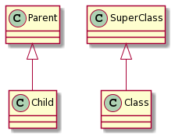

# Generalization

[Go back](../index.md)

A generalization (``Generalisation``, ``Specialisation``), is the UML name for inheritance.

When a class "B" is generalizing a class "A", then the class B will have

* the public attributes/operations declared in A
* the protected attributes/operations declared in A
* the attributes/operations declared in B

**Notes**

* Here, "Class" is inheriting the properties inside the "SuperClass". We can also say that "Class" is generalizing "SuperClass". Same for "Child" and "Parent".
* A class can **only generalize one class** (in fact, we can generalize more classes, but we don't)