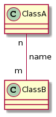

# Multiplicity

[Go back](../index.md)

Since the relationship between two classes is defined by an association, we are simply adding the multiplicity's value to it.

You should read here that

* <kbd>m</kbd> is a value representing the number of instances of the class **A** interacting with an object of the class **B**
* <kbd>n</kbd> is a value representing the number of instances of the class **B** interacting with an object of the class **A**

And, yeah, the number is on the opposite side.

**Notice that the value is at the opposite side**. The values that we can use are

* <kbd>n</kbd>: exactly <kbd>n</kbd>, this is a number like 0,1,2,...
* <kbd>*</kbd>: 0 or more
* <kbd>0..1</kbd>: 0 or 1
* <kbd>0..*</kbd>: same as <kbd>\*</kbd>
* <kbd>1..*</kbd>: 1 or more
* <kbd>n..*</kbd>: <kbd>n</kbd> or more
* <kbd>n..m</kbd>: at least <kbd>n</kbd>, and up to <kbd>m</kbd>
* <kbd>n..n</kbd>: same as <kbd>n</kbd>

For instance, in the example above with <kbd>n..m</kbd>, we could replace our <kbd>n</kbd> by <kbd>0..1</kbd> (0 or 1) and our <kbd>m</kbd> by <kbd>*</kbd> (0 or more).