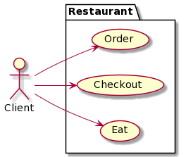
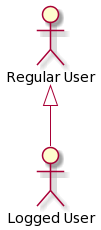
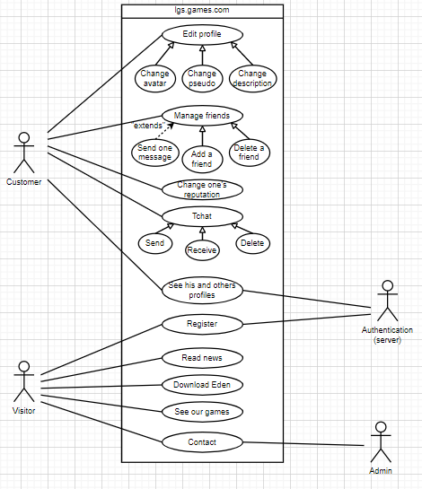

# Use case diagram

[Go back](../index.md)

The "Use case diagram" <small> (or "Diagramme de cas d'utilisation / usage" = DCU) </small> is a diagram representing the interactions between **users** (who: a customer, a user, a person) and a **system** (what: an application, a website, a location).

**Note** that this diagram is not taking into account the timeline, like you **can't** represent the fact that an action will be done after another one. If you think you can, then you are doing it wrong. Check the sequence diagram if you want to take into account the timeline.

## Introduction

A DCU looks like this

with

* **the system**: the Restaurant
* **actors**: only one here, the Client. These are those that are interacting with the system. Note that they are not persons, but roles.
* **use cases**: "Order", "Eat", "Checkout". What your actors can do in/with the system.
* an **association**: a link between actors and use cases.

Let's say a shop is interacting with a factory. If the factory is the system, then the shop is an actor. Using that, you can split a big use case diagram into a bunch of smaller ones. You will make a diagram in which the system is the shop, and the factory an actor and vice versa.

## Generalization between actors

Let's say you got a regular user and a logged user for the system "website". If a logged user can do everything that the regular can do and even more. You can factorize this with a generalization.

This is called Generalization and not inheritance (`Héritage`) since inheritance isn't a UML concept but an implementation one. Here, a Logged User got every use case available for the Regular User, on top of his own use cases.

## Use case associations

You can link use cases between themselves, but DO REMEMBER that you are not allowed to link use cases if it's a temporal relationship like

* if the user is connected (=login)
* then he can see his/her profile (=seeProfile)

`login` and `seeProfile` won't be linked together. `login` will be directly linked to an actor "RegularUser" and `seeProfile` will also be directly linked to another actor called "LoggedUser".

Aside from that, a use case can be linked with another one by

* **a generalization**: if a use case generalize another,  then that means that we could use the use case OR any other generalizing this use case.
* **inclusion**: if a use case is **always** calling another one (=a method **always** calling another one)
* **extension**: a use case **may** call another one (=a method that **may** call another one)

A custom interacting with an ATM

* **may** ask for help (extension)
* **must always** enter his/her code

## Example

A friend made this use case diagram for our website [lgs-games.com](https://lgs-games.com/).

To point out an example of generalization, the generalization of "Edit profile" into

* "Change avatar"
* "Change username"
* "Change description"

means that you can do either of them, like change avatar or change username. If you got one form changing all of them (or not) then you should use "extends".

For "Change one's reputation", you could increase or decrease and this is missing from the diagram (but this would be a generalization)

The diagram is also missing a lot of information like what data is provided to register etc. but that is what makes it cleaner and easier to understand.