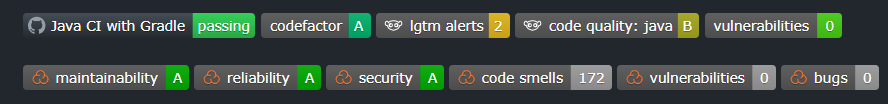

# External websites for reviews

[Go back](../index.md#advanced-concepts)

This is my list of websites that I heard of and used for most of them. You can log in using your GitHub account, and make them review your code (usually, it's free for an open-source project, paid for others).

* [sonarcloud](https://sonarcloud.io) (the **BEST**, quite a lot of feedback)
* [codefactor](https://www.codefactor.io/) (analysis, good)
* [deepsource](https://deepsource.io/) (seems good, but no issues were found in my project 😐)
* [codetriage](https://www.codetriage.com/) (get issues in your inbox)
* [IssueHunt](https://issuehunt.io/) (tackle issues, not really related to this page 🙄)
* [codecov](https://about.codecov.io/) (code coverage)
* [weblate](https://weblate.org/) (not used, translations)
* [snyk](https://snyk.io/) (vulnerabilities, **good**)
* [codacy](https://www.codacy.com/) (I didn't manage to install this one)
* [lgtm](https://lgtm.com/) (basic feedback)
* [scrutinizer-ci](https://scrutinizer-ci.com/) (paid only, not tested)
* [CircleCI](https://circleci.com/) (not tested, ci)

Language-specific

* [StyleCI](https://styleci.io/) (style for PHP/CSS/JS)
* [packagist](https://packagist.org/) (PHP packages)
* [deps.rs](https://deps.rs/) (Rust dependencies alerts)
* [DavidDM](https://david-dm.org/) (Node.js dependencies)
* [PackageQuality](https://packagequality.com/) (npm packages)

> **BUT** it's tiring to check each website if they got news? or How is it automated?

Well, you will usually put a badge in your README (as explained in [Make Git project](../../../proj/make-git-project/index.md)), and the badge will be updated each time someone goes to the page (=each time the badge is rendered), so you will see inside if you have to go check the website or not.

Some websites can also **make comments in your Pull requests** (ex: Sonar cloud, LGTM, and Snyk).

