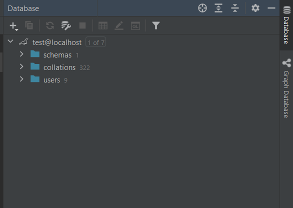
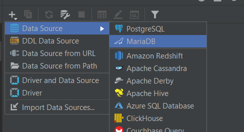
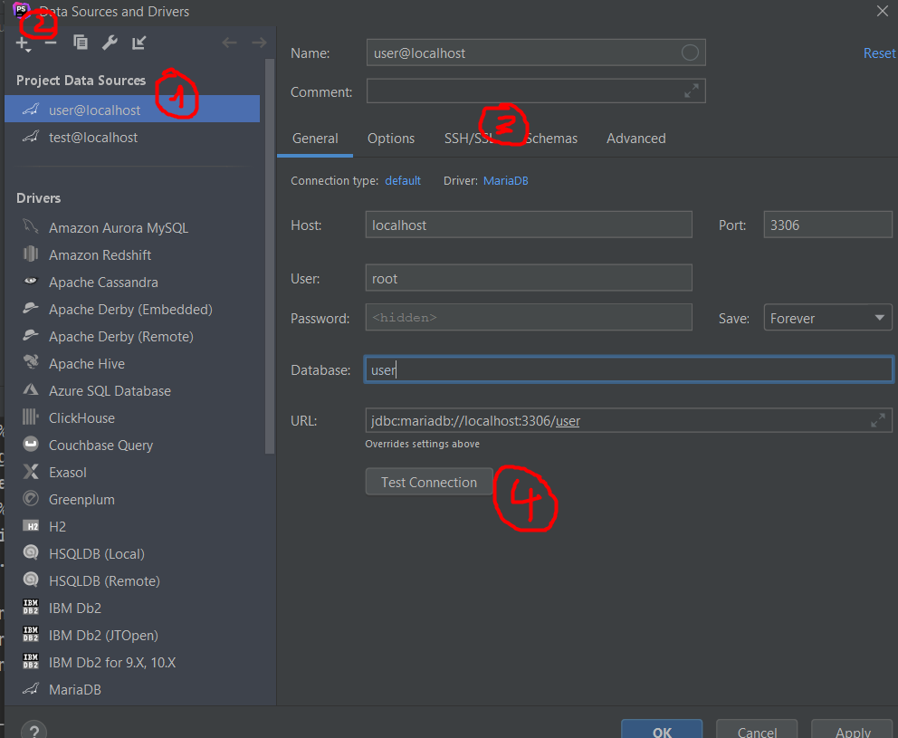
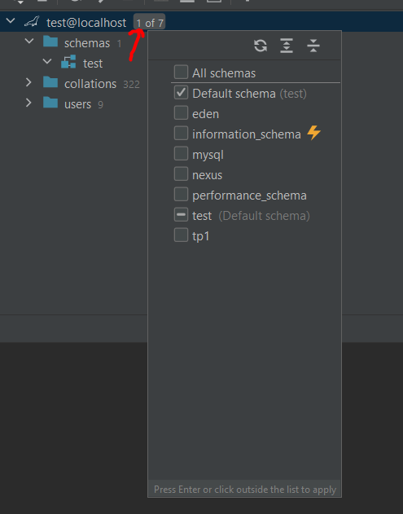
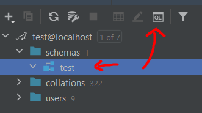
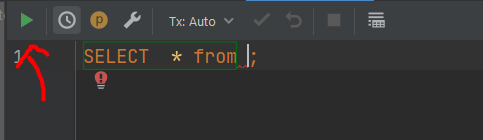

# Databases

[Go back](../menus.md)

In the paid version, you got access to your databases inside the IDE.

Open the menu at the right of your screen

you can add a database

settings your parameters. Please take note that in `3` you can create an `SSH` tunnel to connect to a server, then to a database if your database is not accessible from the outside.

After your database was added, be sure to check the schemas if you don't see anything.

Click on some schema to run a query.

And use the green run button to run your code in your database.

