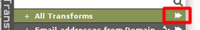

# Investigation

[](https://tryhackme.com/room/passiverecon)

<div class="row row-cols-md-2"><div>

Investigation, or passive reconnaissance (recon) involve gathering information about the target from afar, using public information available, for instance,

* Look for DNS records to look for registrar/contact info/...
* Look for job offers
* Look for news
* ...
</div><div>

The goal is to find as much information as possible. This step is followed by active reconnaissance where you directly interact with the target.

**DNS**

The knowledge related to DNS is stored in [another course](../../server/dns/index.md#recon).

**Subdomains**

As long as you don't interact with the target (no bruteforce...), [Subdomains enumeration](../../server/web/subdomains/index.md) is usually done at this step.
</div></div>

<hr class="sl">

## Open-source intelligence (OSINT)

<div class="row row-cols-md-2"><div>

Open-source intelligence (**OSINT**) is simply of any information that you gather from public sources. It's a collection of websites, available on [osintframework.com](https://osintframework.com/). Simply expand the node, and you will see websites that can provide you information about what you are looking for.

Find other account for a username

* [sherlock](https://github.com/sherlock-project/sherlock) (36.6k ⭐)
* [maigret](https://github.com/soxoj/maigret) (7.1k ⭐)

Find information about a number

* [phoneinfoga](https://github.com/sundowndev/phoneinfoga) (7.7k ⭐)

Find information about an email

* [epieos](https://epieos.com/)
</div><div>

Social Networks
* Instagram: [Osintgram](https://github.com/Datalux/Osintgram) (5.3k⭐) [instaloader](https://github.com/instaloader/instaloader) (5k ⭐)
* Twitter: [twint](https://github.com/twintproject/twint) (archived, 13.9k ⭐)
* Google: [GHunt](https://github.com/mxrch/GHunt) (12.1k ⭐)
* [social-analyzer](https://github.com/qeeqbox/social-analyzer) (Profile in many SN, 9.4k ⭐)
* ...

</div></div>

<hr class="sr">

## Inspecting files

[](https://tryhackme.com/room/introdigitalforensics)

<div class="row row-cols-md-2"><div>

**A PDF**: use `pdfinfo`, an online tool, or simply your default reader, which should have a "details" section.

```bash
$ sudo apt install poppler-utils
$ pdfinfo xxx.pdf
Author:         XXX
Creator:        Microsoft Word
CreationDate:   Sun Aug 28 22:12:17 2022 EDT
ModDate:        Sun Aug 28 22:12:17 2022 EDT
[...]
PDF version:    1.7
```
</div><div>

**An image**: use `exiftool`, or an online tool such as [jimpl](https://jimpl.com/) / [IMV](https://www.geekyhumans.com/tools/image-metadata-viewer). You can view stuff like the GPS coordinates, the camera/device model...

```bash
$ sudo apt install libimage-exiftool-perl
$ exiftool xxx.png
[...]
File Modification Date/Time     : 2022:10:22 18:01:32-04:00
[...]
File Type                       : PNG
File Type Extension             : png
MIME Type                       : image/png
[...]
Software                        : www.inkscape.org
[...]
```

> Hide things in images: [Steganography](https://0xrick.github.io/lists/stego/)
</div></div>

<hr class="sl">

## Maltego

<div class="row row-cols-md-2"><div>

This is a software/tool allowing someone to gather a lot of past, and present information about a target. It includes information about websites, DNS, Domains, emails/telephones, companies... Note that the information generated may not be accurate.


> Official links: [Maltego documentation](https://docs.maltego.com/support/home), [Maltego blog](https://www.maltego.com/blog/), [Maltego tutorials](https://www.maltego.com/categories/tutorial/), and [Maltego webinars](https://www.maltego.com/webinars/),

</div><div>

```bash
$ sudo apt install maltego # tested on Kali Linux
$ maltego
```

Select "Maltego CE (free)", then once you [created a MaltegoCE account](https://www.maltego.com/ce-registration/), you can get started in your first investigation. Click on "new". You will see a white bord. In the left column, you can drag, and drop a starting point. For instance,

1. Search "domain"
2. Drag-and-drop it on the white board
3. Double-click on it to edit it, enter a domain name, then press "ok"
4. Right-click on it, you can now search from something related to this domain name <small>(ex: email addresses...)</small>. If you want to try to look for "everything", then run all transforms



Wait, and investigate what maltego found for you!
</div></div>

<hr class="sr">

## Google Hacking/Dorking

[](https://tryhackme.com/room/googledorking)

<div class="row row-cols-md-2"><div>

Search engines are using bots, called **crawlers** to index websites. They go from a page to another, or from a website to another, by following links. The file **robots.txt** is listing the pages that "good" crawlers shouldn't index, along with the path to a file called **sitemap** which is literally a map of every page/resources of the websites, allowing crawler to easily crawl the website.

Most search engines, Google being the most famous one, allow us to make **advanced queries**. This was a know as Advanced search, but after some guys wrote some books naming that as "Google dorking", then it became widely know as **Google dorking**.

On Google, you can use the [Advanced search](https://www.google.com/advanced_search) page to make advanced queries, while you may also directly use specials tokens in your search bar. There you can find a [long list of Google Search Operators](https://ahrefs.com/blog/google-advanced-search-operators/).

[See Google Hacking Database](https://www.exploit-db.com/google-hacking-database) for juicy queries to exploit this.
</div><div>

* `site:example.com`: search only results on "example.com"
* `site:.com`: search only results on ".com" domains
* `cache:example.com`: cached versions of "example.com"
* `-word`: search results that do not have this word
* `"some word"`: search results that must have "some word"
* `filetype:pdf`: search PDF files
* `intitle:"Hello World"`: search for websites having "Hello World" in their title
* `inurl:admin`: search for URL containing the word "admin"

You may also use

* `imagesize:1920x1080`: search only images on "1920 by 1080"
* `@twitter`: search results on Twitter
* `$400` or `$50..$100`: search for a price
* `#hashtag`: search for a hashtag
* `xxx OR yyy`: search both xxx and yyy
</div></div>

<hr class="sl">

## Recon using certificates/DNS records

<div class="row row-cols-md-2"><div>

[DNS](/info/networking/index.md#domain-name-system-dns-protocol) <small>(used to translate a domain name to an IP address)</small> are storing records about a domain, and its subdomains. The knowledge related to subdomains is stored [here](../web/subdomains/index.md#osint).

Much like subdomains, you can use:

* [crt.sh](https://crt.sh/) to search for certificates issued for a domain name
* [ct search](https://ui.ctsearch.entrust.com/ui/ctsearchui) same, may fetch old certificates
* [dnsdumpster](https://dnsdumpster.com/) fetch DNS records
</div><div>

You can use the [whois](https://www.whois.com/whois/) website, or their command, to dig information about the owner of a domain name, their registrar...

You can use the commands [nslookup/dig](/info/linux/networking/index.md#interact-with-the-outside) to query DNS servers.

```bash
# A = IPV4, AAAA=IPV6, MX, TXT, CNAME...
$ nslookup -type=A example.com
$ dig example.com -t A
# ask 1.1.1.1 DNS server
$ nslookup -type=A example.com 1.1.1.1
$ dig example.com -t A @1.1.1.1
```
</div></div>

<hr class="sr">

## Shodan.io

<div class="row row-cols-md-2"><div>

[Shodan.io](https://www.shodan.io/) is a search engine indexing devices and their information such as the app running on it, the webserver (apache/...), the location, the ports open... And you can even see statistics, such as the top ports used with apache!

> [Search Query Fundamentals](https://help.shodan.io/the-basics/search-query-fundamentals)
</div><div>

**Todo**

* [THM Shodan](https://tryhackme.com/room/shodan)
</div></div>