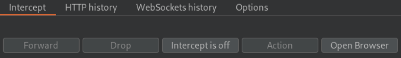

# Burp suite

[](https://tryhackme.com/room/burpsuitebasics)

<div class="row row-cols-md-2"><div>

BurpSuite is a collection of tools that can be used to intercept requests, responses, and inject content in them. This process can be automated, and it's useful both to test websites, and API.

BurpSuite Community is free, and most features are included in 😎, through the intruder is rate-restricted, we can't save our project, and we can't use the automated vulnerability scanner.

*[You can download it, it advised to use a "stable" version](https://portswigger.net/burp/releases#community)*.
</div><div>

There are 6 modules in the suite:

* **Proxy**: intercept, and modify request
* **Repeater**: intercept, modify, and resend multiple times
* **Intruder**: try to bruteforce entrypoint/forms/...
* **Decoder**: decode something, or encode a payload
* **Comparer**: compare data
* **Sequencer**: check algorithm generating tokens/...
</div></div>

<hr class="sl">

## General notes

<div class="row row-cols-md-2"><div>

* Launch the software
* Create a new temporary project

If needed, you can set some project-only options, according to what you will do in the project.

If you want, you can set users-options, such as increasing the font, or using the dark mode.

</div><div>

Some shortcuts

```
Ctrl + Shift + D Switch to the Dashboard
Ctrl + Shift + T Switch to the Target tab
Ctrl + Shift + P Switch to the Proxy tab
Ctrl + Shift + I Switch to the Intruder tab
Ctrl + Shift + R Switch to the Repeater tab
```
</div></div>

<hr class="sr">

## Proxy tab

<div class="row row-cols-md-2"><div>

To proxy is the core module. It's used to intercept requests <small>(and responses if enabled)</small>. Once intercepted, then can be sent to other modules, such as the intruder, or the repeater. But, first, you must configure your browser to send requests to Burp.

* **Solution 1**: Use burp preconfigured chromium web browse
* **Solution 2** 📌: Add the "foxyproxy" plugin to your browser
* **Solution \***: change any settings you want to (browser...) to use a proxy redirecting requests to `127.0.0.1:8080`

<details class="details-e">
<summary>Configuration foxyproxy</summary>

* Click on the plugin | options
* Create a new config with title=Burp, Proxy IP: 127.0.0.1, and Port: 8080

Now, when you click on the plugin, and  then the configuration, any request will be sent to Burp. It also means that when enabled, you "can't" browser your pages unless you allow the request to be sent in burp suite. Click on the plugin, and "turn off" the plugin when you are done.
</details>

<details class="details-e">
<summary>Configuration SSL (avoid error for HTTPS websites)</summary>

Aside from the solution 1, whatever mean you used to redirect requests, it won't with HTTPS requests. There isf documentation as to how you should fix it [here](https://portswigger.net/burp/documentation/desktop/external-browser-config/certificate).

* Intercept must be on in burp suite
* Go to `http://burpsuite/` | Click on "CA". Alternatively, you can use `http://burp/cert`.
* Add the CA to your browser, as explained in the doc. For firefox
  * Go to settings | search certificates
  * View certificates
  * Import the downloaded certificate
  * Check "Trust this CA to identify websites"
  * Done
</details>
</div><div>



Click on **intercept is on** to intercept requests. The web page will keep loading until you unblock the request ⚠️.

<details class="details-e">
<summary>You may manually edit the request</summary>

If you do that for a form for instance, `search=toto`. Actually, "toto" here is **url-encoded**. It means that some characters that may not be used in URL are encoded. 

If you change a value, select it, and use `CTRL+U` to encode it again. Use `CTRL+SHIFT+U` to decode something.
</details>

<details class="details-e">
<summary>Right-click on the request to send it to...</summary>

You can send it to the intruder, repeater...

You can also specifically ask Burp suite to catch the response for this request, with "Do intercept > Response to this request".
</details>

<p class="border border-dark p-3">
<b>Forward (CTRL+F) the request, modified, or not, to the server</b>
</p>

<p class="border border-dark p-3">
<b>Drop the request</b>
</p>
</div></div>

<div class="row row-cols-md-2"><div>

**Scoping**

Usually, to avoid receiving too much traffic, you will define a scope. Then, you can make user to only grab requests/responses being in this scope. First, intercept a request, a forward it.

Now, go to the tab "Targets". Select your target, right-click on it, and add it to the scope. Answer "yes" when prompted to disable out of scope logs.

Go back to the proxy tab, then go to options. Here, you can check "AND URL is in target scope". Now, burp will only intercept requests in the scope.

> **Note**: In target, you will also be able to see burp "sitemap" of the website, along with Issues definitions, which are unused in the community version, but may be a reference when looking for attacks.

**Responses**

If you are interested in responses, be sure to check "intercept responses [...]", and you can also check "AND URL is in target scope".
</div><div class="align-self-center">


</div></div>