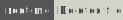

# Digital forensics

[](https://tryhackme.com/room/introdigitalforensics)
[](https://tryhackme.com/room/defensivesecurityhq)
[](https://tryhackme.com/room/adventofcyber4)

<div class="row row-cols-lg-2"><div>

Forensics is the art of investigating crimes. Digital forensics is the same, but for cyber crimes.

* **Memory forensics** 🗺️: dig into a memory capture of a machine to investigate suspect behaviors.

* **Reverse engineering** 🤖: try to understand and investigate suspicious programs. Refer to [this page](/cybersecurity/purple-team/reverse/index.md).

* **File Investigation** ✈️: try to find hidden files, hidden messages, and hidden information in files. Refer to [this page](/cybersecurity/purple-team/files/index.md).
</div><div>

Additional notes

* [Volatility](../tools/forensics/volatility.md) is a well-known memory forensic tool.
</div></div>

<hr class="sep-both">

## Random Topics

<div class="row row-cols-lg-2"><div>

#### Investigate Delete Files

[](https://app.hackthebox.com/machines/Mirai)
[](https://www.root-me.org/en/Challenges/Forensic/Deleted-file)

On Linux, `rm` doesn't delete a file, it only delete the file metadata which marks the memory as 'free to use/writable' by the operating system.

Given the image `data.bin`, these methods may be helpful:

```shell!
$ strings data.bin
```

```shell!
$ sudo apt install foremost
$ foremost -i data.bin
```

```shell!
$ fls -rp data.bin
r/r * 5:        filename
$ icat -r data.bin 5 > filename
```

```shell!
$ debugfs -w data.bin
debugfs> lsdel
```

```shell!
$ testdisk data.bin
```
</div><div>

#### Investigate A Virtual Machine

[](https://academy.hackthebox.com/course/preview/password-attacks)
[](https://www.root-me.org/en/Challenges/Forensic/Oh-My-Grub)

You can mount a `.vmdk`/`.vhd` on Kali Linux using either:

```shell!
$ sudo apt install libguestfs-tools
$ sudo mkdir /mnt/vmdk
$ sudo guestmount -a xxx.vmdk -i --ro /mnt/vmdk
$ sudo ls -lah /mnt/vmdk/
$ sudo SHELL=/bin/bash chroot /mnt/vmdk/
$ sudo umount /mnt/vmdk
$ sudo rm -rf /mnt/vmdk
```

```shell!
$ sudo apt install qemu-utils
$ sudo modprobe nbd
$ sudo qemu-nbd -r -c /dev/nbd1 xxx.vmdk 
$ ls -al /dev/nbd1p* # list the disk partitions
```

You can now mount any partition one by one.

```shell!
$ mkdir p1 && sudo mount /dev/nbd1p1 ./p1
$ sudo SHELL=/bin/bash chroot p1
```

The drive may be [encrypted using BitLocker](/operating-systems/windows/security/index.md#bitlocker-encrypted-drive).
</div></div>