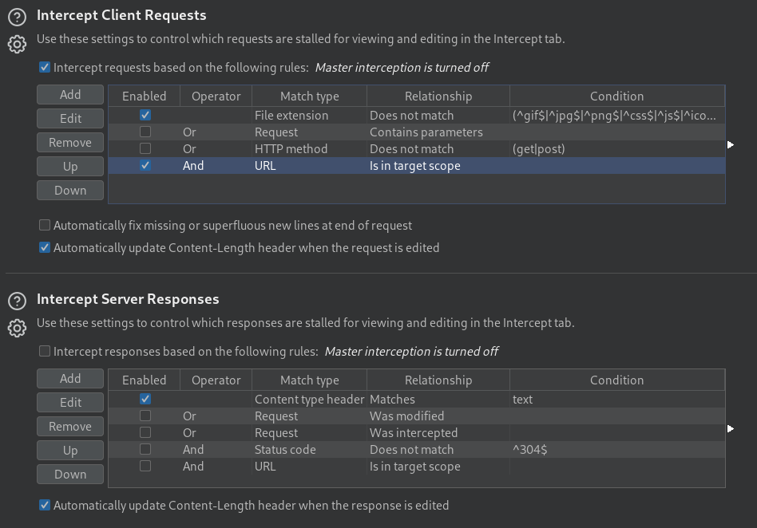
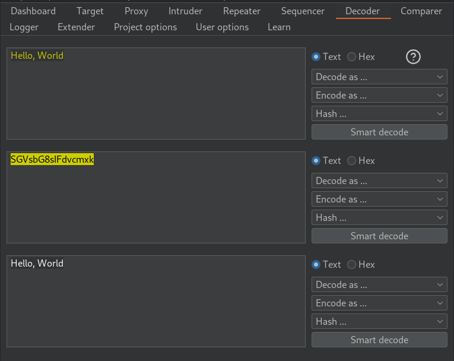
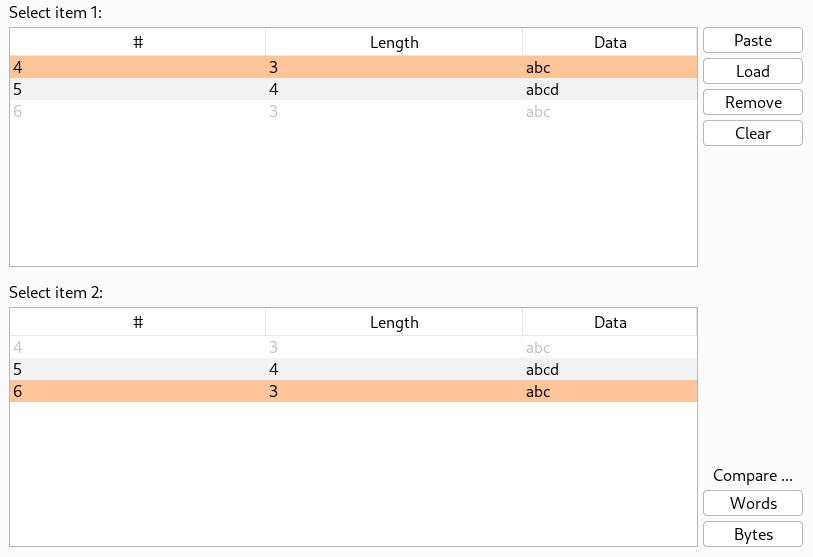

# Burp suite

[](https://tryhackme.com/room/burpsuitebasics)
[](https://tryhackme.com/room/burpsuiterepeater)
[](https://tryhackme.com/room/burpsuiteintruder)
[](https://tryhackme.com/room/burpsuiteom)
[](https://tryhackme.com/room/burpsuiteextender)

<div class="row row-cols-md-2"><div>

Burp Suite is a collection of tools that can be used to intercept requests, responses, and inject content into them. This process can be automated, and it's useful both to test websites, and API.

Burp Suite Community is free, and most features are included in 😎, through the intruder is rate-restricted, we can't save our project, and we can't use the automated vulnerability scanner.

*[You can download it, it advised to use a "stable" version](https://portswigger.net/burp/releases#community)*.
</div><div>

There are 6 modules in the suite:

* **Proxy**: intercept, and modify requests
* **Repeater**: intercept, modify, and resend multiple times
* **Intruder**: try to brute force entry point/forms/...
* **Decoder**: decode something, or encode a payload
* **Comparer**: compare data
* **Sequencer**: check algorithm generating tokens/...
</div></div>

<hr class="sep-both">

## General notes

<div class="row row-cols-md-2"><div>

* Launch the software
* Create a new temporary project

If needed, you can set some project-only options, according to what you will do in the project.

If you want, you can set users-options, such as increasing the font, or using the dark mode.

</div><div>

Some shortcuts

```
Ctrl + Shift + D Switch to the Dashboard
Ctrl + Shift + T Switch to the Target tab
Ctrl + Shift + P Switch to the Proxy tab
Ctrl + Shift + I Switch to the Intruder tab
Ctrl + Shift + R Switch to the Repeater tab
```
</div></div>

<hr class="sep-both">

## Proxy tab

<div class="row row-cols-md-2"><div>

The proxy is the core module. It's used to intercept requests <small>(and responses if enabled)</small>. Once intercepted, then can be sent to other modules, such as the intruder, or the repeater. But, first, you must configure your browser to send requests to Burp.

* **Solution 1**: Use burp preconfigured Chromium web browser
* **Solution 2** 📌: Add the "foxyproxy" plugin to your browser
* **Solution \***: change any settings (browser...) to redirect your browser requests `127.0.0.1:8080`

<details class="details-e">
<summary>Configuration foxyproxy</summary>

* Click on the plugin | options
* Create a new config with title=Burp, Proxy IP: 127.0.0.1, and Port: 8080

Now, when you click on the plugin, and then the configuration, any request will be sent to Burp. It also means that when enabled, you "can't" browser your pages unless you allow the request to be sent in burp suite. Click on the plugin, and "turn off" the plugin when you are done.
</details>

<details class="details-e">
<summary>Configuration SSL (avoid an error for HTTPS websites)</summary>

Aside from solution 1, regardless of the mean you used to redirect requests, it won't with HTTPS requests. There is documentation as to how you should fix it [here](https://portswigger.net/burp/documentation/desktop/external-browser-config/certificate).

* Intercept must be on in Burp Suite
* Go to `http://burpsuite/` | Click on "CA". Alternatively, you can use `http://burp/cert`.
* Add the CA to your browser, as explained in the doc. For Firefox
  * Go to settings | search certificates
  * View certificates
  * Import the downloaded certificate
  * Check "Trust this CA to identify websites"
  * Done
</details>
</div><div>


Click on **intercept is on** to intercept requests. The web page will keep loading until you unblock the request ⚠️.

<details class="details-e">
<summary>You may manually edit the request</summary>

If you do that, note that the URL is **URL-encoded**, meaning that some characters that cannot be used in a URL are encoded so that they don't break the URL. 

You can select your payload, and use `CTRL+U` to URL-encode it. Use `CTRL+SHIFT+U` to decode it.
</details>

<details class="details-e">
<summary>Right-click on the request to send it to...</summary>

You can send it to the intruder, repeater...

You can also specifically ask Burp suite to catch the response for this request, with "Do intercept > Response to this request".
</details>

<p class="border border-dark p-3">
<b>Forward (CTRL+F) the request, modified, or not, to the server</b>
</p>

<p class="border border-dark p-3">
<b>Drop the request</b>
</p>
</div></div>

<div class="row row-cols-md-2"><div>

**Scoping**

Usually, to avoid receiving too much traffic, you will define a scope. Then, you can set up things so that Burp only catches requests/responses being in this scope. First, intercept a request, a forward it.

Now, go to the tab "Targets". Select your target, right-click on it, and add it to the scope. Answer "yes" when prompted to disable out-of-scope logs.

Go back to the proxy tab, then go to options. Here, you can check "AND URL is in target scope". Now, burp will only intercept requests in the scope.

> **Note**: In target, you will also be able to see Burp "sitemap" of the website, along with Issues definitions, which are unused in the community version, but may be a reference when looking for attacks.

**Responses**

If you are interested in responses, be sure to check "intercept responses [...]", and you can also check "AND URL is in target scope".
</div><div class="align-self-center">



<details class="details-e">
<summary>Proxy: Intercept JavaScript</summary>

You may want to intercept a JavaScript file to edit the code before sending it to the browser. Burp Suite does not catch JavaScript by default.

* In Intercept Client Requests, edit and remove `^js$` from the list of filtered extensions.
* Clear your browser cache
  Do the request loading the JavaScript you want to intercept again
</details>
</div></div>

<hr class="sep-both">

## Repeater tab

<div class="row row-cols-md-2"><div>

The repeater is very useful when there is a need to send a usually complex request multiple times with little changes in-between.

Some usual use cases are when trying injections manually, such as SQL injections, or command injections.

Once a request is caught, send it to the repeater. You can use <kbd>CTRL+R</kbd>.
</div><div>

**Notes**

* You have one tab per request.

* Edit the request, URL encode it if needed (CTRL+U), and send it

* There is an inspector on the left, for those that do not want to edit the request manually
</div></div>

<hr class="sep-both">

## Intruder tab

<div class="row row-cols-md-2"><div>

The intruder can be used to do web fuzzing: you can use it to brute force forms, forced browsing... Note that inside the community version, the intruder is heavily **rate-limited**, so you may consider other tools instead. Also, we can't filter results in the CE version, to find interesting ones, so it's a bit hard to use. Once you caught a request, send it to the intruder. You can use <kbd>CTRL+U</kbd>.

**Parameters**

Burp will automatically detect the parameters that will be injected, and wrap them between two **silcrows** (§). The first parameter since the start will be later referred to as 1, the second as 2...

**Payload sets**

Burp Suite is using the term **payload set** to refer to the values that will be used in the attack. It could be a list, a sequence of numbers... You will have to go to the tab **???** to set the payload.

**Rules**

It may be worthwhile to note that Burp also has an equivalent to **rules** that other tools have, allowing us to do transformations on an item from the payload set, such as capitalizing/prefixing/... them.

**Results**

Once the attack is finished, or while in progress, you can sort results by size/... to find the ones that stand out.

**Macros**

There are cases when you want to brute force a form in which some values are changing inside the request. For instance, the server is sending a unique token in every request to avoid simple brute force attacks. You can bypass such primitive checks using a macro.

* Project Options | Sessions | Macros | New | Add a macro and select the request you want to brute force
* Project Options | Sessions | Session Handling Rules | Create a new rule. Set the scope to "intruder" and the URL scope to "suite scope". In the Run Action, pick "Run a macro", and update the sections "update only xxx" according to your needs.
* Done 😥
</div><div>

Note

> $n$: the number of items inside your payload sets<br>
> $m$: the number of parameters

### ➡️Sniper: $n * m$ requests

*the sniper will only attack one parameter at a time*

You provide only one payload set. The attack will test every entry in the payload set for the first parameter and the other will be unchanged, then it will do the same for every other parameter.

### ➡️Battering Ram: $n$ requests

You provide only one payload set. The attack will test the first word for every parameter at the same time, then the second word...

### ➡️Pitchfork: $n$ requests

You provide one payload set per parameter <small>(max 20)</small>. The first word of every payload set is tested in their associated argument, then the second... For instance, take a case when you have a list of `username:password`, and you want to find if there is a couple `(username,password)` that is working.

### ➡️Cluster bomb: $n * m$ requests

You provide one payload set per parameter <small>(max 20)</small>. This is the usual dictionary attack in which every combination is tested.
</div></div>

<hr class="sep-both">

## Decoder tab

<div class="row row-cols-md-2"><div class="align-self-center">

This is like the Burp Suite version of the famous CyberChef, in which you can enter something, and ask Burp Suite to encode/decode it. You can chain encoding/decoding, and you can also hash your input.

There is a button "smart decode", which is like CyberChief magik, which tries to find the encoding, and decode it.

Notice that texts are highlighted/colored with the color of the transformation applied to them to generate the text below. For instance, `"Hello, World"` is in yellow, which means that I used "encode | base64" to generate `SGVsbG8sIFdvcmxk`, while the latter is highlighted in yellow to indicate that I used "decode | base64" to generate the `"Hello, World"` below.
</div><div>


</div></div>

<hr class="sep-both">

## Comparer

<div class="row row-cols-md-2"><div class="align-self-center">

Be it requests or responses, sometimes, they are too long or too complex for us to see manually what changed between them. Sometimes, even for short requests, we may notice that some stuff has changed like headers. 

In any case, if you want to compare requests/responses, the comparer is useful for that. So you can send a request to it from the proxy, the repeater...

In Orange, you can see the two values that will be compared. In each box you can select between the values that are not disabled (greyed).

Once you picked your two values, simply press **Words** or **Bytes** in the bottom left of the screen to process the comparison.
</div><div>

*Random dark mode user note: their dark mode is making this tab hard to use, so I switched back for the capture... It hurts my eyes too 😭*


</div></div>

<hr class="sep-both">

## Sequencer

<div class="row row-cols-md-2"><div>

This tab can be used to send a lot of requests, and compare the entropy/randomness of a token inside a request. You can either pass it a request to a page that generates the token: **Live capture**, or pass a list of captured tokens: **Manual load**.
</div><div>

**Live capture**

Once the request is loaded inside the sequencer, you will be able to select the location of the token within the response: **a cookie, a field inside a form...**. Then, start the capture.

Once you generated a sufficient number of tokens (ex: 10k), pause the capture, and analyze it. If there aren't enough samples, you can unpause the capture and continue.

You can check "auto analyze" to do automatic analysis once every XXX requests, which will become more accurate as the sample size increase.
</div></div>

<hr class="sep-both">

## Extender

<div class="row row-cols-md-2"><div>

Like most community-friendly software, you can write extensions/plugins to enhance them. You can find extensions in the <kbd>Extender | BApp Store</kbd> tab. There are useful extensions such as

* **Logger++**: "[...] logging extension for Burp Suite."
* **WordPress Scanner**: "Find known vulnerabilities in WordPress plugins and themes using WPScan database."
* **Request Timer**: "This extension captures response times for requests made by all Burp tools. It could be useful in uncovering potential timing attacks."
* ...
</div><div>

To install some plugins, you may have to install some adapters as not every plugin was written in Java.

* [Jython](https://github.com/jython/jython) (Python)
* [JRuby](https://github.com/jruby/jruby) (Ruby)
* ...
</div></div>