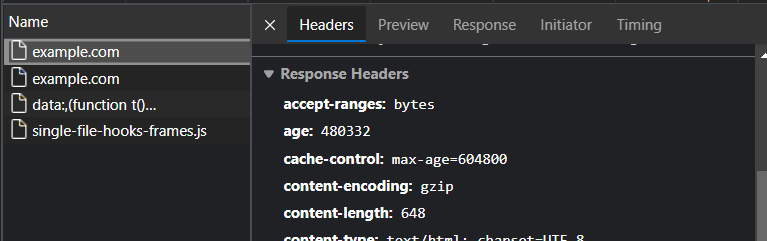

# ⚡ HTTP Headers ⚡

[](https://tryhackme.com/room/agentsudoctf)

<div class="row row-cols-md-2"><div>

[As defined by the HTTP protocol](/it/networking/protocols/index.md#-http---80-tcp), HTTP requests encapsulate headers, with can be used by both the client and the server to exchange information. Vulnerabilities related to headers could lead to

* Version Exposure (see below)
* Injections
    * XSS (see [XSS](/cybersecurity/exploitation/web/forms/xss.md))
    * SSRF (see [SSRF](/cybersecurity/exploitation/web/forms/ssrf.md))
    * Command-injection (see [RCE](/cybersecurity/exploitation/web/forms/command_injection.md))
    * File inclusion (see [File/Path exploits](/cybersecurity/exploitation/web/forms/file_path_exploits.md#file-inclusion))
* CSRF
* ...
</div><div>

You can use websites to check your webserver configuration 🚀

* [observatory.mozilla.org](https://observatory.mozilla.org/)
* [securityheaders.com](https://securityheaders.com/)
* [secure-headers-test](https://geekflare.com/tools/secure-headers-test)

The OWASP foundation as a [Secure Headers Project](https://owasp.org/www-project-secure-headers/) with [their recommended top practices](https://owasp.org/www-project-secure-headers/#div-bestpractices).

This issues may have to be fixed on the server level too. If a website do not use automatic routing, then if a hacker use an invalid URL, they will still receive headers in the response, and these might disclose the server version...
</div></div>

<hr class="sep-both">

## Grab HTTP headers

<div class="row row-cols-md-2"><div>

You should use `curl`

```bash
$ curl -I IP:port
HTTP/1.1 200 OK
Server: nginx/1.18.0 (Ubuntu)
# ...
```

You can use [nmap](/cybersecurity/discovery/nmap/index.md)

```bash
$ nmap --script=http-server-header.nse IP -p80,443
$ nmap -sC IP -p80,443 # may provide less information
```

You can use [Metasploit](/cybersecurity/exploitation/general/metasploit/msfconsole.md)

```bash
msf6 > use auxiliary/scanner/http/http_version
```
</div><div>

You can use your browser, see the network tab of the dev console.



<br>

You could use [telnet](/it/networking/protocols/index.md#-telnet---23-tcp) too, but I doubt you would want to write requests manually... And, it will only work with HTTP, not HTTPS.
</div></div>