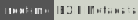

# File investigation

<div class="row row-cols-lg-2"><div>

Any file you find, be it during [Digital forensics](/cybersecurity/blue-team/topics/forensics.md) or during the red team activities, may have:

* 🐟 Hidden content in a file
  * A file inside another file
  * A text inside an image
* 👀 Username/Name of the one that created the file
* 🍫 Information generated by the application that created the file
* ...
</div><div>

This is why you should investigate any file you get your hands on.
 
➡️ For instance, if you notice a "big" image <small>(usually >1 MB)</small>, you may want to check if this is really an image.
</div></div>

<hr class="sep-both">

## Metadata

[](https://tryhackme.com/room/introdigitalforensics)

<div class="row row-cols-lg-2"><div>

Any file has metadata, which is data that provides information on the file, such as the author, the creation date...

See also: [Get-FileMetaData.ps1](https://www.powershellgallery.com/packages/FC_SysAdmin/5.0.0/Content/public%5CGet-FileMetaData.ps1) on Windows <small>(👻)</small>.

<br>

#### PDF metadata

You can use online tools, your PDF reader "details" menu, or `pdfinfo`.

```shell!
$ sudo apt install poppler-utils
$ pdfinfo xxx.pdf
Author:         XXX
Creator:        Microsoft Word
CreationDate:   Sun Aug 28 22:12:17 2022 EDT
ModDate:        Sun Aug 28 22:12:17 2022 EDT
[...]
PDF version:    1.7
```
</div><div>

#### Image metadata

[](https://tryhackme.com/room/adventofcyber2)
[](https://tryhackme.com/room/agentsudoctf)
[](https://tryhackme.com/room/ctfcollectionvol1)
[](https://www.root-me.org/fr/Challenges/Steganographie/EXIF-Metadata)

You can use `exiftool`, [jimpl](https://jimpl.com/), [IMV](https://www.geekyhumans.com/tools/image-metadata-viewer), [exif.regex](http://exif.regex.info/exif.cgi)...

```shell!
$ sudo apt install libimage-exiftool-perl
$ exiftool xxx.png
[...]
File Modification Date/Time     : 2022:10:22 18:01:32-04:00
[...]
File Type                       : PNG
File Type Extension             : png
MIME Type                       : image/png
[...]
Software                        : www.inkscape.org
[...]
```

Also try to perform a reverse image search 🧵.
</div></div>

<hr class="sep-both">

## Steganography

<div class="row row-cols-lg-2"><div>

Steganography is a technique in which a person hides data inside the pixels of an image. It's used to secretly transfer data.

#### Extract Data From An Image

[](https://tryhackme.com/room/agentsudoctf)
[](https://tryhackme.com/room/c4ptur3th3fl4g)
[](https://tryhackme.com/room/chillhack)
[](https://tryhackme.com/room/ctfcollectionvol1)
[](https://tryhackme.com/room/lianyu)
[](https://tryhackme.com/room/easypeasyctf)
[](https://tryhackme.com/r/room/brooklynninenine)
[](https://www.root-me.org/en/Challenges/Steganography/Kitty-spy)

If the hidden content is not protected by a password, you can extract it using the `steghide` command or [zsteg](https://github.com/zed-0xff/zsteg)/[stegoveritas](https://github.com/bannsec/stegoVeritas) for PNGs:

```ps
$ steghide info file.jpg        # check
$ steghide extract -sf file.jpg # extract
```

```ps
$ export PATH=$(ruby -e 'print Gem.user_dir')/bin:$PATH
$ gem install zsteg --user-install
$ zsteg file.png                # refer to the help
```

```ps
$ pipx install git+https://github.com/bannsec/stegoVeritas
$ stegoveritas_install_deps
$ stegoveritas file.png
```

⚠️ If prompted for a password, **try a blank password**.

Otherwise, you may try to brute force the password using tools such as [stegseek](https://github.com/RickdeJager/stegseek) <small>(0.9k ⭐)</small> or [StegCracker](https://github.com/Paradoxis/StegCracker) <small>(0.5k ⭐, 2020 🪦)</small>.

```ps
$ stegseek file wordlist
```
```ps
$ stegcracker file wordlist
```

💎 It's possible that when using the `strings` command we see some interesting parts of the hidden content.
</div><div>

#### Extract Files Nested In Other Files

[](https://tryhackme.com/room/agentsudoctf)
[](https://tryhackme.com/room/ctfcollectionvol1)
[](https://www.root-me.org/en/Challenges/Steganography/EXIF-Thumbnail)
[](https://www.root-me.org/en/Challenges/Steganography/Kitty-spy)

Using [binwalk](https://github.com/ReFirmLabs/binwalk) <small>(10.1k ⭐)</small> you can investigate nested files:

```ps
$ binwalk file.png
# from xxx to yyy: PNG
# from zzz to ttt: ZIP
$ binwalk -e file.png
$ binwalk -dd="*" file.png
```

You can alternatively use `dd`:

```ps
# extract the file by skipping the zzz first bytes
$ dd bs=zzz skip=1 if=file.png of=file.zip
<output is file.zip>
```

If the image is a thumbnail, you could alternatively use:

```ps
$ exiftool -b -ThumbnailImage file.jpg > extracted.jpg
```

#### Additional Steganography Tools 

[](https://tryhackme.com/room/ctfcollectionvol1)

* See also [futureboy](https://futureboy.us/stegano/) steg tools.
* See also [330k encoders](https://330k.github.io/misc_tools/unicode_steganography.html) <small>(Unicode Steganography)</small>
* See also [steganographr](https://neatnik.net/steganographr/) <small>(zero-width characters)</small>
* See also: [stegsolve](https://wiki.bi0s.in/steganography/stegsolve/) <small>(hidden text, similar to stegoveritas)</small>
* See also: [AperiSolve](https://github.com/Zeecka/AperiSolve) <small>(similar to stegoveritas, include many tools)</small>
* See also: [Steganography](https://github.com/ragibson/Steganography) <small>(content hidden using LSB Steganography)</small>
* See also: [lsb-steganography](https://github.com/Aqcurate/lsb-steganography) <small>(Images hidden using LSB Steganography)</small>
* See also: [openstego](https://github.com/syvaidya/openstego) <small>(Hide something)</small>
</div></div>

<hr class="sep-both">

## Audio files

[](https://tryhackme.com/room/c4ptur3th3fl4g)
[](https://www.root-me.org/en/Challenges/Steganography/WAV-Spectral-analysis)

<div class="row row-cols-lg-2"><div>

#### Audacity

You can use [Audacity](https://www.audacityteam.org/) to analyze audio files.

```shell!
$ sudo apt install audacity
$ audacity file.wav
```

Click on the filename, and select "spectrogram." If the text is not readable, you will have to zoom. You can either or both:

* Reduce the frequency interval, by clicking on the filename again, selecting "spectrogram settings", and setting the min/max frequency <small>(the current scale is shown at the start of the track window)</small>

* Increase the height of the track window
</div><div>

#### sonic-visualiser

You can also use [sonic-visualiser](https://github.com/sonic-visualiser/sonic-visualiser) <small>(0.4k ⭐)</small>:

```shell!
$ sudo apt install sonic-visualiser
$ sonic-visualiser file.wav
```

Right-click on the track and in "Layers," select "Spectrogram." Use your mouse to zoom in.

#### Others

* [academo spectrum analyzer](https://academo.org/demos/spectrum-analyzer/)
* [dcode spectrum analyzer](https://www.dcode.fr/spectral-analysis)
* [morsecode audio decoder](https://morsecode.world/international/decoder/audio-decoder-adaptive.html)
* `spek` command
</div></div>

<hr class="sep-both">

## Additional Notes

<div class="row row-cols-lg-2"><div>

#### APNG - PNG GIF

[](https://www.root-me.org/fr/Challenges/Steganographie/APNG-Just-A-PNG-2995)

An image similar to a GIF that contains images and delays between each. It loads the next image after the delay.

```shell!
$ sudo apt-get install apngdis
$ apngdis image.apng
$ cat *.txt | cut -d '=' -f2 | cut -d '/' -f1 | xargs | tr ' ' ','
```
</div><div>

#### Piet Graphical language

[](https://tryhackme.com/r/room/nax)

Weird niche thing. Code stored as an image.

```ps
$ DEST="$HOME/tools/repiet"    
$ git clone -b "master" https://github.com/boothby/repiet $DEST
$ cd $DEST && wget "https://github.com/quentinra/blog.quentinra.dev/tree/master/cybersecurity/purple-team/files/_files/repiet.patch" && git apply repiet.patch && cd -
$ pipx install $DEST
$ repiet image --codel_size <identified_by_zsteg> # and execute the code
```
</div></div>

<hr class="sep-both">

## 👻 To-do 👻

Stuff that I found, but never read/used yet.

<div class="row row-cols-lg-2"><div>

* Stegosploit
* reverse search
* `zcat xxx` or `gunzip -c xxx` and `| cpio -idmv`
* `pngcheck img.png`
* [peepdf](https://github.com/jesparza/peepdf)
</div><div>
</div></div>