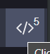

# Second step - Discovery

Discovery 🏝️, a.k.a. active recon (reconnaissance) is the second step of the pentester activities.

It involves gathering information about the target by **probing their network or systems** 🛶️, to find exploitable vulnerabilities.

* 🎯 Host discovery <small>(OS, version...)</small>
* 🕸️ Network discovery <small>(architecture...)</small>
* 🧭 Systems, services and application discovery <small>(FTP, APIs...)</small>
* ...

Unlike passive discovery, as you are directly interacting with the target, you are likely to be detected, and maybe caught 🚓.

Common activities are:

* 🚪 Find entry points
  * running services and open ports
  * web applications or APIs
  * wireless network
  * physical devices
  * backdoors
  * ...
* 🔥 Find versions as there may be known vulnerabilities
* 🔑 Find usernames, backups, exposed data
* 🥅 Find the network architecture <small>(firewall/IDS...)</small>
* 💃 Find any social engineering indicators <small>(contact employees...)</small>
* 🌿 Investigate if a third-party/supplier is vulnerable

## Arsenal 🌱

* Spoof User-Agent

You can install an extension to make the target website believe that you are using another browser. Look for **User-Agent Switcher** extensions on Google. You can try them on [whatismybrowser](https://www.whatismybrowser.com/).

* Use a proxy

You may use a proxy as an intermediary for your requests. If you do, then you can use the **FoxyProxy extension** of your browser to easily swap between no proxy, and your proxies configurations.

* [Devtools](/programming-languages/web/_general/index.md#-developer-tools-devtools-): bypass HTML/JS verifications, hide/remove tags...

* Disable scripts

You may do that to bypass JavaScript verifications. You can use plugins such as [noscript](https://noscript.net/), or ublock by clicking on the following icon

* HTTP clients

We usually don't only rely on our web browser to recon/exploit websites, as they are unreliable. You can use [Postman, curl](/programming-languages/others/apis/_general/index.md#query-an-api) or tools such as the [Burp Suite](/cybersecurity/red-team/tools/utilities/proxies/burp/index.md)...

## Tools and methods 🗺️

Network mapping

* [ping/fping](/cybersecurity/red-team/s2.discovery/techniques/network/ping.md) 🥅: check if a host respond to pings
* [Packet tracing](/cybersecurity/red-team/s2.discovery/techniques/network/trace.md) 🥅: map a network
* The TTL can be used to primitively guess the OS

Scanning and enumeration

* [port scanning](/cybersecurity/red-team/s2.discovery/techniques/network/port_scanning.md) 🚪🔥: discover running services
* [port knocking](/cybersecurity/red-team/s2.discovery/techniques/network/port_knocking.md) 🚪: reveal hidden ports
* [banner grabbing](/cybersecurity/red-team/s2.discovery/techniques/network/banner_grabbing.md) ☠️: get a service banner
* [brute force service credentials](/cybersecurity/red-team/s2.discovery/techniques/network/auth.md) 🚪: try to force your way in
* The banner format may be used to primitively guess the OS

Vulnerabilities scanners

* [Nessus](/cybersecurity/red-team/tools/scanners/vulns/nessus.md): port scanning, find vulnerabilities, quite noisy/slow
* [OpenVAS](/cybersecurity/red-team/tools/scanners/vulns/openvas.md): port scanning, find vulnerabilities, quite noisy/slow
* [Nikto](/cybersecurity/red-team/tools/scanners/web/nikto.md): website vulnerability scanner

Internal Assessments

* [LLMNR/NBT-NS Poisoning](/cybersecurity/red-team/s2.discovery/techniques/network/poisoning.md): usernames, hashes, host fingerprint
* [LDAP And Kerberos Enumeration](/operating-systems/cloud/active-directory/security/index.md#ad-pentester-notes-): usernames, hashes, etc.
* [Password Policy](/cybersecurity/red-team/s2.discovery/techniques/passwords/policy.md): password length, account lockout
* [Password Spraying](/cybersecurity/red-team/s2.discovery/techniques/passwords/spraying.md): gain access to an account

Websites

* [Website mapping](/cybersecurity/red-team/s2.discovery/techniques/websites/mapping.md) 🧭: before investing a website
* [Website fingerprinting](/cybersecurity/red-team/s2.discovery/techniques/websites/fingerprint.md) 🧭: understand your target
* [Source code analysis](/cybersecurity/red-team/s2.discovery/techniques/websites/sanalysis.md) 🚪🔥🔑: comments, hidden code...
* [Account discovery](/cybersecurity/red-team/s2.discovery/techniques/websites/account.md) 🔑: find accounts
* [Forced Browsing](/cybersecurity/red-team/s2.discovery/techniques/websites/forced_browsing.md) 🚪🔑: find hidden pages/folders
* [IDOR](/cybersecurity/red-team/s2.discovery/techniques/websites/idor.md) 🚪🔑: find if you can access someone else content
* [Logic flaws](/cybersecurity/red-team/s2.discovery/techniques/websites/logic_flaws.md) 🚪: find logic flaws, mass assignment
* [Virtual hosts](/cybersecurity/red-team/s2.discovery/techniques/websites/vhosts.md) 🚪: find virtual hosts
* [Subdomains](/cybersecurity/red-team/s2.discovery/techniques/websites/subdomains.md) 🚪: find subdomains
* [Parameters](/cybersecurity/red-team/s2.discovery/techniques/websites/hidden_parameters.md) 🚪: find hidden parameters
* [Json Web Tokens](/cybersecurity/red-team/s2.discovery/techniques/passwords/jwt.md) 🚪🔑: find and exploit these

➡️ You should check for signs of [well-known vulnerabilities](/cybersecurity/red-team/s3.exploitation/index.md#common-vulnerabilities-).

➡️ What you can [do if you get access to a PHP Info script](/cybersecurity/red-team/s2.discovery/techniques/websites/php_info.md).

➡️ Why not try inserting newlines/`%0A` in parameters. Why not try to transform PHP/JS parameters as [explained here]().

🪦 If there is a load balancer such as haproxy blocking some URLs, can you try to see if `//blocked_endpoint` is blocked?

## Additional Notes

#### Remediation 🛡️

* 🔒 Display generic error messages, disable errors messages, and do not give much information <small>(ex: on invalid login, display the message 'credentials invalid', instead of 'username invalid' or 'password invalid')</small>

* 🚧 Test your endpoints with invalid values: 0, -1, characters, symbols... Test your pages with/without expected parameters, especially if a hacker tries to access pages in an unexpected order.

* 🔫 Do not trust anything coming from the user, its browser, or even your database. In a nutshell, do not trust anyone.

 

#### OWASP Foundation

[OWASP](https://owasp.org/) (The Open Source Foundation for Application Security Project) is a foundation that is very well-known for its resources to improve website security. The release every few years the [Top 10 vulnerabilities](https://owasp.org/Top10/).

* See [OWASP Cheat Sheet Series](https://cheatsheetseries.owasp.org/) <small>(23.4k ⭐)</small>
* See [OWASP Web Security Testing Guide](https://owasp.org/www-project-web-security-testing-guide/) <small>(5.4k ⭐, [PDF](https://github.com/OWASP/wstg/releases/download/v4.2/wstg-v4.2.pdf))</small>

#### Pentest Considerations ⚠️

Automated scans can impact the network.

During an assignment, ensure you know which hosts can be automatically scanned (e.g., using Nessus) and which hosts should be excluded and manually tested.

When discovering something, it's important to question why we discovered something, e.g. why is this service present/enabled.

According to the kind of business, we may be able to guess their needs, and also guess some services that should be present.

## 👻 To-do 👻

Stuff that I found, but never read/used yet.

* `sudo arp-scan -l -I eth0`
* [clFrex](https://cifrex.org/)

S3 Buckets

* find S3 Buckets `awscli` (https://docs.aws.amazon.com/cli/latest/userguide/cli-services-s3-commands.html, )
* are not hidden, may be misconfigured to allow edit JS files
* S3 buckets (AWS), blobs (Azure), cloud storage (GCP): may be accessible without auth [grayhatwarfare](https://buckets.grayhatwarfare.com/)

