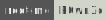

# Website Fingerprint

<hr class="sep-both">

## Analyze Web Requests

[](https://tryhackme.com/room/walkinganapplication)
[](https://tryhackme.com/room/httpindetail)
[](https://tryhackme.com/room/contentdiscovery)
[](https://tryhackme.com/room/agentsudoctf)
[](https://tryhackme.com/room/agentt)
[](https://app.hackthebox.com/machines/Knife)
[](https://tryhackme.com/r/room/unbakedpie)
[](https://www.root-me.org/en/Challenges/Web-Server/HTTP-IP-restriction-bypass)
[](https://www.root-me.org/en/Challenges/Web-Server/HTTP-User-agent)
[](https://www.root-me.org/en/Challenges/Web-Server/HTTP-Headers)

<div class="row row-cols-lg-2"><div>

You can do it from the command line, from your web proxy if you use one, or from the network tab of the devtools console. 

The network tab is unreliable as requests are deleted when the page is reloaded, or some requests might not be exploitable.

A common source of information are the request [headers](/operating-systems/networking/protocols/http.md#http-headers-in-web-applications).

```ps
$ curl -I https://example.com/  # query headers using cURL
```
</div><div>

🔑 The server <small>(Nginx, Apache, IIS, Node.js)</small> and the version may be exposed in the headers.

✨ You may find suspect headers <small>(ex: backdoors such as [PHP8.1-dev](https://github.com/flast101/php-8.1.0-dev-backdoor-rce)...)</small>

👉 You can use the network tab to tune requests and re-send them.

🗺️ There are many web scanner detecting suspicious headers.
</div></div>

<hr class="sep-both">

## Analyze cookies

[](https://academy.hackthebox.com/course/preview/broken-authentication)
[](https://tryhackme.com/room/httpindetail)
[](https://tryhackme.com/room/adventofcyber2)
[](https://tryhackme.com/r/room/unbakedpie)
[](https://tryhackme.com/r/room/glitch)
[](https://tryhackme.com/r/room/vulnnetnode)
[](https://tryhackme.com/r/room/jason)
[](https://app.hackthebox.com/machines/Celestial)
[](https://www.root-me.org/en/Challenges/Web-Server/HTTP-Cookies)

<div class="row row-cols-lg-2"><div>

Cookies can be used to determine the framework/technology/webserver. Some well-known cookies are:

* JSESSIONID — commonly associated with Java Servlets
* PHPSESSID — commonly associated with PHP

Some cookies might contain easily modifiable values or [encoded](/tools-and-frameworks/knowledge/encoding/index.md) values. It's interesting to see how much we can fuzz its values.
</div><div>

Refer to the [Cookie](/programming-languages/web/_general/random/cookies.md) for information on cookies. 

➡️ You can use the [cookie-editor extension](https://cookie-editor.com/) if you don't find it comfortable to use the developer tools.
</div></div>

<hr class="sep-both">

## Architecture Analysis

[](https://app.hackthebox.com/machines/Devvortex)

<div class="row row-cols-lg-2"><div>

#### Favicon Fingerprint

[](https://tryhackme.com/room/contentdiscovery)

Look for the default favicon of the framework. Usually, it's stored at `/favicon.ico`, although it's usually removed. If you do find one, download it, hash it (MD5), and [look for it in OWASP favicon database](https://wiki.owasp.org/index.php/OWASP_favicon_database).

```ps
# Linux
$ curl URL/favicon.ico | md5sum
# Windows (on a downloaded favicon)
$ Get-FileHash .\favicon.ico -Algorithm MD5
```
</div><div>

#### Manual Framework Identification

[](https://tryhackme.com/room/contentdiscovery)


Frameworks and CMS such as WordPress make it easier to develop websites by providing a generic implementation of common website features. It's often advised to use a framework both to ease the work of the developers, and reduce the number of vulnerabilities.

Fewer vulnerabilities don't mean that there are no vulnerabilities. Frameworks may be misconfigured or misused. They may not be updated or users may have installed vulnerable third-party extensions.

Common Frameworks/CMS:

* [WordPress](/programming-languages/web/others/cms/wordpress/index.md): most used content-management system (CMS)
* [Joomla](/programming-languages/web/others/cms/joomla/index.md): popular content-management system (CMS)
* [Drupal](/programming-languages/web/others/cms/drupal/index.md): content-management system (CMS)

Uncommon Frameworks/CMS:

* [phpBB](#php-bulletin-board-phpbb)
* [GetSimple CMS](#getsimple-cms)
* [Subrion CMS](#subrion-cms)
* [umbraco CMS](#umbraco-cms)
* [osCommerce](#oscommerce--ecommerce-framework)
</div></div>

<hr class="sep-both">

## Additional Notes

<div class="row row-cols-lg-2"><div>

#### PHP Bulletin Board (phpBB)

[](https://tryhackme.com/r/room/catpictures)
[](https://www.root-me.org/en/Challenges/Web-Server/Install-files)

When installing a framework, such as [phpBB](https://github.com/phpbb/phpbb), it's important to properly configure it and remove install files.

<br>

#### osCommerce — eCommerce Framework

[](https://tryhackme.com/r/room/blueprint)

[osCommerce](https://www.oscommerce.com/) is a highly vulnerable [open-source](https://github.com/osCommerce) PHP eCommerce framework using a MySQL backend.

If install files were not removed, there is a RCE where we can inject code in the database field during install `/catalog/install/index.php` which is executed when visiting `/install/includes/configure.php`.

📚 Use `oscommerce_installer_unauth_code_exec` for easy exploitation.

<br>

#### Subrion CMS

[](https://tryhackme.com/r/room/techsupp0rt1)

[subrion](https://github.com/intelliants/subrion) <small>(0.3k ⭐)</small> version can be identified on the manager panel located at `/panel/`. Once logged, to get a RCE:

* [Exploit File Upload CVE](https://nvd.nist.gov/vuln/detail/CVE-2018-19422): simply create and upload the usual PHP webshell but rename it as `xxx.phar`.

Upload at `/panel/uploads/` <small>(Right-click to upload)</small> and execute it at `/uploads/xxx.phar` <small>(URL encoding is not automatic!)</small>.

* [Exploit PHP Validation CVE](https://nvd.nist.gov/vuln/detail/CVE-2021-43464): Navigate to `Content>Fields>Select a field>Select Require Field>Write PHP Code`.
</div><div>

#### umbraco CMS

[](https://tryhackme.com/r/room/anthem)

* [official documentation](https://umbraco.com/): it's a .NET CMS
* It is usually hosted on Windows with a MSSQL backend
* It (may?) uses Windows authentication <small>(xxx@domain:pass)</small>
* Config path? `C:\inetpub\wwwroot\Web\Web.config`
* Version 2.12.4 is vulnerable to [RCE](https://github.com/noraj/Umbraco-RCE/) <small>(0.1k ⭐, XSLT upload)</small>
* Once authenticated, click on 'Help' to find the version

<br>

#### GetSimple CMS


Getting access to an account

* There is no default credentials
* The username is `admin`
* You may try brute forcing the password <small>(ex: test `admin`)</small>

Pop a reverse shell

* You can try to upload a reverse shell as an image
* You can replace the template code with a reverse shell, and navigate to the template page shown when editing the template

<br>

#### Cmsimple

[](https://www.root-me.org/en/Challenges/Realist/P0wn3d)

In version 3, you could find the [cmsimple](https://www.cmsimple.org/en/) version from `/content/content.htm`, `/2lang/content/content.htm`, or from the meta tag.

Version 3.1 had a LFI vulnerability at `/index.php?sl=./en`.
</div></div>