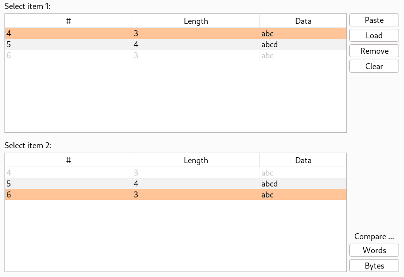

# Burp Comparer

Sometimes, requests or responses are too long or too complex for us to see manually what changed between them. Even for short requests, we may not notice that some stuff has changed like headers.

The **Comparer** is a module to compare requests/responses. Send requests from the repeater or the proxy to it.

In orange, you can see the two values that will be compared. In each box you can select between the values that are not disabled (greyed).

Once you picked your two values, simply press **Words** or **Bytes** in the bottom left of the screen to process the comparison.

