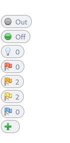
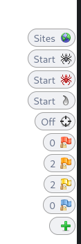
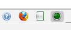

# OWASP ZAProxy

[](https://academy.hackthebox.com/course/preview/using-web-proxies)

<div class="row row-cols-lg-2"><div>

[OWASP ZAP](https://www.zaproxy.org/) (Zed Attack Proxy) or more commonly ZAProxy is an [open-source](https://github.com/zaproxy/zaproxy) <small>(11.8k ⭐)</small> web proxy that offers a robust and complete  alternative to [Burp Suite](../burp/index.md) while being free.

You can [download it here](https://www.zaproxy.org/download/) or install it using:

```ps
$ sudo apt install zaproxy
$ zaproxy
```
</div><div>

There is an embedded pre-configured browser that can be opened using the "firefox" icon at the near end of the icon bar.

Alternatively, we can use our browser and [Foxy Proxy](/cybersecurity/red-team/tools/utilities/proxies/foxyproxy.md) configured to point to `127.0.0.1:8080`. You will need to add Burp Certificate to your browser. Navigate to `https://zap/` or to `Options > Network`, and download and add the certificate to your browser.

📚 You can use a different port if you plan to use multiple proxies. Navigate to `Options > Network > Local Servers`.

➡️ When using a command, refer to [socks](/operating-systems/networking/protocols/socks.md).
</div></div>

<hr class="sep-both">

## ZAProxy Basics

[](https://academy.hackthebox.com/course/preview/using-web-proxies)

<div class="row row-cols-lg-2"><div>

By default, ZAP is catching every request by doesn't intercept them. Additionally, the HUD is enabled by default meaning:

* Requests are internally upgraded to HTTPS
* An interface (HUB) is injected into the page with tools and insight. The left column is mostly for tools related to the current page while the right column is mostly for tools related to the site.

<div class="text-center">



</div>
</div><div>

The in-browser HUD can be enabled by toggling the 'radar' button. There is a tutorial with a few steps to get accustomed to the HUD.

<div class="text-center">


</div>

* There is a button to show hidden comments/fields
* There is a button to enable all disabled fields
* The flags are for the alerts generated passively
* We can access most of ZAP tabs using the HUD

To intercept a request, we must first click on the green button. We can alternatively use the shortcut: `CTRL+B`.

<div class="text-center">


</div>

The first button will send the request and catch the response. The second button will send the request and won't catch the response.
</div></div>

<hr class="sep-both">

## ZAProxy Features

[](https://academy.hackthebox.com/course/preview/using-web-proxies)

<div class="row row-cols-lg-2"><div>

#### ZAProxy Requester

ZAProxy is very similar to Burp Suite Repeater. From any request, right click on it, and select 'Open In Requester tab...'. Alternatively, use the shortcut <kbd>CTRL+W</kbd>.

You should double-click on requester to get a better view of the 4 panels. Double-click back on requester to get back the usual UI.

* The top-level left panel is for the request headers
* The top-level right panel is for the response headers
* The bottom-left panel is for the request body
* The bottom-right panel is for the response body

Click on 'send' to send the request.

#### ZAProxy Proxy

ZAP gradually map the website as it catches HTTP requests/responses. While the result of that is shown in the 'Site' tab, we can use the 'History' tab to observe the sequence of HTTP requests.

Similarly to Burp, you can add websites to the scope.

#### ZAProxy Encoder

The request body is automatically URL encoded. After selecting some text, you can right-click on it and select 'Encode/Decode/Hash'.

This can be handy to easily decode or get the encoding of a text.
</div><div>

#### ZAProxy Replacer

You can automatically edit a request/response using ZAProxy Replacer. Open it using `CTRL+R` or navigate to `options>replacer`.

#### ZAProxy Fuzzer

Right-click on a request and navigate to `attack>fuzz...` to FUZZ a request. Similarly to the history, you can right-click on a request and send it to the requester if you want to work on it.

#### ZAProxy Spider

[](https://academy.hackthebox.com/course/preview/information-gathering---web-edition)
[](https://tryhackme.com/room/adventofcyber2)

ZAP has two spiders that can be used to crawl a website. One traditionally spider, and another 'ajax' spider for dynamic websites. Right-click on a request  and navigate to `attack>spider...` to start crawling a website.

#### ZAProxy Scanner

ZAProxy can passively detect security problems in the website as it discovers URLs. We can run an active scan on the URLs we found to actively look for vulnerabilities.

📚 Run the spider first, then the active scan, to completely make use of what ZAProxy can detect.

📚 ZAProxy can generate a report <small>(Report>Generate Report...)</small>.
</div></div>

<hr class="sep-both">

## 👻 To-do 👻

Stuff that I found, but never read/used yet.

<div class="row row-cols-lg-2"><div>

* [ZAProxy Marketplace](https://www.zaproxy.org/addons/)
</div><div>
</div></div>