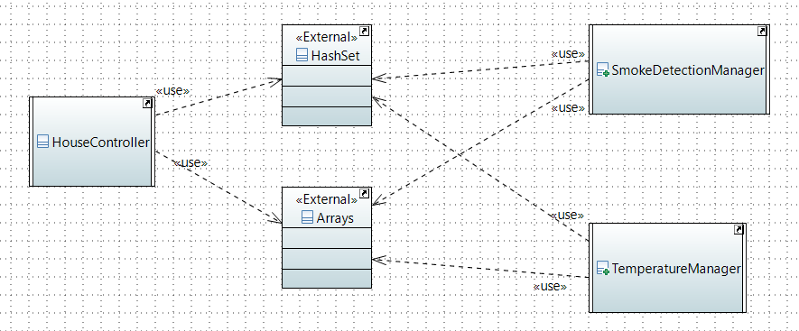
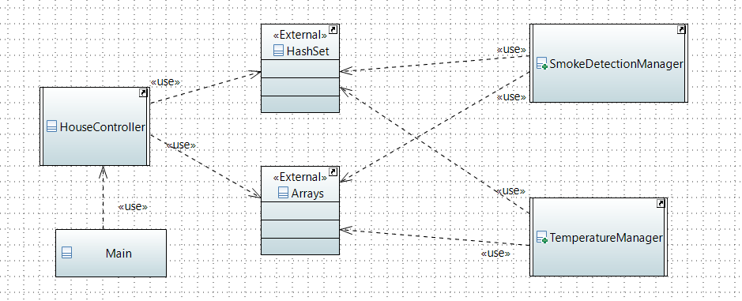

# SmartHouse TD9

...

<hr class="sl">

## xtend : help

> **Goal**: Generate a project, with a main, that can be run. We are not expecting any output (for now, unclear directives).

<details class="details-e">
<summary>Missing files</summary>

The problem is coming, as you could expect, from the model. Some problems that we found were

> **Possible problem**: **Missing names** (xxx.name.empty is raising a NPE)<br>
> **Is this your problem?**: in the first editor, you got a console with errors that happened in the second editor. Check the log inside with CTRL-F.

You may have removed names on states of your Behavior diagram to make it cleaner. That's not good because it's raising exceptions. **Check that every state, if, entry, exit** got a name.

> **Possible problem**: your model is broken 😭<br>

Open every diagram, and check that there is no classes that disappeared. Explorer every entry in the model explorer, and check that there is no duplicates entries (not two times the same class, etc.) People I know having this, didn't manage to solve it 😭.
</details>

<details class="details-e">
<summary>Imports</summary>
<br>

<details class="details-e">
<summary><b>java.util.HashSet</b>/<b>java.util.Arrays</b> no added</summary>

You need to declare dependencies. This is a bit complex, but fortunately, I'm giving you the steps

* Click on SmartHouse (in the model explorer, the root)
* Go to **Profile** > Profile Applications
	* Next to "+" and "x", click on "apply registered profile"
		* Add "Papyrus Code Generation Profile"
		* Add "Papyrus Java Profile"

In SmartHouse (root), add a new package (new child) "ExternalTypes". Click on it, then **Profile**, then **Applied Stereotypes**, and add **NoCodeGen** (it's useless but do it). Put inside two classes

* HashSet <small>(that will be used to reference java.util.HashSet)</small>
* Arrays <small>(that will be used to reference java.util.Arrays)</small>

And on both of them, add them a stereotype (Profile > +) "External". Click on the stereotype, and the small arrow to expand, and name to the referenced class.

Then create in the root a new class diagram "Dependencies" and use the usage relationship to request an import.


</details>

<details class="details-e">
<summary>Missing or unneeded import</summary>

Each import is created for each "use" (usage relationship) you created between two classes. Add or remove such relationship to add or remove imports.
</details>
</details>

<details class="details-e">
<summary>Generating the main</summary>

We are assuming you did the import, so you created **Dependencies**. Open SMModel and copy the class **Main** (Right-click > Copy if needed). Go back to SmartHouse and paste the class in the root. Add it to the diagram Dependencies.



But, you need to edit the code of the main. Expand Main (in the model, the arrow). Click on the OpaqueBehavior **main** and write your code.

```java
System.setErr(System.out);
		
HouseController stateMachine = new HouseController();
stateMachine.transit("S1", "S2"); // error, check HouseController for states
```

You may run the main, as we did with the previous Main.
</details>