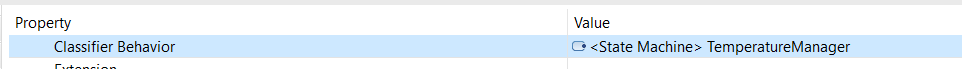

# SmartHouse TD9

[Go back](../index.md)

This section is covering the TD9. You got 3 things to do, while in my opinion, they are not that hard, you may have a hard time if you don't know how you could do something, and the instructions are not detailed enough for you to know how far you should go to reach what the teachers are expecting.

* **Model to Java code generation with Xtend instructions** <small>(Use Xtend plugins for java code generation from state-machines)</small>
* **Model to Java code generation with Acceleo instructions** <small>(Use Acceleo plugins for Java code generation from class)</small>
* **Model to Documentation generation with Acceleo instructions** <small>(Use Acceleo plugins for document generation)</small>

<hr class="sl">

## xtend : help

> **Goal**: Generate code, with a main, that can be run. We are expecting the code to be able to move from one state to another (???).

<details class="details-e">
<summary>Missing files</summary>

The problem is coming, as you could expect, from the model. Some issues that we found were

> **Possible issue**: **Missing names** (xxx.name.empty is raising a NPE)<br>
> **Is this your problem?**: in the first editor, you got a console with errors that happened in the second editor. Check the log inside with CTRL-F.

You may have removed names on states of your Behavior diagram to make it cleaner. That's not good because it's raising exceptions. **Check that every state, if, entry, exit** got a name.

> **Possible issue**: your model is broken 😭<br>

Open every diagram, and check that there aren't classes that disappeared. Explore every entry in the model explorer, and check that there are no duplicate entries (not two times the same class, etc.) People I know having this didn't manage to solve it 😭.
</details>

<details class="details-e">
<summary>Imports</summary>
<br>

<details class="details-e">
<summary><b>java.util.HashSet</b>/<b>java.util.Arrays</b> no added</summary>

You need to declare dependencies. This is a bit complex, but fortunately, I'm giving you the steps

* Click on SmartHouse (in the model explorer, the root)
* Go to **Profile** > Profile Applications
	* Next to "+" and "x", click on "apply registered profile"
		* Add "Papyrus Code Generation Profile"
		* Add "Papyrus Java Profile"

In SmartHouse (root), add a new package (new child) "ExternalTypes". Click on it, then **Profile**, then **Applied Stereotypes**, and add **NoCodeGen** (it's useless but do it). Put inside two classes

* HashSet <small>(that will be used to reference java.util.HashSet)</small>
* Arrays <small>(that will be used to reference java.util.Arrays)</small>

And on both of them, add them a stereotype (Profile > +) "External". Click on the stereotype, and the small arrow to expand, and name to the referenced class.

Then create in the root a new class diagram "Dependencies" and use the usage relationship to request an import.


</details>

<details class="details-e">
<summary>Missing or unneeded import</summary>

Each import is created for each "use" (usage relationship) you created between two classes. Add or remove such relationship to add or remove imports.
</details>
</details>

<details class="details-e">
<summary>Generating the main</summary>

We are assuming you did the import, so you created **Dependencies**. Open SMModel and copy the class **Main** (Right-click > Copy if needed). Go back to SmartHouse and paste the class in the root. Add it to the diagram Dependencies.


But, you need to edit the code of the main. Expand Main (in the model, the arrow). Click on the OpaqueBehavior **main** and write your code.

```java
System.setErr(System.out);
		
HouseController stateMachine = new HouseController();
stateMachine.transit("S1", "S2"); // error, check HouseController for states
```

You may run the main, as we did with the previous Main.
</details>

<details class="details-e">
<summary>NoCodeGen</summary>
<br>

<details class="details-e">
<summary>Code to not import a package marked as NoCodeGen</summary>

If you added NoCodeGen to ExternalTypes, you have to remove it or improve the following code in **ClassUtils.java**, **requiredClassifiers**, right before the return. You may use the method filter too if you want.

```java
// import
// import org.eclipse.papyrus.designer.languages.common.profile.Codegen.NoCodeGen;
EList<Classifier> usedClassesReturn = new UniqueEList<Classifier>();
for(Classifier c : usedClasses) {
	if (!GenUtils.hasStereotypeTree(c, NoCodeGen.class)) {
		usedClassesReturn.add(c);
	}
}
```
</details>

<details class="details-e">
<summary>Code to not generate a package marked as NoCodeGen</summary>

Edit **noCodeGen** in **JavaModelElementsCreator**.

```diff
- GenUtils.hasStereotypeTree(element, ExternLibrary.class) ||
+ GenUtils.hasStereotypeTree(element, ExternLibrary.class) &&
+ GenUtils.hasStereotypeTree(element, NoCodeGen.class);
```
</details>
</details>

<details class="details-e">
<summary>Default code for methods</summary>

We are considering cases such as `return false;` missing in a method (as a default implementation), while you could also completely implement a method.

<details class="details-e">
<summary>Default/Implementation, as we did with the main</summary>

* Right-click on a class (ex: TemperatureSensor)
* New Child > Opaque Behavior > Owned ...
* Name it (ex: `getTemperatureDefaultImplementation`)
* Language > + > Java
* Write some code
```java
// todo
return false;
```
* Click on a method (ex: `getTemperature`)
* In UML, look for the field Method
* Add your Opaque Behavior
</details>

<details class="details-e">
<summary>Default implementation in the generator</summary>

You must change the return type so that it is always a class, if this is not a constructor nor void. Then, the default behavior will be **return null** if we are returning something that is not void, nor it's a constructor.

In **JavaOperations.xtend**, in **javaReturnSpec**

```diff
- JavaGenUtils.javaQualifiedName(operation.type, operation.owner) + ' ' 
+ JavaGenUtils.javaQualifiedName(operation.type, operation.owner).toFirstUpper() + ' '
```

And in **javaOperationDeclaration**

```diff
- «IF mustGenerateBody(operation)»«JavaOperations.javaOperationImplementation(operation)»«ENDIF»
+ «IF mustGenerateBody(operation)»«JavaOperations.javaOperationImplementation(operation)»
+ «IF javaReturnSpec(operation) != 'void ' && !isConstructor(operation)»return null;«ENDIF»«ENDIF»
```
</details>
</details>

<details class="details-e">
<summary>Missing variable states, and everything related to behaviors diagrams</summary>

You should have such a variable in both manager and the controller (=every software). If not, you will have to check the **Classifier behavior** value. Simply click on the class for which there is a problem, go to advanced. Check the value for **Classifier behavior** is a state machine. If not, then double click on it and select the state machine.


</details>

<hr class="sr">

## Acceleo (code) : help

> **Goal**: generate code from classes.

<details class="details-e">
<summary>Types aren't valid Java types</summary>

First, types such as Real are not converted to Float. You need to replace the print of the type with a call

* use `genType(aProperty.type.name)`
	* instead of `aProperty.type.name`
	* or instead of `aProperty.type.name.toUpperFirst()`
* of course, sometimes the variable isn't called aProperty

The locations are

* **classJavaFile**: **fields** (1), **operations** (1), **parameters** (1), **accessors** (2)
* **interfaceJavaFile**: **genInterfaceJavaFile** (1), **parameters** (1)

And we are creating the template **genType** in **common/fileUtils.mtl**

```java
[**
 * Generates the type in Java given an OCL type
 * @param aType The OCL Type
 */]
[template public genType(aType : String)]
[if (aType.toUpperFirst() = 'Real')]Float[else][aType.toUpperFirst()/][/if]
[/template]
```

> **Pro tip**: We should handle **Unlimited Natural** (Long) too. String, Boolean, and Integer are already like we want. 
</details>

<details class="details-e">
<summary>Missing imports</summary>

An easy way to do this is to hard code the import, by adding some lines in **genDefaultImport** inside **common/fileUtils.mtl**

```java
[template public genDefaultImport(aType : Type)]
// [protected ('for imports')]
import java.util.*;
// [/protected]
[/template]
```

You need to add import right after the java.util import. But, this won't do. You will also have to put every package inside one package, because in Java, you can't import classes nested in the default package. **In fileUtils**, edit these two functions with

```diff
[template private packagePath(aType : Type)]
- [ /* something */ /]
+ ['/' + aType.getSourcePackage() + '/' + /* something */ /]
[/template]

[template public genPackageValue(aType : Type)]
- [ /* something */ /]
+ [aType.getSourcePackage() + '.' + /* something */ /]
[/template]
```

And create the template **getSourcePackage**

```java
[template public getSourcePackage(aType : Type)]
[aType.getModel().name/]
[/template]
```

Now, your packages will be in a default package named **SmartHouse**. Allowing you to use the following import statements.

```java
import SmartHouse.Software.*;
import SmartHouse.Hardware.*;
import SmartHouse.Communication.Alarm_Protocol.*;
import SmartHouse.Communication.Controller_Protocol.*;
import SmartHouse.Communication.HeatingACS_Protocol.*;
import SmartHouse.Communication.Managers_Protocol.*;
import SmartHouse.Communication.Sensors_Protocol.*;
```
</details>

<details class="details-e">
<summary>Duplicates methods</summary>

Obviously, this is a problem in your model, but you can edit **classJavaFile**, template **operations**

```diff
- [for (anOperation : Operation | aClass.getOperations()->union(aClass.getImplementedInterfaces().ownedOperation))]
+ [for (anOperation : Operation | aClass.getOperations())]
```
</details>

<details class="details-e">
<summary>Do not generate External Classes</summary>

Wrap the code generating aClass inside this if. You can trick this code to make it work with other templates.

```java
[let c : Classifier = aClass.oclAsType(Classifier)]
[if (c.getAppliedStereotypes()->collect(name)->count('External') = 0)]

[/if]
[/let]
```
</details>

<details class="details-e">
<summary>Running your code 🚀</summary>

* In the runtime_editor
* Right-click > New > Others > Java Project
* `org.eclipse.acceleo.javagen.SmartHouse`, Java 1.8, and you don't need to open the Java perspective
* Generate the code and put it in src
</details>

<details class="details-e" hidden>
<summary>(Sample) generate imports</summary>

**This code isn't complete, I was trying to generate imports**, but stopped midway.

```
[template public genDefaultImport(aType : Type)]
// [protected ('for imports')]
import java.util.*;
[for (aPackage : Package | aType.ancestors().eAllContents(Package))]
[let anc : Sequence(T) = aPackage.ancestors(Package)->reject(aPackage : Package | aPackage.oclIsTypeOf(Model)).name->reverse()->sep('.')]
    [if (anc->isEmpty())]
import [aPackage.name/].*;
    [else]
    // some import
    [/if]
[/let]
[/for]
// [/protected]
[/template]
```
</details>

<hr class="sr">

## Acceleo (documentation) : help

> **Goal**: generate a file with some weird content, have a sort of print of our classes <s>and our interfaces</s> (interfaces were not handled by our teacher)<br>
> **Tip**: do not try to indent the code to make things cleaner. This is changing the output 😱.

<details class="details-e">
<summary>Fix generateMain not generating interfaces</summary>

Update the code in **generateInterface.mtl**, to use a recursive template **generatePackage** (that we will code), to handle interfaces that were in nested packages.

```java
[template public generateElement(aModel : Model)]
[comment @main/]
[file (aModel.name+'_generated.txt', false, 'UTF-8')]
[for (c: Class | aModel.packagedElement->filter(Class)->sortedBy(name))]
[generateClassElement(c)/]
[/for]
[comment DONE search for classes and interfaces in model's nested packages/]
[for (p : Package | aModel.nestedPackage->sortedBy(name))]
[generatePackage(p)/]
[/for]
[/file]
[/template]
```

And

```java
[template private generatePackage(p : Package)]
[if (not p.name.equalsIgnoreCase('Needs'))]
[comment DONE then display Package's name/]
Package [p.name/]
[comment DONE and indent classes and interfaces names/]
	[for (c : Class | p.packagedElement->filter(Class)->sortedBy(name))]
	[generateClassElement(c)/]
	[/for]
	[for (i : Interface | p.packagedElement->filter(Interface)->sortedBy(name))]
	[generateInterfaceElement(i)/]
	[/for]
	[for (p : Package | p.packagedElement->filter(Package)->sortedBy(name))]
	[generatePackage(p)/]
	[/for]
[/if]
[/template]
```
</details>

<details class="details-e">
<summary>Possible generateInterface code</summary>

Update the template **generateInterfaceElement** in **generateInterface.mtl**.

```none
[comment encoding = UTF-8 /]
[**
 * The documentation of the module generateInterface.
 */]
[module generateInterface('http://www.eclipse.org/uml2/5.0.0/UML')]
[import org::eclipse::acceleo::module::sample::files::generateAttribute/]
[import org::eclipse::acceleo::module::sample::files::generateOperation/]
[import org::eclipse::acceleo::module::sample::files::generateParent/]
[import org::eclipse::acceleo::module::sample::files::generateAssociation/]

[**
 * The documentation of the template generateElement.
 * @param anInterface
 */]
[template public generateInterfaceElement(anInterface : Interface)]

[file (anInterface.name, false, 'UTF-8')]
[anInterface.visibility/] interface [anInterface.name.toUpperFirst()/][generateParentElement(anInterface)/] {

[for (p : Property | anInterface.attribute)]
	[generateAttributeElement(p)/]
[/for]
[for (o : Operation | anInterface.ownedOperation)]
	[generateOperationElement(o)/]
[/for]
[generateAssociationElement(anInterface)/]
}
[/file]
[/template]
```

And create `generateParentElement(Interface)` in `generateParent.mtl`

```none
[**
 * The documentation of the template generateElement.
 * @param anInterface
 */]
[template public generateParentElement(anInterface : Interface)]
[for (i : Interface | anInterface.redefinedInterface) before ('extends') separator (', ') ]
	[i.name/]
[/for]
[/template]
```

And edit `generateAssociationElement` in `generateAssociation.html`

```diff
- [template public generateAssociationElement(c: Class)]
+ [template public generateAssociationElement(c: Type)]
```
</details>

<details class="details-e">
<summary>Do not generateInterface documentation in another file</summary>

Update the template **generateInterfaceElement** in **generateInterface.mtl** to have this (remove the file instruction).

```java
[template public generateInterfaceElement(anInterface : Interface)]
[anInterface.visibility/] interface [anInterface.name.toUpperFirst()/][generateParentElement(anInterface)/] {
[for (p : Property | anInterface.attribute)]
	[generateAttributeElement(p)/]
[/for]
[for (o : Operation | anInterface.ownedOperation)]
	[generateOperationElement(o)/]
[/for]
[generateAssociationElement(anInterface)/]
}
[/template]
```
</details>

<details class="details-e">
<summary>Missing implements for classes</summary>

Update **generateParentElement(aClass)** in **generateParent.mtl**.

```java
[template public generateParentElement(aClass : Class)]
[aClass.extendedClasses()/][aClass.implementedInterfaces()/]
[/template]

[template private extendedClasses(aClass : Class)]
[for (aSuperClass : Class | aClass.superClass) before(' extends ') separator(', ')][aSuperClass.name.toUpperFirst()/][/for]
[/template]

[template private implementedInterfaces(aClass : Class)]
[for (anInterface : Interface | aClass.getImplementedInterfaces()) before(' implements ') separator(', ')][anInterface.name.toUpperFirst()/][/for]
[/template]
```
</details>

<details class="details-e">
<summary>Removing type &lt;Type&gt;</summary>

In **generateOperation.mtl**, replace &lt;Type&gt; with **?** (first) and then **void** (second, put a space before).

```java
[template public generateOperationElement(anOperation : Operation)]
[if (anOperation.upper = -1 or anOperation.upper > 1)]
[anOperation.visibility/] List<[if (anOperation.type.name.oclIsUndefined())]?[else][anOperation.type.name/][/if]> [anOperation.name/]([for (op : Parameter | anOperation.ownedParameter) separator(', ')][if (op.type.oclIsUndefined())]?[else][op.type.name/] [op.name/][/if][/for]) {}
[else]
[anOperation.visibility/][if (anOperation.type.name.oclIsUndefined())] void[else] [anOperation.type.name/][/if] [anOperation.name/]([for (op : Parameter | anOperation.ownedParameter) separator(', ')][if (op.type.oclIsUndefined())]<?>[else][op.type.name/] [op.name/][/if][/for]) {}
[/if]
[/template]
```

In **generateAttribute.mtl**, replace &lt;Type&gt; with **?** (first) and then **Object** (second).

```java
[template public generateAttributeElement(aProperty : Property)]
...
[aProperty.visibility/] List<[if (aProperty.type.name.oclIsUndefined())]T[else][aProperty.type.name/][/if]> [aProperty.name/];
[else]
[aProperty.visibility/][if (aProperty.type.name.oclIsUndefined())] Object[else] [aProperty.type.name/][/if] [aProperty.name/];
[/if]
[/template]
```
</details>