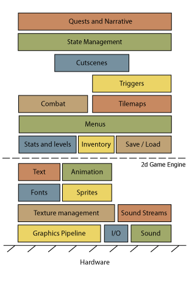

# Games Engines

Starting developing a video game from scratch is a bad idea. Most video games are sharing the same base that can be reused.

A game engine will deal with a lot of things related to the hardware <small>(sound, io, graphics)</small> and let us focus on our game <small>(quests, inventory, levels)</small>.

Picking a game engine is usually a choice based on:

* The targeted platforms for our game 🧐
* The knowledge of the team 😎
* The features of the game engine 🚀
* The price and/or the license constraints ✨
* The community, support, and documentation 📚

Source: [envato-tuts+ / Game Development](https://gamedevelopment.tutsplus.com/)

## Basic Elements

#### Lifecycle and game loop

Most game engines have a similar lifecycle. 

1. It initializes the game elements
2. It repeatedly calls the game loop
   1. We fetch the user input
   2. We update the game accordingly <small>(update)</small>
   3. We update the screen <small>(render)</small>
3. We dispose of the game elements

#### Frames Per Second (FPS)

The Frames Per Second (FPS) represents the number of times the [game loop](#lifecycle-and-game-loop) is executed per second.

Unfortunately, the graphic card may not call the game loop with a constant time <small>(e.g., not every 1ms)</small>. This may be because the update was slower, the render was slower, or they were too fast 😎.

The side effect is that moving objects may not move smoothly. To fix this behavior, we use the **delta time** <small>(=time since when the last update)</small> every time we are moving something. ✍️

