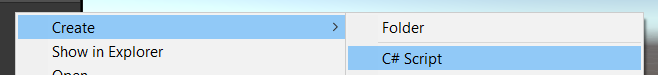
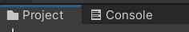
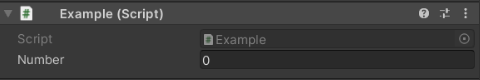
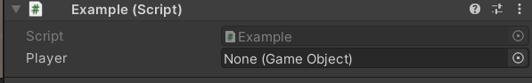
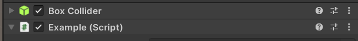

# Be good, use folders!

The project files are usually split into folders, using these folders names

* **Animations**, **Audio**, **Cutscene**
* **Editor**, **Images**, **Materials**
* **Plugins**
* **Prefabs**: your prefabs
* **Scenes**: your scenes (unity scene files, a screen of your game)
* **Scripts**: your C# scripts (.cs)
* **Settings**, **Shaders**

> **Prefabs**: if you are planning to duplicate a GameObject, you should create a Prefabs. Simply drag and drop a GameObject in the Project Window. This created a file. Double-click on the file to edit the prefab, and this will edit the properties of every instance of this Prefab. You can create a new instance by drag and dropping the prefabs in the hierarchy window. On each instance, in the property window, you may see a small blue line on a property, meaning that the prefabs and this instance got a different value for this property.

<hr class="sl">

## Scripts

Scripts are in **C#**, an old version of C#. From [this page about the C# compiler](https://docs.unity3d.com/2020.3/Documentation/Manual/CSharpCompiler.html), Unity 2020.3 (LTS) is using **C# 8.0**. In **2021.2+**, they are using **C# 9.0**, but of course, we are not using a non-LTS version. You should also note that even if they are using versions 8.0 or 9.0, **every feature of C# is not available** (check on the page above, for "Unsupported features").

Right-click inside the **project window**, create a new Folder "Scripts" and a new script (ex: "Example.cs").

<div class="text-center">


</div>

<div class="row">
<div class="col-md-6">

```cs
using UnityEngine;

public class Example : MonoBehaviour
{
    // Awake is called when the script instance is being loaded
    private void Awake() { }

    // Start is called before the first frame update
    private void Start() { }

    // Update is called once per frame
    private void Update() { }
}
```
</div>
<div class="col-md-6">

### Explanations

After removing unused imports, I added the Awake function. This is a sample of the 3 functions you will use.

These scripts can be added to components, by **clicking on a component**, then using **"add component"** in the inspector window. Search your scripts (ex: "Example") and add them.


Note that you can use the 3 vertical dots to remove a component, or easily open a script.

> If you are unsure about what's a method/class/attribute, you may read the Java course or watch some videos 🚀.
</div>
</div>

> **Note**: In a Script, you can use `Debug.Log(something)` to print something in the editor, inside the console . You got variants such as `Debug.LogWarning` or `Debug.LogError` if needed.
>
> **Note**: In C#, you can use `var` instead of the type of a variable when creating a variable with a value, to ask the compiler to infer a type. This is a kind of lazy practice 🙄.

<hr class="sl">

## User-friendly scripts

If you want, you may **add fields in the inspector** as you have for other sections, like "Number" here.



Either make the attribute **public** or add **[SerializeField]** before the attribute (recommended).

```cs
// Note: can be on two lines, or one
[SerializeField] private int number = 0;
// same as above :(, but this is "a side effect"
public int number = 0;
```

<details class="details-border">
<summary>Of course, you can make something look better by using ToolTips, Menus, Headers, Spaces, etc.</summary>

```cs
// you renamed something
[SerializeField]
[FormerlySerializedAs("OldName")] private int number = 0;

// make a class available in "folder/.../name" in the
// component selector
[AddComponentMenu("folder/class")]
// adding tooltips
[Tooltip("blah blah blah")]
// The following attributes will be inside this header
[Header("a header")]
// ...
// Spacing
[Space(value)]
```
</details>

<details class="details-border">
<summary>Note that you can easily link components using this</summary>
<br>

```cs
[SerializeField] private GameObject player;
```

Giving you



And you simply have to drag-and-drop a game object (ex: a player) from the **Hierarchy window** to this field. This is useful when you don't want to do tiring things (ex: using tags/...) to get another GameObject.

Note: you can use the small dot too , to see a list of GameComponent this field can take.
</details>

<hr class="sr">

## Game Objects in Scripts

After you attached a script to an entity, you can get other components in a script with `GetComponent<TypeOfComponent>`



```cs
// In Example.cs, I can get the BoxCollider with
BoxCollider collider = GetComponent<BoxCollider>();
```

You can also access some objects such as Transform or the tag with attributes

```cs
// associated gameObject
GameObject o = gameObject; // <=> this.gameObject
```

<hr class="sl">

## Lifecycle, game loop, and Input

> In Unity, everywhere you were using speed to move something, simply multiplying by `Time.deltaTime` will make the speed constant (=a real speed per second)
> `pos.x * Time.deltaTime * speed`

Anyway, you can see if a key is pressed/mouse button pressed with

```cs
// -1 (left) 0 or 1 (right)
// tryied to move to the left/right
float axisX = Input.GetAxis("Horizontal");
// -1 (down) 0 or 1 (up)
// tryied to move up/down
float axisY = Input.GetAxis("Vertical");
// true if enter pressed
bool pressed = Input.GetKey(KeyCode.KeypadEnter);
// or you can change the state using down/up
bool down = Input.GetKeyDown(KeyCode.KeypadEnter);
bool up = Input.GetKeyUp(KeyCode.KeypadEnter);
```

<details class="details-e">
<summary>Pro tip 🚀</summary>

A lot of developers are not GetAxis but GetAxisRaw, as they want to get rid of the smoothing.

```cs
float axisX = Input.GetAxisRaw("Horizontal");
```

It's not a good practice to use keys such as "KeyCode.KeypadEnter". In Edit > Project Settings > Input Manager > Axes, you got names such as "Jump" with keys (such as Space). In your code, you should use theses

```cs
bool pressed = Input.GetButton("Jump");
bool pressed = Input.GetButtonDown("Jump");
```
</details>

> **Beware!** As a script can be added to multiple GameObject, if you are handling events using this (in Update), you will update every GameObject. You have functions for mouse related stuffs in MonoBehaviour that you can override such as
> ```cs
>  private void OnMouseUp() {}
>  private void OnMouseDown() {}
>  private void OnMouseOver() {}
>  private void OnMouseEnter() {}
>  private void OnMouseExit() {}
> ```

<hr class="sr">

## Materials and Sprites

<details class="details-e">
<summary>Materials</summary>

This is a sort of skin, for 3D models.

* In the Project window
* **[Optional]** In a folder Materials
* Right-click > Create > Material
* **[Optional]** you may set the material as Transparent, if you are intending so make it a light source (trick)
* **[Up to you]** you can change the **color** on the line "Albedo"
* **[Up to you]** you can set an **image** (=texture) by clicking on the little circle with a dot inside, right before "Albedo"
* **[Up to you]** you can enable emission and set a color, if you want this color to be emitted from your material (trick)

To apply one,

* Click on a Game object
* Mesh Renderer > Materials
* Drag and drop your Material from the Project window to the input field

</details>

<hr class="sl">

## Light

...

<hr class="sr">

## Animations

...

<hr class="sl">

## Useful methods

...

<hr class="sr">

## Random bunch of notes

...

<hr class="sl">

## UserInterface (UI)

...

<hr class="sl">

## Ways to improve

<details class="details-border">
<summary>Use if not then return</summary>
<br>

```cs
private void MyMethod()
{
	// [some code before] (optionnal)
	if (something) {
		// ...
	}
}
// replace with
private void MyMethod()
{
  // [some code before] (optionnal)
  if (!something) return;
  // ...
}
```
</details>

<details class="details-border">
<summary>Coding conventions</summary>
<br>

```cs
// add a _ before the name if private
private int _number;
// otherwise
[SerializeField] private int number;

// notice, the name is starting by a Uppercase
// => do not forget to add "private"
private void MyMethod()
{
	// local variable
	var myVariable = 0;
}
```
</details>

<hr class="sr">

## Sources

[The WHOLE LIST OF References](refs.md)