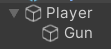
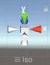

# Unity Editor

As there is a lot of content about Unity, this course will only provide knowledge about the **editor itself** such as the **interface**, the **project structure**, **along with everything that is not 2D/3D-specific** such as handling **scenes**, **input**, etc.

> The previous course was about **general knowledge** related to [Unity](../unity/index.md)<br>
> You can dig more into **2D** with [Unity 2D](../unity-2d/index.md)<br>
> You can dig more into **3D** with [Unity 3D](../unity-3d/index.md)

Most of the time, you will have to go back and forth between your code and [the official documentation](https://docs.unity3d.com/Manual/index.html) or your search engine (there is a search bar in the documentation too). You may also check [the scripting reference](https://docs.unity3d.com/ScriptReference/).

> **Pro tip**: there are many ways to do something in unity.
> * First, you may use a button/... in a window 👍 (most used)
> * Second, you may use a shortcut 🚀 (best)
> * Third, you may use a toolbar menu. You can find shortcuts here if you forgot one 🧐

<hr class="sl">

## Game object

Everything in Unity is a **game object**. **Players**, **enemies**, **items**, **camera**, **sounds**, **UI elements**, **lights**, and so on, are **game objects**. It means that they got the following properties

<details class="details-s">
<summary>A <b>name</b> ✨: for you to know what's this game object</summary>

```cs
string myName = name; // or this.name or this.gameObject.name
```
</details>

<details class="details-s">
<summary>A <b>tag</b> 🏷: Quite useful. You can add a tag "enemy" <small>(you can create tags)</small> and check the tag of a game object to know if this is an "enemy". You can also find game objects by tag name.</summary>

```cs
string myTag = tag; // or this.tag or this.gameObject.tag
GameObject g = GameObject.FindWithTag("tag"); // null if not found
GameObject obj = GameObject.FindGameObjectWithTag("tag"); // FindWithTag is an alias of this one
GameObject[] objects = GameObject.FindGameObjectsWithTag("tag");
```
</details>

<details class="details-s">
<summary>A state "<b>enabled</b>" 🤚. You can enable/disable your game object. If a game object is disabled, it won't be updated anymore.</summary>

```cs
bool isEnabled = enabled;
```

> **Pros**: they are disabling game objects that are far from the camera, and enabling game objects near the camera. Some game objects may be visible even if the camera is far, you may handle that too.
</details>

<details class="details-s">
<summary><b>Transform</b> ⚙: a <b>component</b> handling the position, rotation, and scale of a Game object.</summary>

```cs
Transform myTransform = transform; // transform.position, ...
myTransform.LookAt(target);
myTransform.Rotate(axis, angle);
myTransform.Rotate(axis, Time.deltaTime * angle, Space.World); // or Space.Self
```
</details>

> **Pro tip**: avoid changing the scale, it can cause performances issues, and this will be tiring to manage later.<br>
> **Note**: you will learn more about "**components**" in another section.<br>
> **Note**: you will learn about methods available for game objects in another section.

<hr class="sr">

## Scenes

**Scenes are screens of your games**. For instance, you may have StartMenuScene, LoadingScene, GameScene, GameOverScene, InventoryScene, etc. Of course, you are free, you may split our GameScene in more scenes <small>(ex: one per level?)</small>, or you may merge scenes <small>(ex: GameScene with InventoryScene)</small>. By default, Unity is opening a new project in the "SampleScene".

In Unity, creating a scene will not be enough to make it a part of your game. You need to

* Open the new scene
* File > Build Settings
  * Click on "add opened scenes in build" <small>(you may take note of the build index)</small>
  * Or drag and drop scenes from the project window to the list

Now, you will be able later to switch scenes using this sample of code

```cs
SceneManager.LoadScene(buildIndex);
SceneManager.LoadScene("SceneName");
```

If you got things that you don't want to lose between scenes

* you may create `static variables`. Instances are destroyed, but static variables aren't reset.
* you may create a singleton, if you don't want to instance an object twice (check [DontDestroyOnLoad](https://docs.unity3d.com/ScriptReference/Object.DontDestroyOnLoad.html), or [Unity Singleton](https://blog.mzikmund.com/2019/01/a-modern-singleton-in-unity/), while [DontDestroyOnLoad+Singleton](https://gist.github.com/mstevenson/4325117))

> **Pro tip?**: it seems that scenes are removed from the build after updating Unity. If you sorted your scenes and used indexes in your code, it may break. Make sure to keep a copy of your scenes indexes.

<hr class="sl">

## Interface

When you are opening a project, by default you got 4 windows.

* **hierarchy window** 📚 (left): list of all **GameObjects** of your scene
* **scene window** 🛠 (middle)
	* **scene tab**: edit your scene
	* **game tab**: run your scene
		* press play to run
		* press play again to stop
		* press pause to pause the simulation

When **running** your game, you can go edit things <small>(either by going back to the scene, or by clicking on a game object in the game/hierarchy)</small>, to test things. **Note that everything will be reverted once you stopped playing**. Some are changing the color of the editor in play mode <small>(Edit > Preferences > Colors > Playmode tint)</small>.

* **inspector window** ⚙ (right): you can edit the properties of the selected **GameObject**
* **project window** 🗄 (bottom): all of your project files

<hr class="sr">

## Hierarchy window

**This is the list of the game objects that are populating your scene**. The order does not really matter in 3D, but in 2D, this is important.

<details class="details-e">
<summary>Create game objects</summary>

Simply right-click in the hierarchy window, and select what you want to create.


</details>

<details class="details-e">
<summary>Group game objects</summary>

**You can group game objects**, which is making nested game objects rendered at a position relative to their parent. This is useful when you want to make sure that a gun is always rendered at a fixed position to a player <small>(or, mostly, when you want something to be rendered relative to something else)</small>.

To create a group, create a new game object inside another one (right-click on the parent > create). You can also drag and drop an existing object inside another game object.



> **Tip 1**: Sometimes, we are using an "Empty game object" as the parent to sort things.<br>
> **Tip 2**: If you are hiding the parent, its children are also hidden. This is useful, but if this is not what you want, you can simply prevent the parent from being rendered by disabling its rendered rather than disabling the parent itself.
</details>

> **Pro tips**
> * <kbd>Double-click</kbd> on a item in the hierarchy to focus it in the scene view
> * <kbd>F2</kbd> to rename the selected item
> * <kbd>CTRL+D</kbd> to duplicate the selected item
> * <kbd>ALT+expand or hide</kbd> to expand/hide all children of a group
> * you can use the search bar to look for a game object by name, or for game objects having a component <small>(you must write the full name of the component)</small>

Note: in complex games, you may define "selections". It means that pressing a shortcut (or toggling an menu item) will automatically select a game object. Click on a game object, then edit, then selection, and save it. Then use the shortcut, or use edit > selection > load, to load your selected game object.

<hr class="sl">

## Scene window

Select in this list of icons (or using their shortcut) a tool. You can move, rotate, and scale game objects in the scene. You will be able to do that using the **inspector window** too <small>(ex: with the move tool, two arrows will be available on the selected game object, click on one, and try moving it)</small>.


You can also change your point of view by clicking on one axis here. Click back on the square to go back to Perspective.



> **Pro tips**
> * <kbd>F</kbd> to focus a game object
> * <kbd>Mouse Wheel</kbd> to zoom/de-zoom
> * <kbd>Left-Click/Middle-click</kbd> to move your point of view (not the camera)
> * <kbd>CTRL</kbd> when moving something, while make the position change by 0.25. It's called **snapping**, and you can change the unit in edit > Grid and Snap settings.
> 
> You can select and edit multiples game objects in one go, by pressing <kbd>SHIFT</kbd> and clicking on two game objects (=select every game object between these two). You can use <kbd>CTRL</kbd> and pick them one by one.

<hr class="sr">

## Inspector window

In the inspector, **you can edit the properties of the selected game object**, even if this game object isn't inside the hierarchy window <small>(ex: files in the project window)</small>.

<div class="row row-cols-md-2 mx-0"><div>


</div><div class="align-self-center">

1. Enable/Disable
2. Name
3. Tag
4. Transform (set the position, rotation, scale)
5. Add new components (explained later)
</div></div>

<div class="row mx-0"><div class="col-md-4">


</div><div class="align-self-center col-md-8">

Later, you may have to remove a component. You can do it by clicking on the 3 small dots, then "remove components".

You may also use "Copy component" and "Paste component as new" or "Paste component values".

> **Pro tip**: you need to reduce the number of components as you as possible<br>
> **Pro tip**: as per the previous statement, in a group of game objects, try to merge some components (ex: the colliders, etc.)
</div></div>

> **Pro tip**: in the container in which you got "inspector", on the same line, you got three small dots too. You can switch from "normal" to "debug" mode here, which will show you way more fields in the inspector.<br>
> **Pro tip**: some are giving icons to game objects. This is done by clicking on the "cube" next to (1). These icons are only visible in the scene view.

<hr class="sl">

## Project window

The project window is, as a wise man said, a warehouse. This is a file explorer allowing you to explore your scenes, your assets <small>(images, textures, materials, sounds, etc.)</small> and works on them. **The project files should be split into folders**, such as

* **Animations**, **Audio**, **Cutscene**
* **Images**, **Materials**
* **Plugins**, **Prefabs**, **Scenes**
* **Scripts**: your C# scripts (.cs)
* **Settings**, **Shaders**

That's not the only thing you can do here! This is not a simple explorer.

<details class="details-e">
<summary>Create new scenes/materials/script/... 🚀</summary>

You can create a folder with <code>Right-click > Create > Folder</code>. Once you did, double-click to move inside your new folder, and you can

* Create a **new scene** with <code>Right-click > Create > Scene</code>
* Create a **new material** with <code>Right-click > Create > Material</code>
* Create a **new script** with <code>Right-click > Create > C# Script</code>
</details>

<details class="details-e">
<summary>Create Prefabs 📚✨</summary>

You may want to create a "**template**" for your Game Objects. For instance, every bullet is the same. You could duplicate the Game Object. But what if you want to change something? Will you manually edit everything? No way! You should create a **Prefab** (Prefabricated game object).

**Create a prefab**

* Simply **drag and drop** an existing game object, **from** the **hierarchy** window, **to** the **project window**, inside a folder "Prefabs"

**Instances of a prefab**

* **Drag and drop a prefab**, either **inside the scene**, or inside the **hierarchy**
* Every instance of this Prefab is now blue inside the hierarchy window

**Edit the prefab**

* Simply 
  * **double-click** on the **prefab** inside the **project window**
  * Or click on the arrow on the line of the prefab instance in the hierarchy
* It will open a prefab inside the scene window, with its hierarchy window
* **It will update the values for every instance** (aside from transform, or properties modified by the instance)

**Edit one instance**

* You can edit prefabs instances as you always did, it won't alter the prefab
* **If the prefab and the instance got different values in a field**, then
  * the **line** with a different value will have a **blue left border**
  * the different **value** will be in **bold**
* You can **revert/update the prefab** a value with a **right-click on the name of the field**
* **You can see every overridden property by clicking on "override"**, right below "layer" in the inspector.
</details>

<details class="details-e">
<summary>Console 📺</summary>

The console is a tab of the **Project window**. You can clear the console with "clear". In the console, you got different kinds of logs such as

* Normal Logs (Debug)

```cs
Debug.Log("message");
```

* Warnings

```cs
Debug.LogWarning("warning");
```

* Errors

```cs
Debug.LogError("error");
```
</details>

> **Pro tip**: please remember the word "assets". Everything that you are creating in the project explorer (scripts/materials/...) are called **assets**.

<hr class="sr">

## Components

You may refine your game object with what we call **components**. They are extensions such as collision, physics, etc. that you can add to your game objects. You can do that in the inspector (as we saw before), or by dropping a component on a game object in the hierarchy. You can write scripts which are also components to add things such as movement, etc.

You can use these methods to get a component, either applied on our game object, its children, or its parent. **Note that these methods are called on a game object, here it's the attribute "gameObject" in `MonoBehaviour`**, but it's implicit.

```cs
// the component is Rigidbody
Rigidbody r = GetComponent<Rigidbody>(); // same as gameObject.GetComponent<Rigidbody>() ...
r = GetComponentInChildren<Rigidbody>();
r = GetComponentInParent<Rigidbody>();

// disable a component (ex: the renderer to "hide" something)
// assert that we got a Renderer first!
GetComponent<Renderer>().enabled = true;
```

<details class="details-e">
<summary>Rigidbody (Physics 🐱‍🏍)</summary>

First, Rigidbody is for 3D games, and you have Rigidbody2D for 2D games. A game object with a rigid body **is subject to gravity** and **colliders**. If you ever add this to a game object, **you can't use transform to move your game object**, as you need to apply forces to move it. **If you are not planning to use force, be sure to toggle " is kinematic" on your Rigidbody component**.

1. `is kinematics: true`: no forces (including gravity) applied on this game object (ex: a wall).
2. `use gravity: false`: still apply forces, but no gravity.
3. **Constraints**
   * you can freeze the Rotation (ex: x, y, z = no rotation)
   * you can freeze the position (ex: z in 2D)
4. **Interpolate**: turn it on for the player's character ([source](https://docs.unity3d.com/ScriptReference/Rigidbody-interpolation.html))
5. **Settings** (Edit > Project Settings > Physics)
   * You can change the gravity
   * You got a Layer Collision Matrix, explained in Collider
6. **Some code**

**Pro tip**: updating physics must be done in the method `FixedUpdate` <small>(running at 50 FPS, even if the game is running at 20 FPS)</small> instead of `Update`. In `Update`, you will process input (calls to Input.Something), and in `FixedUpdate`, you will ONLY update the force, you won't call Input.Something (use attributes to remember what key/... were pressed).

```cs
// if up then Jump, etc.
rb.AddForce(Vector3.left); // move to the left
rb.AddForce(Vector3.left * speed);
rb.AddForce(Vector3.left * speed, ForceMode.A_MODE_HERE);
```
</details>

<details class="details-e">
<summary>Colliders</summary>

Colliders are used to check if our game object is colliding with another object. You will define a collider covering your game object (up to you, whether only touching the bust is considered as colliding=more efficient, etc.). Once you created you collider, **it will be triggered each time a game object having a Rigidbody is entering your collider**.

1. **is trigger**
   1. if **false**, this object is solid, trigger the method `OnCollisionEnter`. Both objects must have a **Rigid body**, at least one must be kinematic.
   2. if **true**, object are passing trough each other, trigger the method `OnTriggerEnter`
2. **Layers**
   * by default, object may collide even if there are not on the same layer.
   * You can change this behavior by tweaking the collision matrix at the end of Edit > Project Settings > Physics 
3. **Physical material**
    * it's an asset "create > Physic Material" in the project explorer
    * you can set the every friction to 0, and set combine to minimum to disable friction.
    * then you can add it to a collider
4. **Some Code** (3 ways that I used)

```cs
// 1. return every collider inside this sphere
Physics.OverlapsSphere(position, radius)
// only layers in mask (ex: mask = LayerMask.GetMask("Default", "Water"))
Physics.OverlapsSphere(position, radius, mask)
// 2. you can use Vector3.Distance (or Vector2)
// 3. you can use Bounds.Intersects
GetComponent<Collider>().bounds.Intersects(anotherBounds);
etComponent<Renderer>().bounds.Intersects(anotherBounds);
```

> **Pro tip**: this may not be the best way to do it, but methods such as `OnCollisionEnter` are filled with the game object we are colliding with. You may use tags, and check the tag of the game object.
</details>

> **Pro tip**: on the same line that you use to remove a component, you got a question mark inside a circle. Click on it to open the documentation of a component.

<hr class="sl">

## Scripts

Scripts are in **C#**, an old version of C#. From [this page about the C# compiler](https://docs.unity3d.com/2020.3/Documentation/Manual/CSharpCompiler.html), Unity 2020.3 (LTS) is using **C# 8.0**. In **2021.2+**, they are using **C# 9.0**. You should also note that even if they are using versions 8.0 or 9.0, **every feature of C# is not available** (check on the page above, for "Unsupported features").

Right-click inside the **project window**, create a new Folder "Scripts" and a new script (ex: "Example.cs").

* the name of the class must be the name of the file
* the name must start with an uppercase, following the UpperCamelCase format

<details class="details-e">
<summary>Basic Empty Script</summary>

<div class="row row-cols-md-2 mx-0"><div>

```cs
using UnityEngine;

public class Example : MonoBehaviour // Example.cs
{
    // Awake is called when the script instance is being loaded
    private void Awake() { }

    // Start is called before the first frame update
    private void Start() { }

    // Update is called once per frame
    private void Update() { }
}
```
</div><div>

* **using**

The `using` keyword is importing a namespace, meaning a collection of classes, enums, ... This allow us to use `MonoBehaviour` instead of prefixing classes (`UnityEngine.MonoBehaviour`).

* **MonoBehaviour**

A MonoBehaviour is the base class for a Script. It got a lot of methods, that are called automatically (Awake, Start, Update, Event-related functions, ...) in which you can write some code.

> A script is a component, so you can add it to a game object as usual. You can also drag and drop a script on a game object in the hierarchy.

* **More**

You can write new methods, add new attributes, ... See the [C# documentation](https://docs.microsoft.com/en-us/dotnet/csharp/tour-of-csharp/). If you are familiar with Java, it easy to sail in C#.
</div></div>
</details>

<details class="details-e">
<summary>Game object</summary>

**You attached your script to a Game object**. We already saw in the section

* "Game objects" how to get the name, tag, ...
* "Components" how to get a component attached on the same game object (its children or its parent)

> **Pro tip**: If needed, you got the attribute `gameObject` (resp. `this.gameObject`).

There is another problem. Let's say you want to **reference another game object** in another script. There are multiples way to do this

* use tags, and find object with tag
* use SerializedFields (see [Unity Script++](../unity-ufs/index.md#serialize-field))
* use the approach explained in the UI section, way better for UI elements
</details>

<details class="details-e">
<summary>Usual methods</summary>

<table class="table table-bordered table-striped border-dark mt-3">
<tr><th>Method</th><th>Description</th><th>Calls</th></tr>

<tr><th colspan="3" class="text-center text-my-blue">Unranked 👀</th></tr>

<tr>
<th>Instantiate</th>
<td>clone an object</td>
<td>

```cs
var _obj = Instantiate(obj);
var _obj = Instantiate(obj, pos, rot);
var _obj = Instantiate(obj, pos, Quaternion.identity);
```
</td>
</tr>

<tr>
<th>Destroy</th>
<td>destroy an object</td>
<td>

```cs
Destroy(obj);
Destroy(obj, time_before_death);
```
</td>
</tr>

<tr>
<th>Messages</th>
<td>call a method on every script on this game object.</td>
<td>

```cs
SendMessage("methodName");
// and on its ancestors
SendMessageUpwards("methodName");
```
</td>
</tr>

<tr><th colspan="3" class="text-center text-my-blueI">Position 🗺</th></tr>

<tr>
<th>Vector2<br>Vector3</th>
<td>A class used to represents a position (x,y) or (x,y,z).
Note that I'm using Vector3 a lot, but a lot of functions are in Vector2 too.</td>
<td>

```cs
// shortcuts to create vectors
Vector3.back, Vector3.down, Vector3.up, ...
someVector.normalized; // magnitude=1, just a direction
Vector3.MoveTowards(current, target, maxDistancePerStep);
if (Vector3.Distance(a, b) <= 0.0001f) {} // a near b?
```
</td>
</tr>

</table>
</details>

> **Pro tip**: [we are explaining a lot of things about scripts here](../unity-ufs/index.md).<br> 
> **Fun fact**: a long time ago, it was possible to use JavaScript too.

<hr class="sr">

## Input

In Unity, go to **Edit > Project Settings > Input Manager**. Expand Axes. In this menu, you may check, change, add new entries for input.

* **Horizontal**: you can see **left**/**right** to move, while **A** and **D** are working
* **Vertical**: you can see **down**/**up** to move, while **S** and **W** are working
* **Jump**: you can see **space**

Increase the size to add more 🚀. Once you are good, in a script, you can do that. If a value is inside "dead", then its 0. "negative" means the value that will be negative (-1) in GetAxis (explained later). And "sensitivity" is the response time (low=smooth, great=fast). 

<div class="row row-cols-md-2 mx-0"><div>

**Discontinuous input**

```cs
// <0 (left) or 0 (none) or 0> (right)
float axisX = Input.GetAxis("Horizontal");
// <0 (down) or 0 (none) or 0> (up)
float axisY = Input.GetAxis("Vertical");

if (Input.GetButton("Jump")) // if "Jump" triggered
{
    // do action
}
```
</div><div>

**Continuous input**

```cs
if (Input.GetButtonDown("Jump"))
{
    _isJumpPressed = true; // change the state
}
if (Input.GetButtonUp("Jump"))
{
    _isJumpPressed = false; // revert the state
}
```
</div></div>

<details class="details-e">
<summary>Not using the Input Manager</summary>

**For testing purposes**, you may also directly use the key. Once you did check, be a good fellow, and use the input manager 🤓.

```cs
bool pressed = Input.GetKey(KeyCode.Space);
bool down = Input.GetKeyDown(KeyCode.Space);
bool up = Input.GetKeyUp(KeyCode.Space);
```
</details>

<details class="details-e">
<summary>Delta time</summary>

As explained in the game engine course, delta time is important. If you are planning to update the position by 10 m/s, then having variations such as 9 m/s one time, then 11 m/s another time, are not good right 😬?

```cs
// you should (MUST) store 10 in an attribute
var speed = 10 * Time.deltaTime;
```
</details>

<details class="details-e">
<summary>Raw</summary>

When you are using the method not raw, you will see that the player will still move a bit after you stop pressing a key. This is great, but if this is not what you want, you can use

```cs
float axisX = Input.GetAxisRaw("Horizontal");
```
</details>

<details class="details-e">
<summary>Mouse</summary>

* **Input Mouse**

**Note that you don't need this if you are using the input manager** (simply use the name of the input as always).

```cs
// b is 0 = Left-Click, 1 = Right-Click, 2 = Middle-Click
Input.GetMouseButton(b);
Input.GetMouseButtonDown(b);
Input.GetMouseButtonUp(b);
```

* **Mouse events**

You can react to even such as "Mouse is over this game object", ... which the following functions are available in every Game Object.

```cs
private void OnMouseUp() {}
private void OnMouseDown() {}
private void OnMouseOver() {}
private void OnMouseEnter() {}
private void OnMouseExit() {}
```
</details>

> **Pro tip**: there is a new input system, that is event based. You should [read the documentation](https://docs.unity3d.com/Packages/com.unity.inputsystem@1.2/manual/index.html). Available in Unity 2019.4+ in version 1.0. You may use the version 1.2 which is still compatible with 2019.4+.

<hr class="sl">

## User Interface (UI)

In Unity, UI stuffs are in a game object called "**canvas**". Simply create one (UI > canvas), then you can add buttons (UI > buttons), texts (UI > text), etc. as a children of your canvas. Note that creating an UI element outside a canvas, will automatically generates a new canvas.

> **Pro tip**: **go back to 2D** to create your user interface. If you were in 3D, simply toggle "2D" in the Scene windows .

<details class="details-e">
<summary>Positioning components</summary>

It's not the best to manually place something in your canvas. What if a user got a window smaller or larger? **We are usually using anchors (`ancrage`) to position components**.

Click on an UI element, and check the "Rect Transform". Then click on this (**Anchor presets**) .

By pressing **ALT** and clicking on elements of the grid, you can position your component somewhere in the canvas, and you can stretch it too (increase width, height, both).

Here is an example of positioning an image near the top.


</details>

<details class="details-e">
<summary>How to ...?</summary>

* **Responsive canvas**

If you are **not using anchors**, you can click on your canvas, and in the component "canvas scaler", set **mode to "scale with the screen size"** while defining a size. I think it's better to use anchors.

* **Handle backgrounds**

You can create an Image, or an empty component, or do this on any component having the component "Image". You may drop a **sprite** (see 2D-sprites) in "Source Image" to create a **background image**, and/or you may **change the color**/**add a material**.

* **Override width/height/...**

If you want to override the minimum/preferred/... width, height, then you can do that by adding a **Layout element component** to the game object you want to override. You can use this when you got components inside another, and you want one to act a bit differently.

* **Auto-resize components**

If you got a component with some text, you may want your component to auto-resize itself, when the text is shorter or longer, smaller or bigger. You can do that by adding a component called "Content Size Fitter" and set either (or both) fields to "Preferred size".

> **Pro tip**: you may have to add a layout, for instance a horizontal layout, which is allowing you to use padding too.
</details>

<details class="details-e">
<summary>Layout managers</summary>

**Layout managers** (`gestionnaires de mise en page`) are components allowing you to design easily your interface. You need **to create an empty game object** (empty is not mandatory) and give it the layout manager. Once you did, **children of the** empty **game object will be displayed according to the manager you picked**.

If you are familiar with Swing in Java, then this is quite similar.

* **Horizontal Layout**

Components are on the same line, with a gap (that is 0 by default).

* **Vertical Layout**

One component per line, with a gap between lines (that is 0 by default).

* **Grid Layout**

An horizontal layout by default. You can make columns and rows by selecting another value for the field "constraint".
</details>

<details class="details-e">
<summary>Handling multiple menus / another way of referencing something</summary>

You could create multiples canvas, and turn them on/off. I heard that Unity is advising against this, but I couldn't find a proof that this is not a good practice. Anyways, another way to

* create a canvas, and put everything inside
* Add a component "XXXManager" (your script) on the canvas
* Add a component "XXXElement" (your script) on each menu (you may use "Empty Game objects", and put your stuff inside)

Then, in the manager, you are using `GetComponentsInChildren<XXXElement>`. As each component go a field "gameObject" for the associated game object, you got your menus too from their components. You may add a method in **XXXElement** returning the kind of menu (use an enum) to do specific stuff according to the kind of menu.
</details>

> **Pro tip**: As you can watch is [this video, there is a new way to create interface, called UI Builder](https://www.youtube.com/watch?v=NQYHIH0BJbs&ab_channel=CocoCode). It's not available yet.

<hr class="sr">

## Digging into topics

<details class="details-e mt-3">
<summary>Camera</summary>

* **Remove background**

You can replace the Skybox with a black background or something else, by clicking on the camera, and editing "clear flags" and background. You can also turn off skybox in the editor with this button. 


* **Preview camera**

Simply click on the camera, you will see a little preview.

* **Set camera view**

If you like what you are seeing, you can right-click on your camera and click on "Align with view". The "view" is your view of the scene in the editor.

* **Some code**

```cs
Camera.current // may be null
Camera.allCameras
Camera.main // may be null

Camera.main.ViewportToScreenPoint() // ex: mouse position to world position
Camera.main.ScreenToViewportPoint() // ex: world position to mouse position
```
</details>

<details class="details-e">
<summary>Cursor</summary>

```cs
Cursor.visible = true;
Cursor.visible = false;
Cursor.SetCursor(cursorTexture, hotSpot, cursorMode);
```
</details>

<details class="details-e">
<summary>Coroutines</summary>

**Coroutines** are functions with multiples returns. Each time the function is called, the code will be executed until the next return. **This is quite used when you need to do a job after X seconds, or when a condition is true, etc.**.

Inside such function, you can call

* `yield return null`: tell unity to wait one frame and call again the coroutine
* `yield return ...`
  * `new WaitForSeconds(1f);`: wait for 1 second
  * `new WaitUntil(() => false);`: wait until the function returns true
  * `new WaitWhile(() => true);`: wait until the function returns false
  * `new WaitForSecondsRealtime(1f)`: wait for 1 real second (unscaled time)
  * You can create new ones by extending `CustomYieldInstruction`
  * ...
* `yield break` (or no other return): coroutine done

**Declare a function**

```cs
private IEnumerator MyCoroutine()
{
	// when started, wait for one second then print "some code"
	yield return new WaitForSeconds(1f);
	Debug.Log("Some code");
}
```

**Start/Stop your coroutine**

```cs
StartCoroutine(MyCoroutine());
StartCoroutine(nameof(MyCoroutine)); // or StartCoroutine("MyCoroutine");

var c = MyCoroutine();
StartCoroutine(c);
StopCoroutine(c);
StopAllCoroutines();
```
</details>