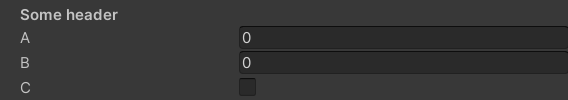
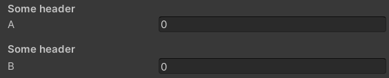
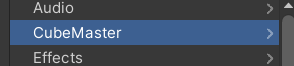
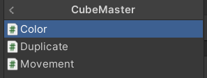
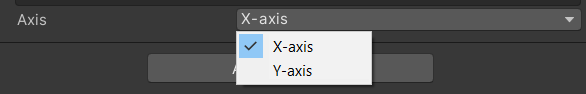
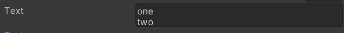
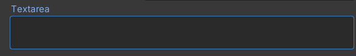

# Unity Script++

This course is a gathering of notes and tips to make your scripts cleaner, and more user-friendly.

<hr class="sl">

## Coding conventions

### Methods

<details class="details-s">
<summary>The name of a method should starts with an uppercase</summary>

```diff
- private void myMethod() {}
+ private void MyMethod() {}
```
</details>

<details class="details-s">
<summary>You should explicitly add the qualifier</summary>

```diff
- void MyMethod() {}
+ private void MyMethod() {}
```
</details>

### Attributes

<details class="details-s">
<summary>Private attributes should start with an underscore (<code>_</code>), or ends with an underscore (up to you). You can use either snake case, or camel case.</summary>

```diff
- private int myAttribute;
+ private int _myAttribute;
```
</details>
<details class="details-s">
<summary>Attributes should be private or protected</summary>

```diff
- int myAttribute; // not private (implicit)
- public int myAttribute; // not public
+ protected int _myAttribute; // either explicit protected
+ private int _myAttribute; // or explicit private
```
</details>
<details class="details-s">
<summary>Serialized variables (explained later) or public variables (bad 🙄) should start with a lower case</summary>

```diff
- public int _myAttribute;
- [SerializeField] private int _myAttribute;
+ public int myAttribute;
+ [SerializeField] private int myAttribute;
```
</details>

<hr class="sr">

## Performances

<details class="details-s">
<summary>If must not be the last instruction</summary>

```diff
- private void MyMethod()
- {
- 	// some code here (optionnal)
- 	if (something) {
- 		// some code here
- 	}
- }
+ private void MyMethod()
+ {
+ 	// some code here (optionnal)
+ 	if (!something) return;
+ 	// some code here
+ }
```
</details>

<hr class="sl">

## Serialize Field

When creating a Script, it's shown in the inspector. You can add fields inside the inspector too, to allow someone (or yourself) to easily change some values/parameters.

The **bad way** to do this, is to set an **attribute public**. Indeed, as a "side effect", it will be shown inside the editor, but it also means that any other class know this attribute, and this may lead to problems later.

The **right way** to do this, is to declare a serialized field.

```cs
[SerializeField] private int number = 0;
// or on two lines 😶
[SerializeField]
private int number = 0;
// or 🙄 (bad 👎)
public int number = 0;
```

Resulting in


<details class="details-e">
<summary>Rename a Serialize Field 👍</summary>

```cs
[SerializeField]
[FormerlySerializedAs("oldName")] private int number = 0;
```
</details>

<details class="details-e">
<summary>Tooltips 😎</summary>

Maybe, the name of your attribute isn't providing enough information for the user to know what should be in this field. You should always add a **Tooltips**, shown when the user is hovering (=mouse stay over) the field.

```cs
[Tooltip("Some description blah blah blah")]
[SerializeField] private int number = 0;
```

 (mouse hovering "key")

> **Pro tip**: this is not an excuse to give bad names to your fields (as I did with "number" or "key").
</details>

<details class="details-e">
<summary>Headers ✨</summary>

You can make categories with Headers. This is a great way of sorting your serialize field, if you got a lot of them.

```cs
[Header("Some header")]
[SerializeField] private int a;
[SerializeField] private float b;
[SerializeField] private bool c;
```


</details>

<details class="details-e">
<summary>Spaces ✨✨</summary>

If headers aren't enough, you can add some spacing too.

```cs
[Header("Some header")]
[SerializeField] private int a;
[Space(2)]
[Header("Some header")]
[SerializeField] private int b;
```


</details>

<details class="details-e">
<summary>New Menu 🚀</summary>

When click on "adding component", you got a list of menus such as "Audio", ... You can add a new menu here 🚀!

```cs
// this is a path, you can subfolders (=nested menus) with /
[AddComponentMenu("CubeMaster/Movement")]
public class MovementManager : MonoBehaviour {}
```



</details>

<hr class="sr">

## Serialize Field : more

<details class="details-e">
<summary>General 🛠</summary>
<br>
<table class="table table-striped table-bordered border-dark">
<tr><th>Code</th><th>Editor/Description</th></tr>

<tr><td>

```cs
[HideInInspector] public float hide;
```
</td><td><br>

No field "hide".
</td></tr>

<tr><td>

```cs
[RequireComponent(typeof(Collider))]
[RequireComponent(typeof(Collider), typeof(RigidBody))]
public class SomeClass : MonoBehaviour {}
```
</td><td><br>

You can't add this class as a component of a game object, if this class do not have a collider.
</td></tr>

<tr><td>

```cs
[DisallowMultipleComponent]
public class SomeClass : MonoBehaviour {}
```
</td><td><br>

You can't have more than one instance of this component per game object.
</td></tr>

<tr><td>

```cs
private enum Axis
{
	[InspectorName("X-axis")] X, 
	[InspectorName("Y-axis")] Y
}
[SerializeField] private Axis axis = Axis.X;
```
</td><td><br>

You can use this to rename the values of your enum in the inspector. It does not work for attributes 😭.



</td></tr>
</table>
</details>

<details class="details-e">
<summary>Numbers 🔢</summary>
<br>
<table class="table table-striped table-bordered border-dark">
<tr><th>Code</th><th>Editor/Description</th></tr>

<tr><td>

```cs
[Min(10)] public int speed = 15;
```
</td><td>


If the value is lower than min, then value = min.
</td></tr>

<tr><td>

```cs
[Range(0, 1)] public float volume;
```
</td><td><br>


</td></tr>

</table>
</details>

<details class="details-e">
<summary>Strings 📚</summary>
<br>
<table class="table table-striped table-bordered border-dark">
<tr><th>Code</th><th>Editor/Description</th></tr>

<tr><td>

```cs
[Multiline(2)] public string text = "";
```
</td><td><br>


</td></tr>

<tr><td>

```cs
[TextArea] public string textarea = "";
```
</td><td><br>


</td></tr>

</table>
</details>