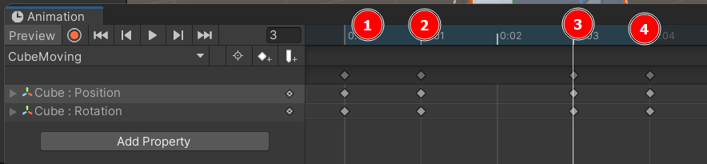

# Unity Animations 🎬

<div class="row row-cols-lg-2"><div>

Unity Cinematic capabilities are quite powerful. They are fully illustrated in [The Heretic Short Movie](https://www.youtube.com/watch?v=iQZobAhgayA) which was fully made in Unity using Animations and Cinematics.
</div><div>
</div></div>

<hr class="sep-both">

## Animations 🚸

<div class="row row-cols-lg-2"><div>

We define the states of a game object. For a character, we could have "Idle," "Walking," and "Shooting." We will define how we change from one state to another.

#### Animator Controller

From the "Project Window," create an animation controller. Double-click on it to open the Animator Editor. Drag-and-drop animations to it or create empty states. Right-click on a state to create a transition.

Aside from the initial transition, click on any transition to define the conditions using parameters. On the left column of the animator window, click on the "parameter," tab. You can define the variable used in conditions here.

Transitions can be immediate or progressive. Edit the transition settings to define how long the two states are overlapping.

From the code, you can set a parameter to trigger a trigger:

```cs
Animator anim = GetComponent<Animator>(); // Awake
anim.SetBool("name", false);
anim.SetFloat("name", 0);
anim.SetInteger("name", 0);
anim.SetTrigger("name");
anim.Play("anim_name");
```

📚 You can attach a `StateMachineBehaviour` script to a state.

⚠️ Using `"name"` is not optimal, use the ID that you got using `Animator.StringToHash("name")`. Store it in a static constant.
</div><div>

#### Animator

To animate a component, we need to add an Animator component to it, and link an Animator Controller to it.

#### Animation

You can record an animation. From the "Project Window," create an animation and open it. Select a game object with an animator. Press the record button and manually animate the game object.

You will define the position, rotation, etc. at one point of the timeline. Select another point in the timeline and continue your work.



⚠️ The timeline is in tenths of a second. Use the scroll to zoom out.
</div></div>

<hr class="sep-both">

## Particles ✨

<div class="row row-cols-lg-2"><div>

Add the "particle system" component to a game object for it to emit particles. By default, they are purple, but because there is no material.

* **Renderer > Material**: set the material for the particles
* **Emission**
    * You can set the number of particles per second
    * You can add bursts of particles
* **Shape**: you can change the shape of the effect
* **Trails**: you can give a trail to your particles
* **Color over lifetime**: you can change the color over time
</div><div>
</div></div>

<hr class="sep-both">

## 👻 To-do 👻

Stuff that I found, but never read/used yet.

<div class="row row-cols-lg-2"><div>

Cinemachine, LeanTween, and Timeline packages

* Add cinemachine brain to our camera
* Create a new virtual camera.
* You could have one camera looking at the target
* You could have one camera following the target. Set body to the position. Increase damping (time to adjust). If the point is too far, rotate or move the camera.
* Use timeline to switch between cameras

Set the priority to tell the cinemachine which camera it should pick.
</div><div>

Random

* Post extrapolate
* CTRL-D to extract animation from a model
* [VFXToolbox](https://github.com/Unity-Technologies/VFXToolbox)
</div></div>